# 데이터베이스 설계

# 데이터베이스 설계

- 사용자의 요구 사항을 고려하여 데이터베이스를 생성하는 과정

### 훌륭한 데이터베이스 설계

- 시간의 흐름에 따른 데이터의 모든 측면을 나타낸다.
    
    → 앞으로 들어올 데이터 고려
    
- 데이터 중복을 최소화
- 효율적인 접근성
- 무결성을 제공
- 이해하기 쉬어야 한다.

## 데이터베이스 설계 단계

---

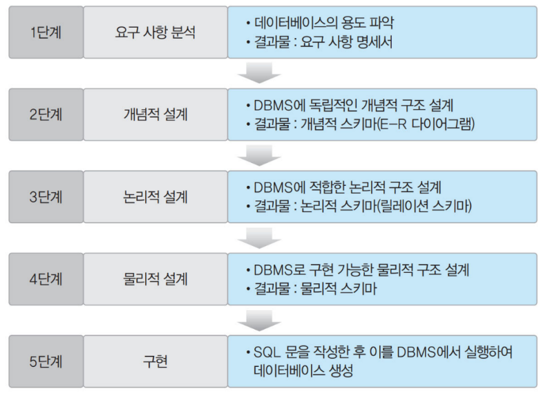

---

# 개체-관계 다이어그램

## 개체(Entity)

- 각 개체만의 고유한 특성이나 상태, 즉 속성을 하나 이상 가지고 있다.

## 속성(Attribute)

- 개체나 관계가 가지고 있는 고유의 특성

### 다중 값 속성

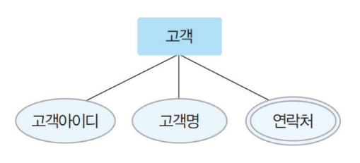

- 값을 여러 개 가질 수 있는 속성
- 이중 타원으로 표현

`ex` 고객의 연락처 속성 / 책의 저자 속성

---

### 복합 속성

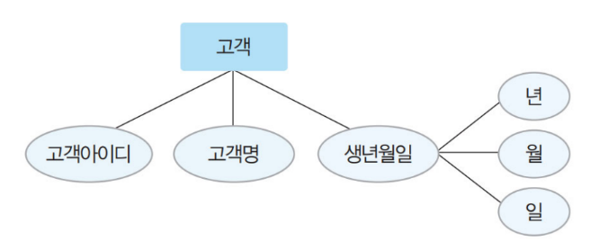

- 의미를 분해할 수 있는 속성

`ex` 고객의 주소 속성, 생년월일 속성

---

### 유도 속성

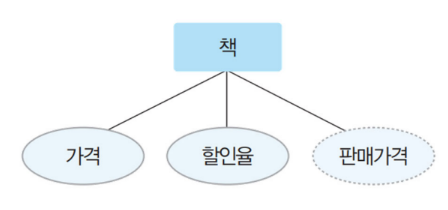

- 다른 속성 값에서 유도되어 결정되는 속성
- 값이 별도로 저장되지 않는다.

`ex` 책 개체: 가격과 할인율 속성으로 계산되는 판매가격

---

### 키 속성

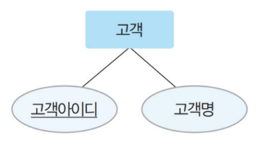

- 각 개체 인스턴스를 식별하는 데 사용되는 속성
- 둘 이상의 속성들로 구성되기도 한다.

---

## 관계(Relationship)

- 개체와 개체가 맺고 있는 의미 있는 연관성

### 관계에 참여하는 개체 타입 수

- 이항 관계: 개체 타입 두 개가 맺는 관계
- 삼항 관계: 세 개가 맺는 관계
- 순환 관계: 개체 타입 하나가 자기 자신과 맺는 관계

### 매핑 카디널리티 기준

- 일대일(1 : 1) 관계
- 일대다(1 : n) 관계
- 다대다(n : m) 관계

## 관계 - 참여 특성

### 필수적 참여(전체 참여)

- 개체의 모든 인스턴스가 관계에 반드시 참여해야 하는 것

`ex` 모든 고객은 책을 반드시 구매해야 한다.

## 관계 - 종속성

### 약한 개체

- 다른 개체의 존재 여부에 의존적인 개체
- 강한 개체와 약한 개체는 일반적으로 일대다 관계를 가지고, 약한 개체는 강한 개체와의 관계에 필수 참여 한다.
- 약한 개체는 이중 사각형, 관계는 이중 마름모
- 부분 키: 강한개체와 약한 개체의 관계 내부에서 구분되는 약한 개체의 키
    
    ---
    
    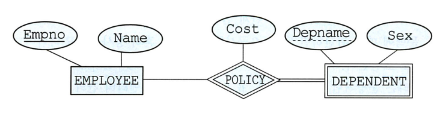
    

---

Depname → 부분 키

## 설계 1 단계: 요구 사항 분석

## 개념적 설계

결과물: E-R 다이어그램

1. 개체 추출, 각 개체의 주요 속성과 키 속성 선별
2. 개체 간 관계 결정
3. E-R 다이어그램으로 표현

### 개체 추출

1. 필요없는 명사(광범위한)는 지운다.
2. 개체를 추출한다. 
3. 개체의 속성을 추출하고 속성 중 키 속성을 찾는다.
4. 표로 정리한다.
    
    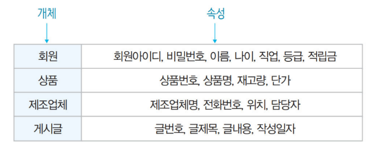
    
    ---
    
    → 키 속성을 명시하자.
    
    → 유도 속성과 복합 속성도 고려 `ex` 나이를 직접 저장하는 것 보다 생년월일로 저장
    

### 관계 추출

1. 동사를 찾는다. 형용사는 무시
2. 관계에 대해서 카디널리티와 참여 특성을 결정한다.

---

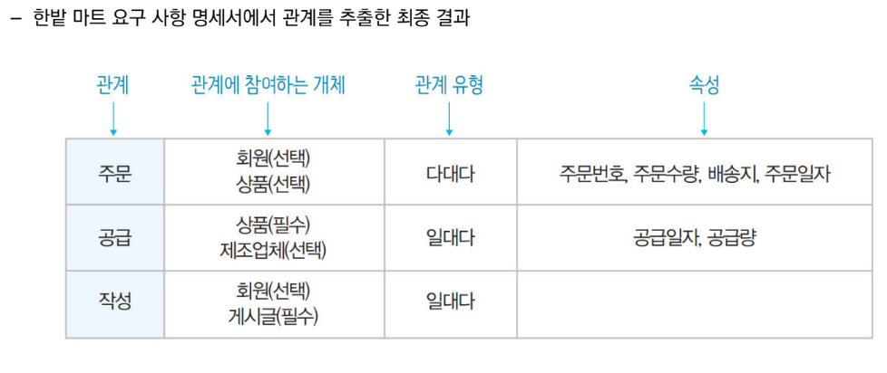

---

보는 사람 입장에서 이해가 잘 되도록 개체와 관계유형을 적는다.

### 문제: “여러분이 직접 생각한 요구사항이 있으면 작성하세요”

- 바꾸거나 추가한 이유에 대해서

## 논리적 설계

- 논리적 스키마 설계
- 결과물: 논리적 스키마 → 릴레이션 스키마

## 릴레이션 스키마 변환 규칙

### 규칙 1: 모든 개체는 릴레이션으로 변환한다.

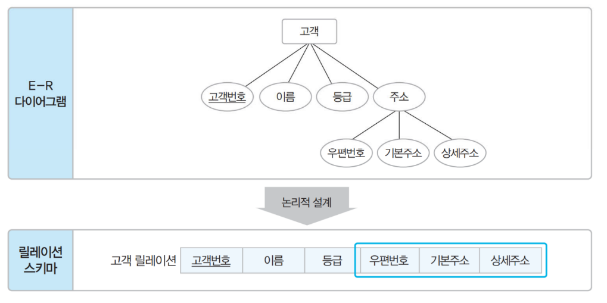

---

→ 복합 속성은 속성을 분해 후 릴레이션에 적용한다.

### 규칙 2: 다대다 관계는 릴레이션으로 변환한다.

- 다대다 관계는 별도로 하나의 릴레이션으로 변환한다.
1. 관계 릴레이션 별도 생성
2. 관계에 참여하는 개체들의 기본 키를 관계 릴레이션에 포함시켜 외래키로 지정
3. 외래키를 조합하여 기본키로 조정
    
    +) 대리키를 사용하는 방법도 있다.

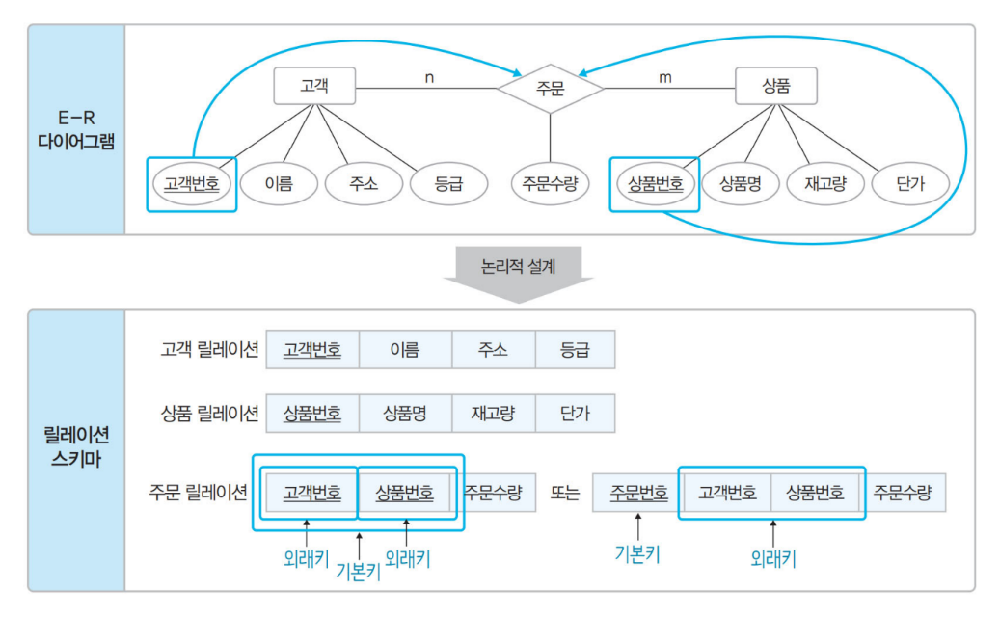

---

주문 릴레이션의 속성을 고객 릴레이션에 포함 시키면 안되는 이유??

→ 고객은 여러 상품을 주문하기 때문에 원자성에 위배된다.

### 규칙 3: 일대다 관계는 외래키로 표현한다.

1. 규칙 3-1: 일반적으로 ‘다’쪽으로 외래키로 포함시킨다.

---

- ‘다’ 쪽으로 하는 이유는 제조업체는 여러 상품을 공급하기 때문이다.(원자성 위배)
- 제조업체가 필수 참여 → 위 방법을 사용
- 제조업체가 선택 참여 → 위 방법을 사용하면 널값이 많이질 수도 있다.
    
    → 별도의 릴레이션을 생성(규칙2 적용)
    

1. 규칙 3-2: 약한 개체가 참여하는 일대다 관계는 외래키를 포함하여 기본키로 지정
    
    
    
    ---
    
    외래키와 기본키가 합해져 복합키를 구성한다.
    

### 규칙 4-1: 외래키를 서로 주고 받는다.

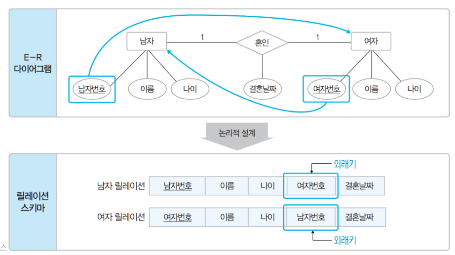

---

→ 불필요한 데이터 중복이 발생할 수 있다.

### 규칙 4-2: 필수적으로 참여하는 개체만 외래키로 받는다.

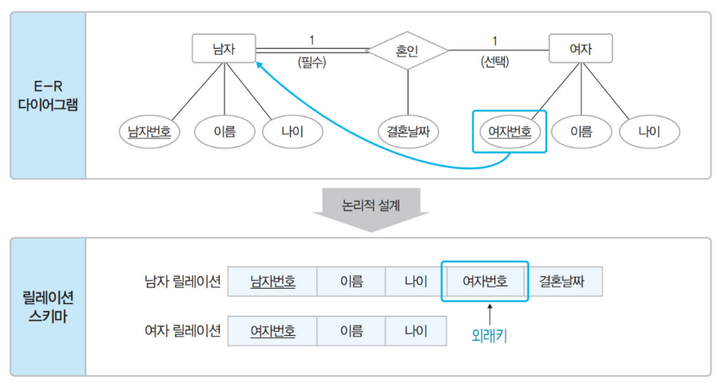

---

### 규칙 4-3: 모든 개체가 필수적으로 참여하면 릴레이션을 하나로 합친다.

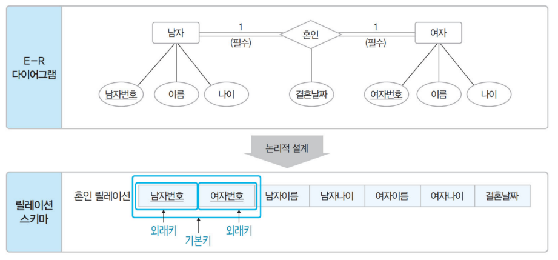

---

### 규칙 5: 다중 값 속성은 별도의 릴레이션으로

!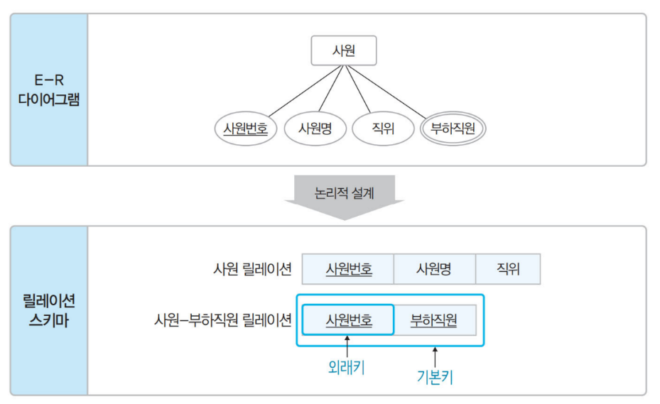

---

### 순환 관계도 기본 규칙을 그대로 적용

---