# 정규화

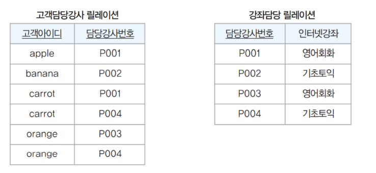

# 정규화 개념

- 부주의한 데이터베이스 설계는 데이터 중복을 야기하여 여러 가지 이상 현상을 유발
- 이상현상: 데이터 중복으로 인해 삽입, 수정, 삭제 연산을 수행할 때 발생하는 부작용
- 정규화: 이상 현상을 제거해 데이터베이스를 올바르게 설계해 나가는 과정

# 이상 현상

## 삽입 이상

- 새 데이터를 삽입하려면 불필요한 데이터도 함께 삽입해야 하는 문제

---

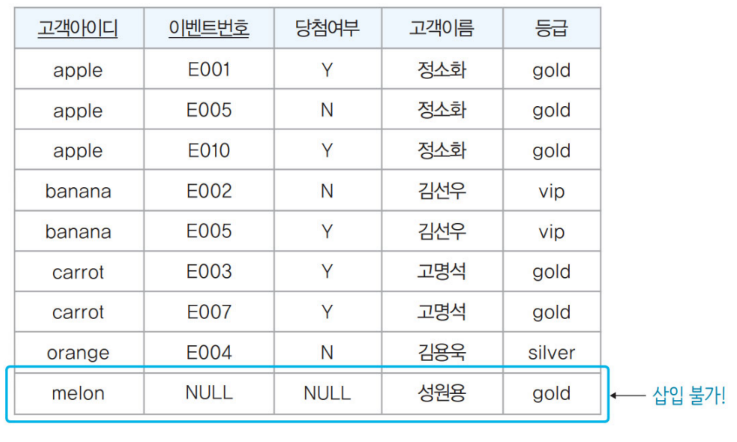

---

→ 고객에 대한 정보만 넣을 수 없다. 기본키는 NULL 값을 가질 수 없기 때문이다.

## 갱신 이상

- 중복된 투플들 중 일부만 수정하여 데이터가 불일치하게 되는 모순 발생

---

→ 데이터 불일치 발생(중복된 투플이 많아서 발생할 수 있는 문제)

## 삭제 이상

- 투플을 삭제하면 꼭 필요한 다른 데이터까지 삭제하는 문제

---

→ 이벤트 참여와 관련없는 고객아이디, 고객이름, 등급 데이터까지 손실

위와 같이 이상 현상들이 발생하는 이유는 고객 정보와 이벤트 정보가 같은 릴레이션에 있기 때문이다.

# 함수 종속

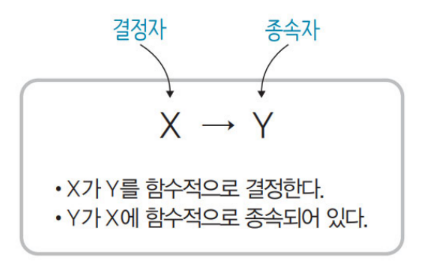

---

`ex` 고객 아이디가 고객의 등급을 결정한다.( 고객 아이디를 알면 고객의 등급을 알 수 있다.)

## 함수 종속 관계 판단 시 유의 사항

- 속성 값은 계속 변할 수 있으므로 현재 릴레이션에 포함된 속성 값만으로 판단하면 안된다.
- 기본키와 후보키는 릴레이션의 다른 모든 속성들을 결정한다.
- 기본키나 후보키가 아니더라도 결정자가 될 수 있는 속성이 있다.

함수 종속 판단 순서

1. 키를 좌측에다 놓는다.
2. 우측에 종속자가 될 속성들을 적는다.
3. 우측에 있는 속성들 중 결정자가 될 수 있는 것을 고려한다.

## 완전 함수 종속(FFD)

- 속성 집합 X의 전체가 아닌 일부분에는 종속X
    
    `ex` { 고객아이디, 이벤트번호 } → 당첨여부
    

## 부분 함수 종속(PFD)

- 속성 집합 Y가 속성 집합 X의 전체가 아닌 일부분에 함수적으로 종속
    
    `ex` { 고객아이디 } → 고객이름

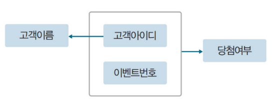

---

# 기본 정규형과 정규형 과정

정규화의 목표: 관련이 없는 함수 종속성은 별개의 릴레이션으로 분해한다.

- 주의 사항: 정규화를 통해 릴레이션은 무손실 분해가 되어야 한다.
    
    → 분해된 릴레이션을 조인했을 때 데이터 손실이 발생하지 않는 것
    

## 제1 정규형(1NF)

: 릴레이션에 속한 속성 값은 원자 값으로만 구성되어야 한다.

## 제2 정규형(2NF)

: 기본키가 아닌 모든 속성이 기본키에 완전 함수 종속되어야 한다.

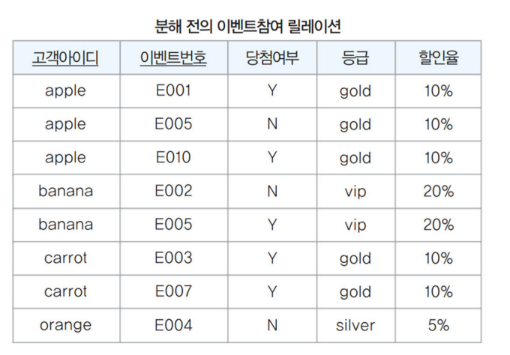

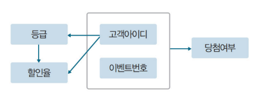

---

→ 부분 함수 종속 관계가 생겼다.

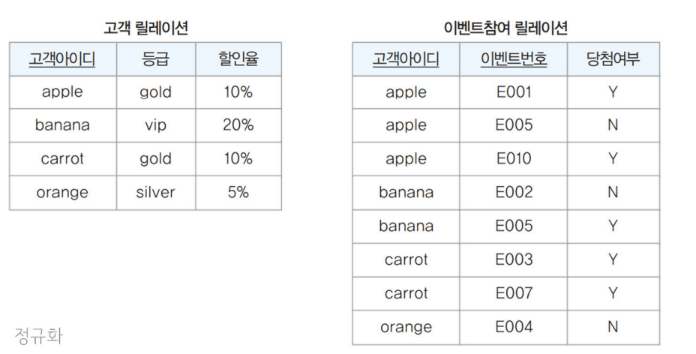

---

부분 함수 종속을 제거하려고 분해 → X 값의 부분키를 포함하여 분해(무손실 분해를 위해)

2NF의 특성 때문에 단일 키로 구성된 릴레이션은 무조건 2NF를 만족한다.

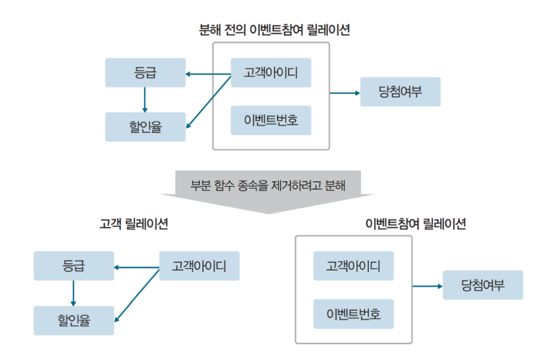

---

## 제3 정규형(3NF)

: 기본키가 아닌 모든 속성이 기본키에 이행적 함수 종속이 되지 않아야 한다.

→ 키가 아닌 속성이 키가 아닌 또다른 속성을 결정하면 안된다.

### 이행적 함수 종속

: 키인 속성에도 종속, 키가 아닌 속성에도 종속되는 관계

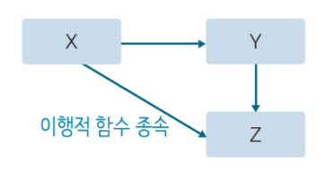

---

릴레이션 분해

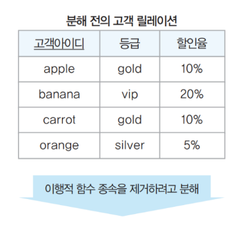

---

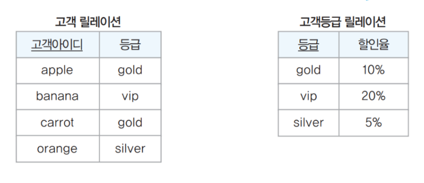

---

→ 총 3개로 릴레이션이 분해되었다. → 성능에 영향을 미친다.

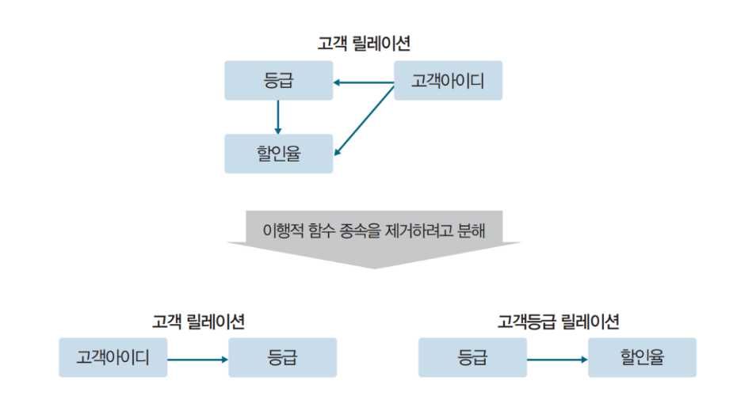

---

→ 결정자는 남겨둔다.(등급, 고객아이디)

## 보이스 코드 정규형(BCNF)

: 함수 종속 관계에서 모든 결정자가 후보키어야 한다.

`ex` 

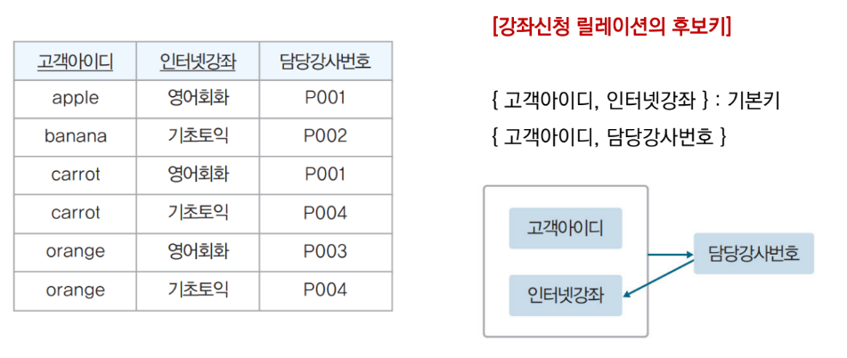

---

→ 키가 아닌 속성이 키의 일부를 가리킨다.

---

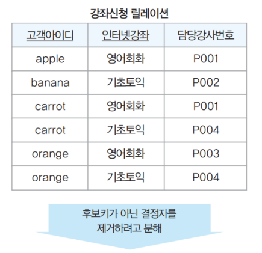

---

---

→ 키 속성을 남겨두는 게 일반적이지만 보이스코드 정규형은 구조가 바뀐다.(키가 변경)