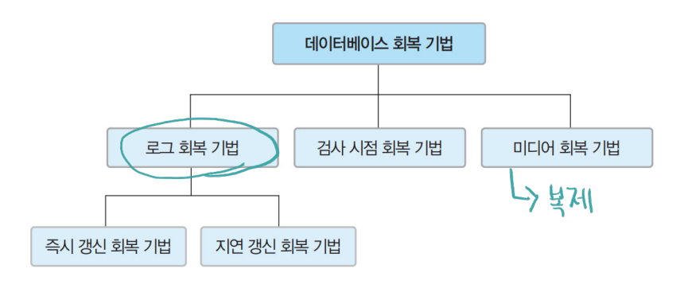
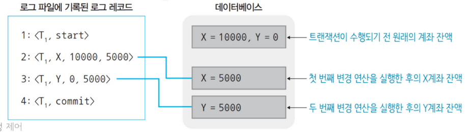
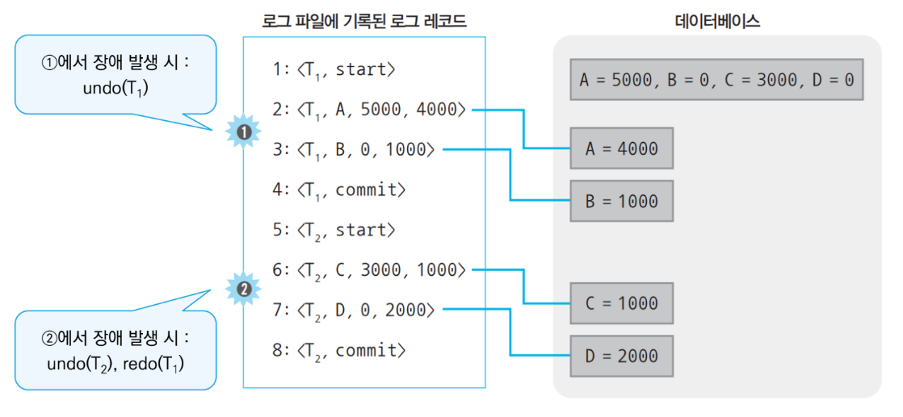
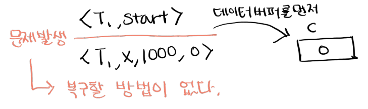
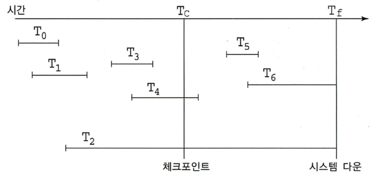
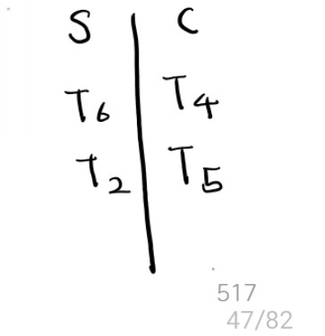
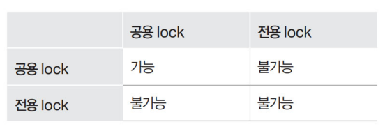
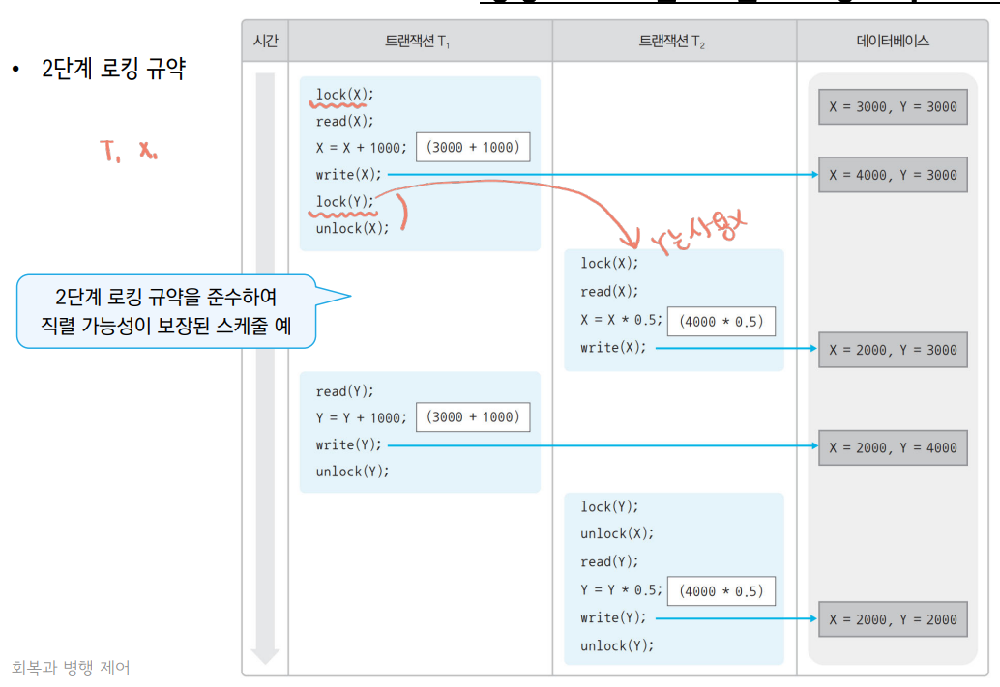
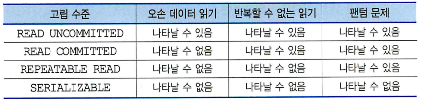

# 트랜잭션 요약

# 트랜잭션 특성

### 원자성

: 트랜잭션 연산이 정상적으로 실행되거나 실행되지 않아야 한다.

→ all or nothing

### 일관성

: 트랜잭션 종료 후에도 데이터베이스의 일관된 상태를 유지

### 격리성, 고립성

: 한 트랜잭션이 데이터를 갱신하는 동안 다른 트랜잭션이 접근하지 못하게 한다.

- 트랜잭션들이 동시에 수행되더라도 일관된 결과를 얻을 수 있도록 제어
- DBMS는 다양한 격리 수준 제공

### 지속성

: 데이터베이스에 반영한 트랜잭션 수행 결과는 영구적이어야 한다.

# 장애와 회복

## 회복을 위한 연산

### 로그(log)

: 연산이 실행될 때마다 데이터 변경 이전 값과 이후의 값을 파일에 기록

### 재실행(redo)

: 로그를 이용해 모든 변경 연산을 재실행해 장애가 발생하기 직전의 상태로 복구

- 로그에 commit 레코드가 존재할 때

### 취소(undo)

: 로그를 이용해 지금까지 실행된 변경 연산을 취소해 원래 상태로 복구

- 로그에 commit 레코드가 존재하지 않을 때

## 로그 회복 기법

---

---

### 즉시 갱신 회복 기법

: 트랜잭션 수행 중 데이터 변경 연산 결과를 데이터베이스에 즉시 반영

→ 로그 기록, 데이터 수정을 병행

---

---

**적용 → 장애 발생 시**

---

---

1. 로그를 위에서 아래로 순차적으로 읽는다.
2. 완료된 트랜잭션과 완료되지 않은 트랜잭션을 파악
3. 완료된 트랜잭션은 redo(재실행)를 실행
    1. redo는 새로운 데이터(new)로 덮어 쓴다. → 위에서 아래로
4. 완료되지 않은 트랜잭션은 undo(취소)를 실행
    1. undo는 이전 데이터(old)로 덮어 쓴다. → 아래에서 위로

### 지연 갱신 회복 기법

: 트랜잭션 수행 중 데이터 변경 연산 결과를 로그에만 기록해 두고, 부분 완료된 후에 데이터베이스에 한번에 반영

→ undo 연산은 필요 없다.

**로그 먼저 쓰기**

: 데이터베이스 버퍼보다 로그 버퍼를 먼저 디스크에 기록

---

---

## 검사 시점 회복 기법

: 로그를 기록하되 일정 시간 간격으로 검사 시점을 만든다.

- 최근 검사 시점 이후의 트랜잭션에만 회복 작업 수행

---

→ redo할 트랜잭션 수가 줄어 성능이 개선된다.

---

# 병행 제어

## 병행 수행 문제

### 갱신 손실(lost update)

: 수행 중인 트랜잭션이 갱신한 내용을 다른 트랜잭션이 덮어 쓰는 문제

---

### 모순성 - 반복할 수 없는 읽기(unrepeatable read)

: 한 트랜잭션이 동일한 데이터를 두 번 읽을 때 서로 다른 값을 읽는 문제

→ 데이터의 일관성을 해친다.

---

### 오손 데이터 읽기(dirty read)

: 완료되지 않은 트랜잭션의 갱신한 데이터를 다른 트랜잭션이 읽었을 때 발생하는 문제

---

## 트랜잭션 스케줄

### 직렬 가능 스케줄

: 직렬 가능 스케줄과 같이 정확한 결과를 생성하는 비직렬 스케줄

## 병행 제어 기법

### 로킹 기법

: 병행 수행되는 트랜잭션들이 같은 데이터에 동시 접근을 못하도록 lock과 unlock을 사용

### lock 연산의 두 가지 종류

1. 공용 lock
    
    : 해당 데이터에 read 연산만 실행 가능, 다른 트랜잭션도 공용 lock 연산 가능
    
2. 전용 lock
    
    : 해당 데이터를 read, write 연산 모두 실행 가능, 다른 트랜잭션은 어떤 lock 연산도 실행X
    
    ---
    
    
    
    ---
    

### 2단계 로킹 규약

1. 확장 단계
    
    : lock 연산만 실행할 수 있고, unlock 연산은 실행할 수 없는 단계
    
2. 축소 단계
    
    : unlock 연산만 실행할 수 있고, lock 연산은 실행할 수 없는 단계
    

---

---

### 로킹 단위

- 단위가 커질수록 병행성은 낮아지지만 제어가 쉽다.
- 단위가 작아질수록 제어가 어렵지만 병행성은 높아진다.

### 팬텀 문제

: 기존 데이터는 동일한데 새로 추가된 값에 의해 데이터 값이 변경되는 현상

## 격리 수준

