# 회복과 병행 제어

# 트랜잭션

## 트랜잭션 개념

- 트랜잭션: 하나의 작업을 수행하는데 필요한 데이터베이스 연산을 모아 놓은 것
- 작업 수행에 필요한 SQL 문들의 모임 → 주로 데이터 갱신

## 트랜잭션의 특성

### 원자성

: 트랜잭션 연산들이 모두 정상적으로 실행되거나 하나도 실행되지 않아야 한다.

→ **all or nothing**

- 트랜잭션 도중 장애가 발생하면 지금까지 실행한 연산 처리를 모두 취소하고 작업 전 상태로 되돌아 간다.

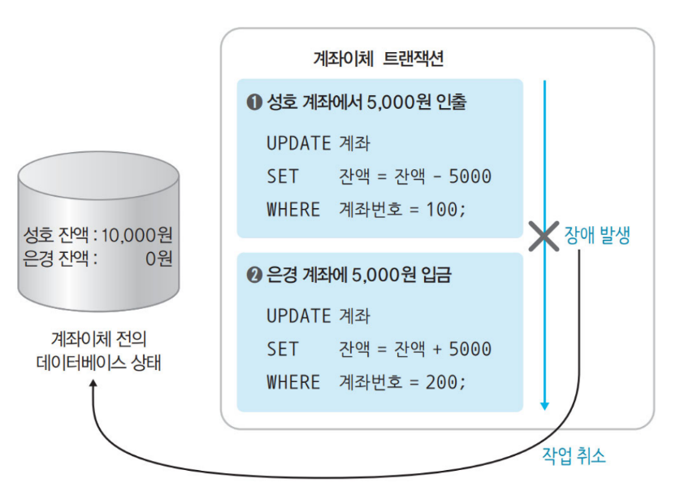

---

### 일관성

: 트랜잭션이 종료된 후에도 데이터베이스는 일관된 상태를 유지해야 한다.

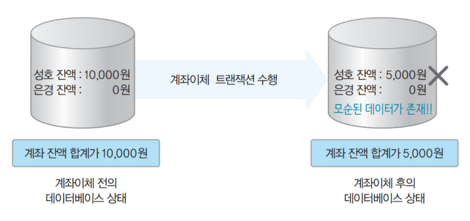

---

### 격리성(고립성)

: 한 트랜잭션이 완료되기 전에는 갱신 중인 데이터를 다른 트랜잭션들이 접근하면 안된다.

- 여러 트랜잭션이 동시에 수행되더라도 일관된 결과를 얻을 수 있도록 제어해야 한다.
- 요구 사항에 따라 **다양한 격리 수준을 제공(isolation level)**
    
    → 프로그래머의 역할
    
    - 격리성이 낮아지면 데이터에 문제가 생길 수 있다.

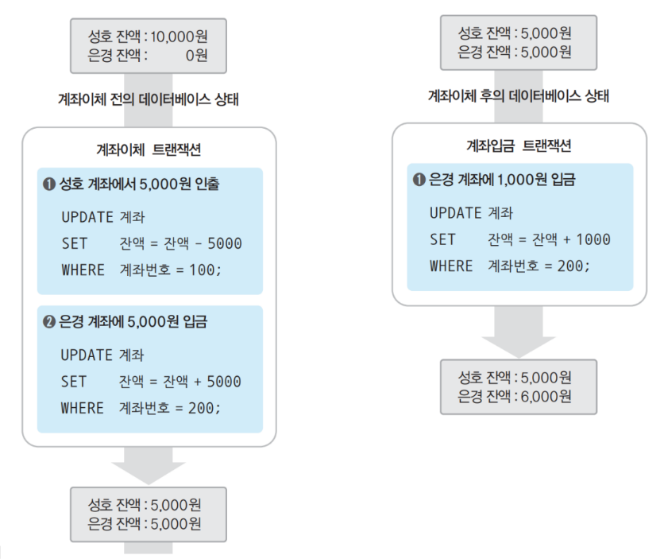

---

### 지속성

- 트랜잭션의 수행 결과는 영구적이어야 한다.
- 메모리에서 데이터를 수정후 디스크(데이터베이스)에 옮길 때 문제가 발생 수 있다.

### 트랜잭션을 지원하는 DBMS 기능

**원자성, 지속성 → 회복기능**

**일관성, 격리성 → 병행 제어 기능**

## 트랜잭션 연산

### commit 연산

: 트랜잭션이 성공적으로 완료되었다고 선언하는 연산

- commit 연산 후 트랜잭션 실행 결과가 데이터베이스에 반영된다.

### rollback 연산

: 트랜잭션 수행이 실패했음을 선언하는 연산

- 트랜잭션이 지금까지 실행한 연산의 결과가 취소

# 장애와 회복

## 장애의 유형

1. 트랜잭션 장애
    
    : 트랜잭션 수행 오류로 인한 장애
    
2. 시스템 장애
    
    : 하드웨어의 결함으로 인한 장애
    
    `ex` 하드웨어 이상으로 메인 메모리에 저장된 정보가 손실
    
3. 미디어 장애
    
    : 디스크 장치의 결함으로 디스크에 저장된 데이터베이스가 손상된 상태
    

## 데이터베이스의 저장 연산

### 데이터베이스 저장 장치 종류

1. 휘발성 저장 장치
    
    → 장애가 발생하면 데이터 손실 `ex` 메인 메모리
    
2. 비휘발성 저장 장치
    
    → 디스크에 문제가 생시면 데이터 손실
    
3. 안정 저장 장치
    
    → 비휘발성 저장 장치를 이용해 데이터 복사본 여러 개를 만드는 방법
    

### 트랜잭션 수행을 위한 데이터 이동 연산

- 디스크와 메인 메모리 간의 데이터 이동
    - **input**: 디스크 블록(데이터 베이스)에 저장되어 있는 데이터를 메모리 버퍼 블록에 이동
    - **output**: input과 반대
- 메인 메모리와 프로그램 변수 간 데이터 이동
    - **read:** 메인 메모리 버퍼 블록에 저장되어 있는 데이터를 프로그램의 변수로 읽어오는 것
    - **write:** read와 반대

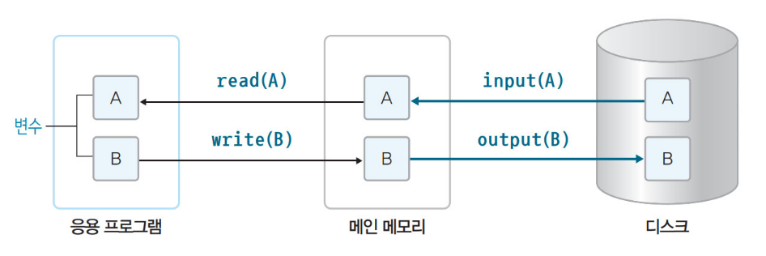

---

+) 메인 메모리에서 데이터를 한번에 모아 디스크로 이동시킨다.

→ 성능을 고려하기 때문이다.

## 회복 기법

### 회복의 필요할 때

1. 트랜잭션을 수행하는 도중 시스템 다운
2. 트랜잭션이 완료(commit) 직후에 시스템이 다운 → output 단계
    
    : 갱신 효과가 주기억 장치로부터 디스크에 기록되지 않을 수 있다.
    

### 회복

: 장애가 발생하기 전의 일관된 상태로 복구시키는 것

+) 성능을 위해 버퍼의 내용을 디스크에 기록하는 횟수를 줄이는 것이 일반적이다.

### How? 회복

1. 고장이 발생하기 전에 트랜잭션 완료가 안됐을 때
    
    : **취소(undo)**
    
2. 고장이 발생하기 전에 트랜잭션이 완료됐을 때
    
    : **재수행(redo)**
    

### 회복을 위한 연산

1. **로그**
    
    : 트랜잭션 연산이 실행될 때마다 데이터 변경 이전 값과 이후 값을 별도의 파일에 기록
    
2. **재실행(redo)**
    
    : 로그를 이용해 실행된 모든 변경 연산을 재실행하여 **장애가 발생하기 직전의 상태로 복구**
    
    → 트랜잭션이 완료(commit)되고 난 후 장애가 발생했을 때
    
3. **취소(undo)**
    
    : 로그를 이용해 지금까지 실행된 모든 변경 연산을 취소해 **초기 상태로 복구**
    
    → 트랜잭션이 완료 되기 전 단계에 장애가 생겼을 때
    

### 로그 파일

: 데이터 변경 이전 값과 이후 값을 기록한 파일

---

→ 데이터베이스의 변경에 관련되는 것을 중심으로 로그를 기록한다.

# 회복 기법 - 로그 회복 기법

## 즉시 갱신 회복 기법

: 트랜잭션 수행 중에 데이터 변경 결과를 데이터베이스 버퍼에 즉시 저장

→ 로그 기록, 데이터 수정 병행

- redo나 undo 연산을 실행해 데이터베이스를 복구

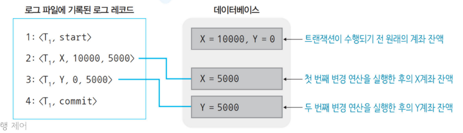

---

### 즉시 갱신 회복 기법의 회복 전략

1. commit 전(트랜잭션 완료 전)에 장애가 발생
    
    → undo 연산 실행(초기 데이터 값으로 돌아가는 것)
    
2. commit 후(트랜잭션 완료 후)에 장애가 발생
    
    → redo 연산 실행 
    

**적용**

---

---

장애 발생 시 회복 모듈의 기능

1. 로그 레코드를 위에서 아래로 순차적으로 읽는다.
2. 완료된 트랜잭션과 완료되지 않은 트랜잭션을 파악한다.
3. 완료된 트랜잭션은 redo(재실행)를 실행하고 완료되지 않은 트랜잭션은 undo(취소)를 실행한다.
    1. redo는 새로운 데이터(new)로 덮어 쓴다. 즉 위에서 아래로 
    2. undo는 초기 데이터(old)로 덮어 쓴다. 즉 아래에서 위로

## 지연 갱신 회복 기법

: 트랜잭션 수행 중에 데이터 변경 결과를 **로그에만 기록**하고 **트랜잭션이 부분 완료된 후**에 **로그에 기록된 내용을 데이터베이스에 한번에 반영**

- 트랜잭션 수행 중에 장애가 발생한 경우, 로그에 기록된 내용을 버리기만 하면된다.
    
    → undo 연산을 필요없고 redo 연산만 사용
    

### 로그 먼저 쓰기

: 데이터베이스 버퍼보다 로그 버퍼를 먼저 디스크에 기록한다.

데이터베이스 버퍼를 로그 버퍼보다 디스크에 기록하는 경우 생기는 문제점

---

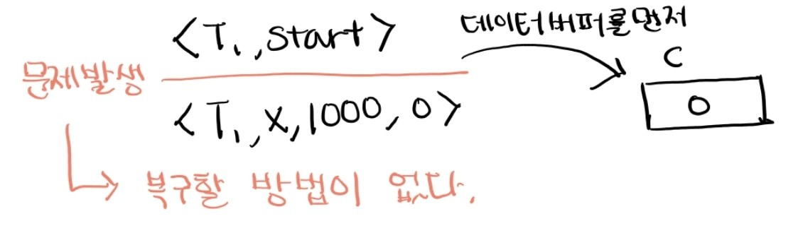

---

## 검사 시점(checkpoint) 회복 기법

: 일정 시간 간격으로 검사 시점을 만든다.

- 장애 발생 시 최근 검사 지점 이후의 트랜잭션에만 회복 작업 수행

### 체크포인트가 없는 로그

---

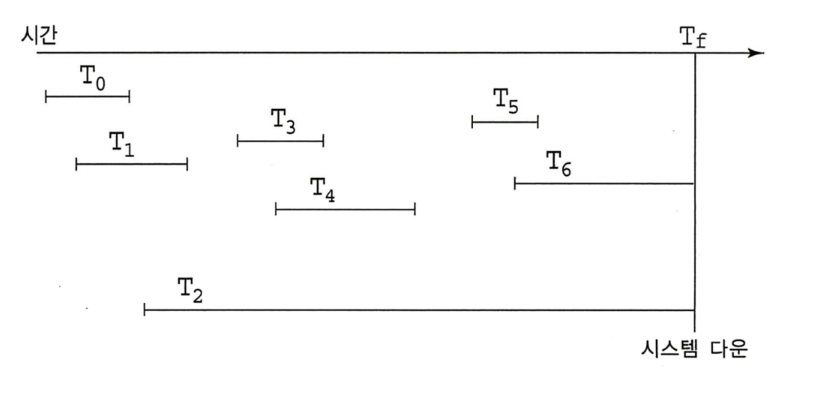
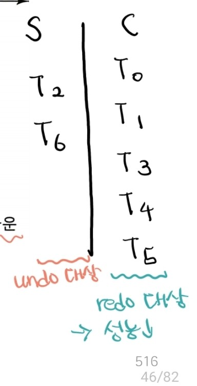

---

### 체크포인트가 있는 로그

---

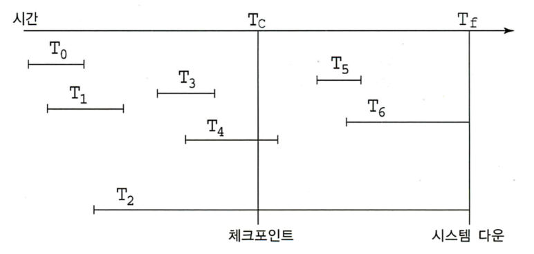

---

→ redo할 트랜잭션 수가 줄어 성능을 개선한다.

# 병행 제어

: 여러 개의 트랜잭션을 동시에 수행하는 것의 의미

→ 인터리빙 방식으로 진행

## 병행 제어를 하지 않을 때 발생되는 문제

### 갱신 손실(lost update)

: 수행 중인 트랜잭션이 갱신한 내용을 다른 트랜잭션이 덮어 씀으로써 갱신이 무효화되는 문제

---

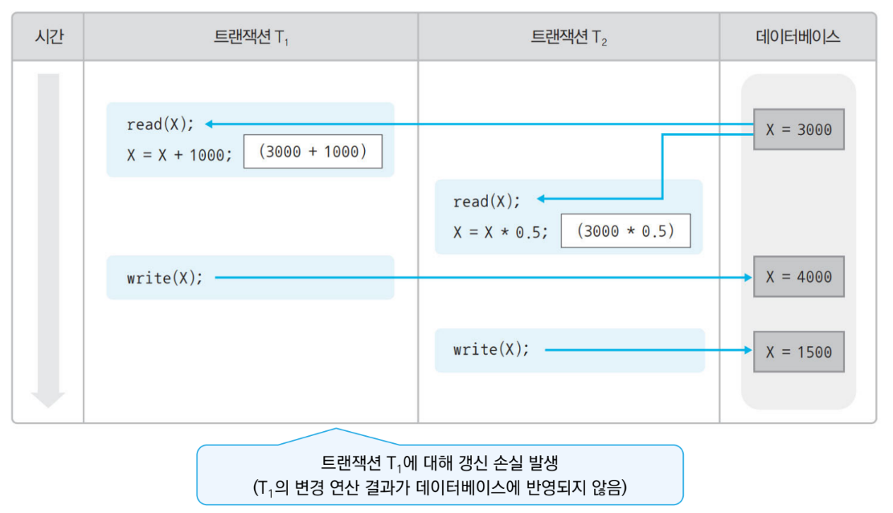

---

→ T1의 수행 결과인 `X = 4000`을 T2 수행 결과인 `X = 1500`이 덮어씀

### 반복할 수 없는 읽기(unrepeatable read)

: 한 트랜잭션이 동일한 데이터를 두 번 읽을 때 서로 다른 값을 읽는 문제

---

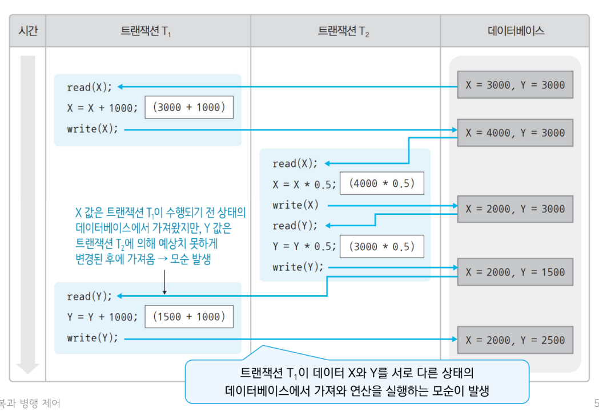

---

→ 연산을 수행 후 write을 해주었기 때문에 갱신 손실은 발생하지 않는다.

### 오손 데이터 읽기

: 완료되지 않은 트랜잭션이 갱신한 데이터를 다른 트랜잭션이 읽었을 때 발생하는 문제

---

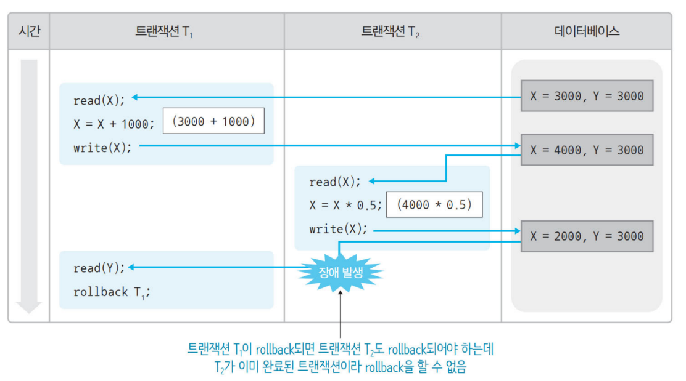

---

## 트랜잭션 스케줄

### 직렬 가능 스케줄

: 직렬 스케줄과 같이 정확한 겨로가를 생성하는 비직렬 스케줄

## 병행 제어 기법 - 로킹 기법(locking)

: 병행 수행되는 트랜잭션들이 같은 데이터에 접근하지 못하도록 lock과 unlock 연산을 이용

- read 또는 write 연산을 실행하기 전 lock 연산을 실행
- unlock 연산을 실행해서 독점권 반납

### lock 연산의 두 가지 종류

1. 공용 lock
    
    : read 연산만 실행할 수 있다. 그리고 해당 데이터에 다른 트랜잭션도 공용 lock 연산이 가능
    
2. 전용 lock
    
    : write 연산과 read 연산을 실행할 수 있다. 그러나 다른 트랜잭션은 어떤 lock 연산도 실행할 수 없다.
    

---

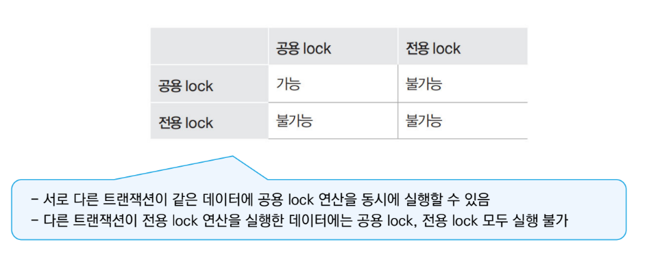

---

### 2단계 로킹 규약

---

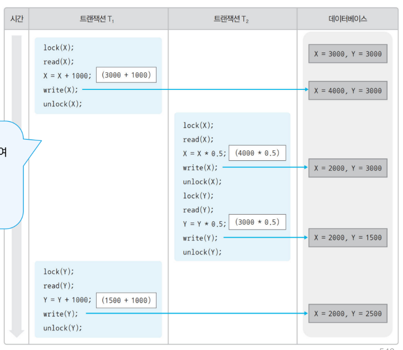

---

→ T1이 데이터 X에 너무 빨리 unlock 연산을 실행해 T2가 일관성 없는 데이터에 접근

: 2단계 로킹 규약으로 해결

2단계 로킹 규약: lock과 unlock 연산의 수행 시점에 대한 새로운 규약 추가

- 확장단계: 트랜잭션이 lock 연산만 실행가능, unlock 연산은 실행할 수 없는 단계
- 축소 단계: 트랜잭션이 unlock 연산만 실행 가능, lock 연산은 실행할 수 없는 단계

---

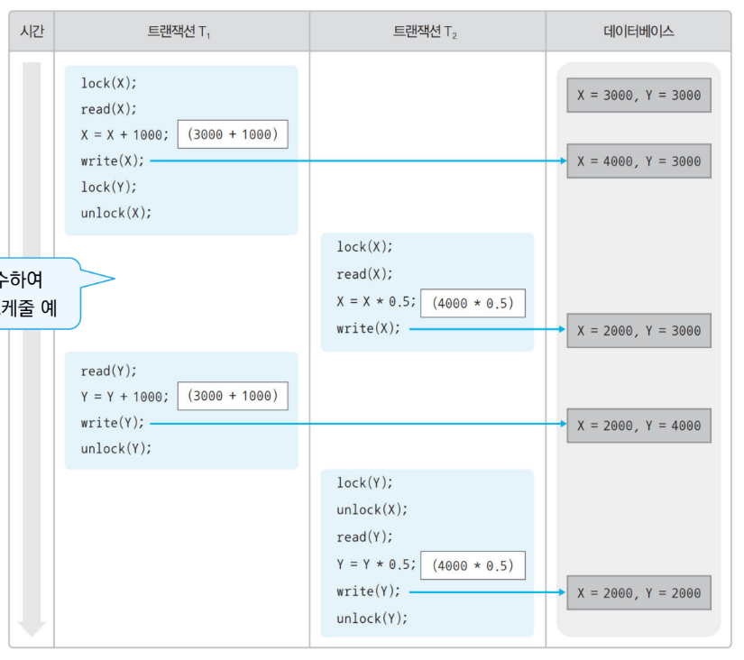

---

### 로킹 단위

: lock 연산을 실행하는 대상 데이터의 크기

1. 로킹 단위가 커질수록 병행성을 낮아지지만 제어가 쉽다.
2. 로킹 단위가 작아질수록 제어가 어렵지만 병행성은 높다.

### 팬텀 문제

: 한 트랜잭션 T1에 속한 첫 번째 SELECT문과 두 번째 SELECT 문의 수행 결과가 다르게 나타난다.

---

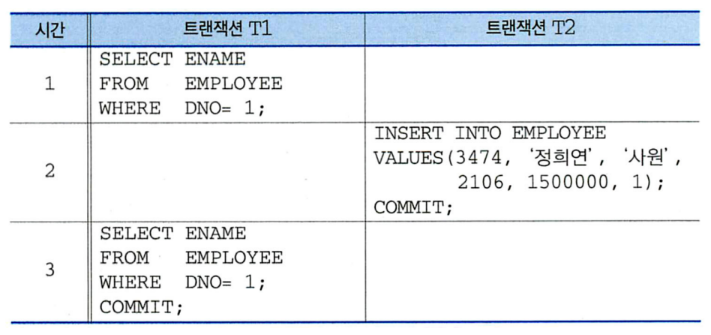

---