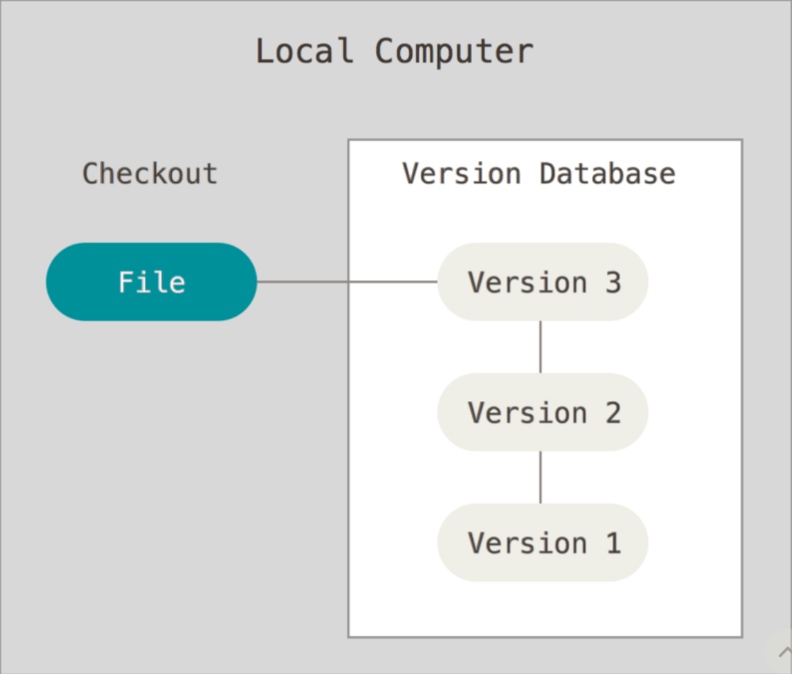
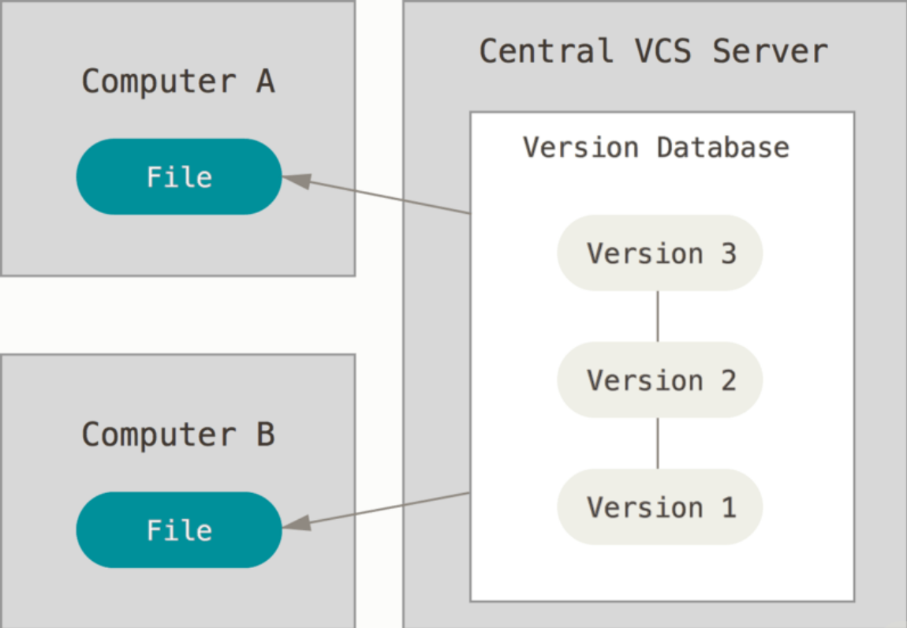
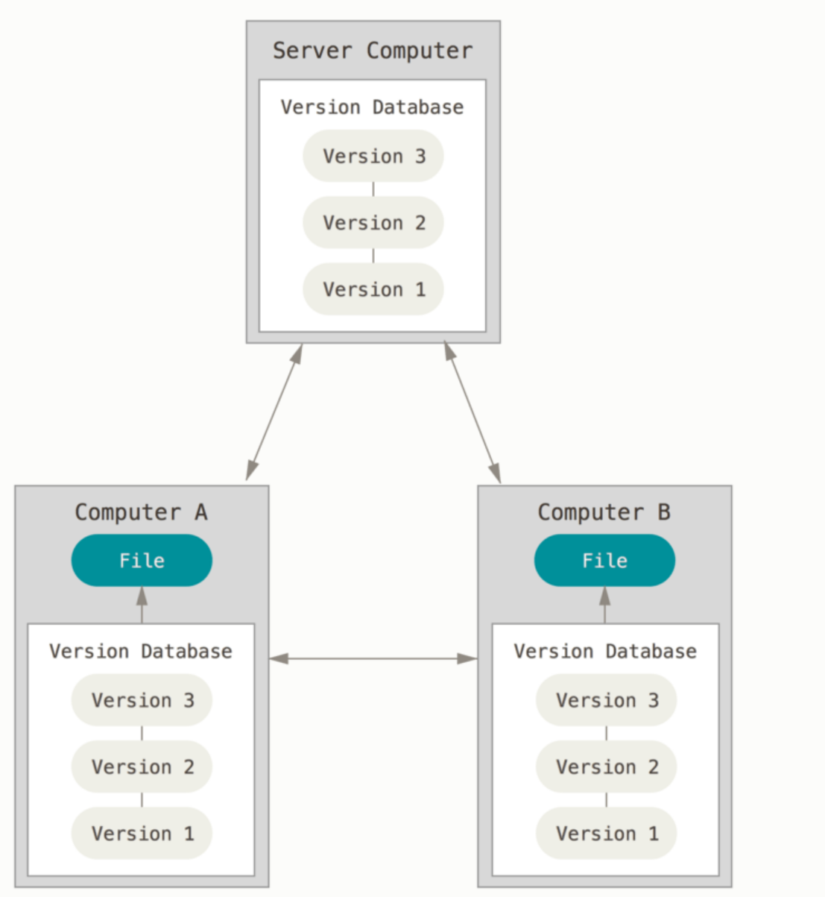

# 1.1 버전 관리란?

---

## 버전 관리란?

버전 관리 시스템(Vesion Control System)

- 파일 변화를 시간에 따라 기록했다가 특정 시점의 버전을 다시 꺼내올 수 있는 시스템

### 로컬 버전 관리

보통 버전을 관리하기 위해 디렉토리로 파일을 복사하는 방법을 사용한다.

그렇지만, 잘못되기 쉽다. 

→ 작업하던 디렉토리를 지워버리거나, 실수로 파일을 잘못 고칠 수 있고, 잘못 복사할 수 있다.

위와 같은 이유로 로컬 VCS라는 것을 만들었다.

이 VCS는 간단한 데이터베이스를 사용해 파일의 변경 정보를 관리

많이 쓰는 VCS 도구 → RCS(Revision Control System)

- RCS는 기본적으로 Patch Set(파일에서 변경되는 부분)을 관리
- 일련의 Patch Set을 적용해 모든 파일을 특정 시점으로 되돌릴 수 있다.

### 중앙 집중식 버전 관리(CVCS)

프로젝트를 진행하다 보면 다른 개발자와 함께 작업을 해야 한다.

→ 이를 위해 CVCS가 개발

CVS, Subversion, Perforce 같은 시스템은 파일을 관리하는 서버가 별도 존재

클라이언트가 중앙 서버에서 파일을 받아 사용(Checkout)

CVCS 환경은 로컬 VCS에 비해 장점이 많다.

- 관리자는 누가 무엇을 할지 관리
- 모든 클라이언트가 로컬 데이터베이스를 관리하는 것보다 중앙 VCS 하나를 관리하는 것이 쉽다.

CVCS 환경의 치명적인 결점

- 중앙 서버에 발생한 문제
    
    서버가 다운되면 협업할 수 없고 사람들이 하는 일을 백업할 방법도 없다.
    
- 중앙 데이터 베이스가 있는 하드디스크에 문제
    
    프로젝트의 모든 히스토리를 잃는다.
    

### 분산 버전 관리 시스템(DVCS)

Git과 같은 DVCS에서의 클라이언트는 단순히 파일의 마지막 스냅샷을 Checkout 하지 않는다.

- 저장소를 히스토리와 더불어 전부 복제(Clone)
- 서버에 문제가 생길 시, 이 복제물로 다시 작업을 시작
- 클라이언트 중 아무거나 골라서 서버를 복원

대부분의 DVCS 환경에서는 remote(원격) 저장소가 존재