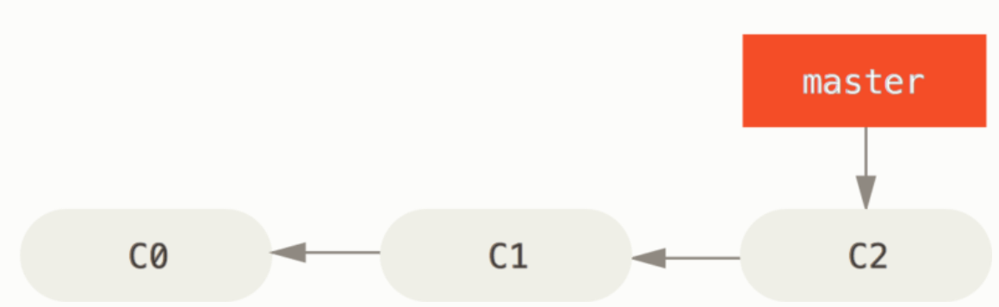
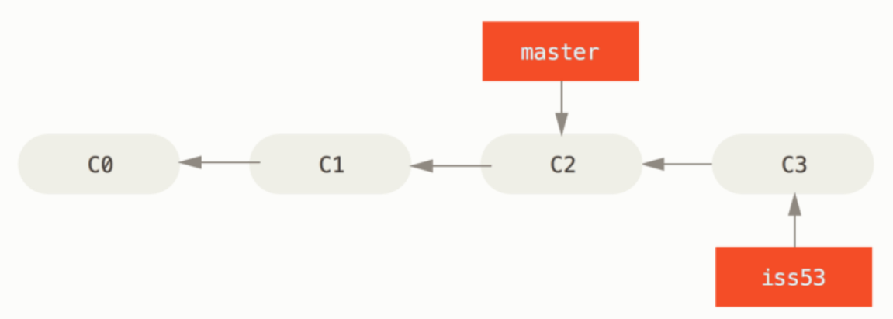
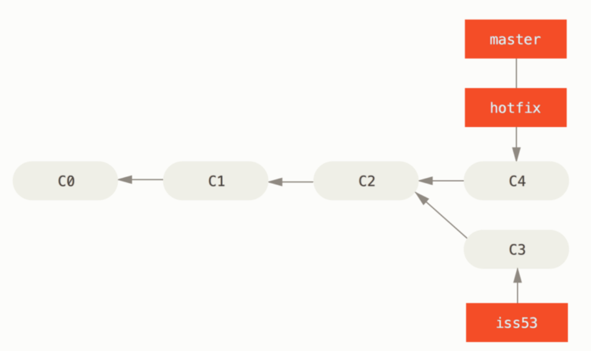
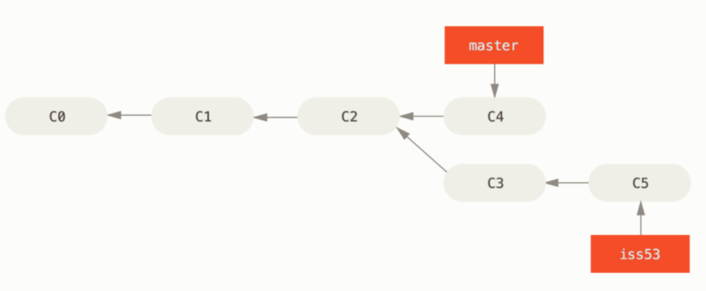
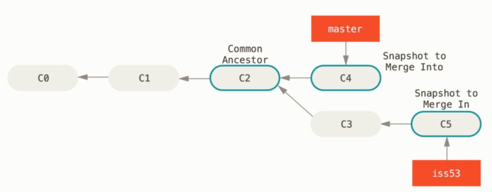
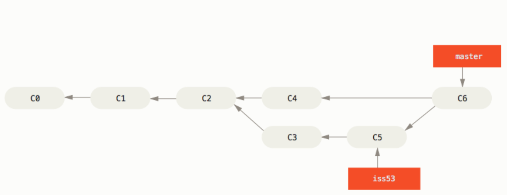

# 3.2 브랜치와 Merge의 기초

# 브랜치와 Merge의 기초

브랜치와 Merge는 보통 다음과 같은 식으로 진행

1. 웹사이트가 있고 작업을 진행
2. 새로운 이슈를 처리할 때 Branch를 하나 생성
3. 새로 만든 Branch에서 작업을 진행

이때 중요한 문제가 생겨 그것을 해결하는 Hotfix를 먼저 만들어야 한다.

1. 새로운 이슈를 처리하기 전, 운영(Production) 브랜치로 이동
2. Hotfix 브랜치 새로 하나 생성
3. 수정한 Hotfix 테스트를 마치고 운영 브랜치로 Merge
4. 다시 작업하던 브랜치로 이동해 하던 일을 진행한다.

## 브랜치의 기초

먼저 지금 작업하는 프로젝트에서 이전에 master 브랜치에 커밋을 몇 번 진행



현재 커밋 히스토리

53번 이슈를 처리해야 한다.

→ 이 이슈를 해결할 브랜치를 새로 하나 생성

브랜치를 만들면서 Checkout까지 한번에 하려면 `git checkout -b`라는 옵션 추가

```tsx
$ git checkout -b iss53
Switched to a new branch "iss53"
```

위 명령은 아래 명령을 간단하게 한 것

```tsx
$ git branch iss53
$ git checkout iss53
```


→ 브랜치 포인터를 새로 만들었다.

`iss53` 브랜치를 Checkout 했다(`HEAD`는 `iss53` 브랜치를 가리킴)

- 이제 커밋을 하면 iss53 브랜치가 앞으로 나아간다.

```tsx
$ vim index.html
$ git commit -a -m 'added a new footer [issue 53]'
```



---

다른 상황을 가정해보자.

만드는 프로젝트에 문제가 생겨 즉시 고쳐야 한다.

→ 버그를 해결할 Hotfix에 iss53이 섞이는 것을 방지하기 위해 iss53 코드를 어딘가에 저장하고 원래 운영 환경의 소스로 복귀해야 한다.

Git을 사용하면 이런 노력을 들일 필요없고 그냥 master 브랜치로 돌아가면 된다.

하지만 브랜치를 이동하려면 해야 할 일이 있다.

- 아직 커밋하지 않은 파일이 Checkout 할 브랜치와 충돌 나면 브랜치를 변경할 수 없다.
    
    → 브랜치를 변경하기 전, 워킹 디렉토리를 정리하는 것이 좋다.
    
    이런 문제를 다루는 방법은 Stashing과  Cleaning에서 다룰 예정
    
    지금은 작업하던 것을 모두 커밋 후 master 브랜치로 이동
    
    ```tsx
    $ git checkout master
    Switched to branch 'master'
    ```
    

이때 워킹 디렉토리는 53번 이슈를 시작하기 이전 모습으로 돌아간다.

→ 새로운 문제에 집중할 수 있는 환경이 만들어진다.

**Git은 자동으로 워킹 디렉토리에 파일들을 추가, 삭제, 수정해 Checkout한 브랜치의 마지막 스냅샷으로 되돌려 놓는다.**

이제 hotfix 브랜치를 만들고 새로운 이슈를 해결

```tsx
$ git checkout -b hotfix
Switched to a new branch 'hotfix'
$ vim index.html
$ git commit -a -m 'fixed the broken email address'
[hotfix 1fb7853] fixed the broken email address
 1 file changed, 2 insertions(+)
```

운영환경에 적용하기 위해 문제를 제대로 고쳤는지 테스트하고 최종적으로 운영환경을 배포하기 위해 hotfix 브랜치를 master 브랜치에 합쳐야 한다.

→ `git merge` 명령어 사용

```tsx
$ git checkout master
$ git merge hotfix
Updating f42c576..3a0874c
Fast-forward
 index.html | 2 ++
 1 file changed, 2 insertions(+)
```

**Merge 메시지의 “fast-forward”**

hotfix 브랜치가 가리치는 C4 커밋이 C2 커밋에 기반한 브랜치

→ 브랜치 포인터는 Merge 과정없이 그저 최신 커밋으로 이동

이러한 Merge 방식을 **“Fast-forward”**라 부른다.

이제 hotfix는 master 브랜치에 포함됐고 운영환경에 적용할 수 있다.



---

이제 다시 일하던 브랜치로 복귀 → 더 이상  필요없는 hotfix 브랜치는 삭제

→ `git branch -d`

```tsx
$ git branch -d hotfix
Deleted branch hotfix (3a0874c).
```

이제 이슈 53번을 처리하던 환경으로 되돌아 가 하던 일 진행

```tsx
$ git checkout iss53
Switched to branch "iss53"
$ vim index.html
$ git commit -a -m 'finished the new footer [issue 53]'
[iss53 ad82d7a] finished the new footer [issue 53]
1 file changed, 1 insertion(+)
```



→ master와 별개로 진행되는 iss53 브랜치

💥**이전에 작업한 hotfix가 iss53브랜치에 영향을 끼치지 않았다는 점을 이해해야 한다.**

`git merge master` 명령으로 master 브랜치를 iss53 브랜치에 Merge

→ iss53 브랜치에 hotfix가 적용

## Merge의 기초

53번 이슈를 다 구현 → master 브랜치에 Merge하는 과정 살펴보기

`git merge` 명령으로 합칠 브랜치에서 합쳐질 브랜치를 Merge

```tsx
$ git checkout master
Switched to branch 'master'
$ git merge iss53
Merge made by the 'recursive' strategy.
index.html |    1 +
1 file changed, 1 insertion(+)
```

hotfix를 Merge 했을 때와 메시지가 다르다.

현재 브랜치가 가리키는 커밋은 Merge할 브랜치의 조상이 아니다

→ Git은 ‘Fast-forward’로 Merge하지 않는다.

→ 이 경우 각 브랜치가 가리키는 커밋 두 개와 공통 조상 하나를 사용해 “3-way-Merge”를 진행



“3-way Merge”의 결과를 별도의 커밋으로 만들고 해당 브랜치가 그 커밋을 가리키도록 이동시킨다.

→ 이런 커밋은 부모가 여러 개고 Merge 커밋이라 부른다.



iss53 브랜치는 더 이상 필요가 없다.

다음 명령으로 해당 브랜치 삭제하고 이슈의 상태를 처리 완료로 표시

```tsx
$ git branch -d iss53
```

## 충돌의 기초

3-way Merge가 실패하는 경우가 있다.

→ Merge하는 두 브랜치에서 같은 파일의 한 부분을 동시에 수정하고 Merge하면 Git은 해당 부분을 Merge하지 못한다.

`ex` 53번 이슈와 hotfix가 같은 부분을 수정 → Git은 Merge 하지 못하고 아래와 같은 충돌 메시지 출력

```tsx
$ git merge iss53
Auto-merging index.html
CONFLICT (content): Merge conflict in index.html
Automatic merge failed; fix conflicts and then commit the result.
```

자동으로 Merge하지 못해 새 커밋이 생기지 않는다.

→ 변경사항의 충돌을 개발자가 해결해야 한다.

Merge 충돌이 났을 때 Git이 어떤 파일을 Merge할 수 없었는지 확인하려면 `git status` 명령을 이용

```tsx
$ git status
On branch master
You have unmerged paths.
  (fix conflicts and run "git commit")

Unmerged paths:
  (use "git add <file>..." to mark resolution)

    both modified:      index.html

no changes added to commit (use "git add" and/or "git commit -a")
```

충돌이 일어난 파일은 unmerged 상태로 표시

해당 부분을 수동으로 해결

```tsx
<<<<<<< HEAD:index.html
<div id="footer">contact : email.support@github.com</div>
=======
<div id="footer">please contact us at support@github.com</div>
>>>>>>> iss53:index.html
```

충돌을 해결하려면 위쪽이나 아래쪽 내용 중에서 고르거나 새로 작성하여 Merge한다.

충돌을 해결하는 예제

```tsx
<div id="footer">
please contact us at email.support@github.com
</div>
```

충돌한 양쪽에서 조금씩 가져와서 새로 수정, `<<<<<<<`, `=======`, `>>>>>>>` 가 포함된 행을 삭제

→ 이렇게 충돌한 부분을 해결 → `git add`  명령으로 다시  Git에 저장

(merge 도구를 활용해 충돌을 해결하고 도구를 종료하면 자동으로 `git add`가 수행되고 해당 파일이 Staging Area에 저장)

`git status` 명령으로 충돌이 해결된 상태인지 다시 한번 확인

```tsx
$ git status
On branch master
All conflicts fixed but you are still merging.
  (use "git commit" to conclude merge)

Changes to be committed:

    **modified:   index.html**
```

`git commit` 명령으로 Merge한 것을 커밋

충돌을 해결하고 Merge할 때 커밋 메시지

```tsx
Merge branch 'iss53'

Conflicts:
    index.html
#
# It looks like you may be committing a merge.
# If this is not correct, please remove the file
#	.git/MERGE_HEAD
# and try again.

# Please enter the commit message for your changes. Lines starting
# with '#' will be ignored, and an empty message aborts the commit.
# On branch master
# All conflicts fixed but you are still merging.
#
# Changes to be committed:
#	modified:   index.html
#
```

충돌을 해결했고 좀 더 확인해야 하는 부분은 무엇이고 왜 그렇게 해결했는지에 대해서 자세하기 기록하는 습관이 좋다.