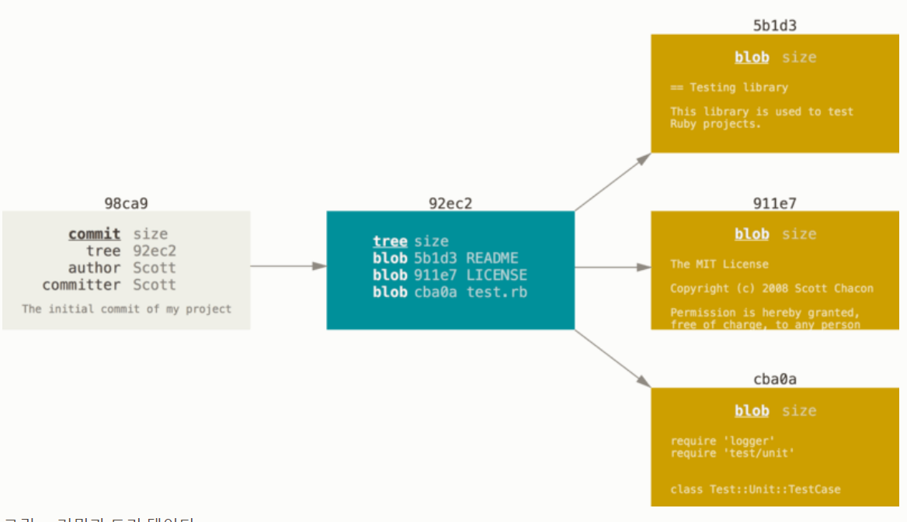
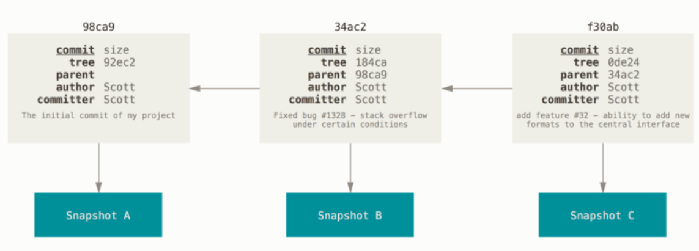
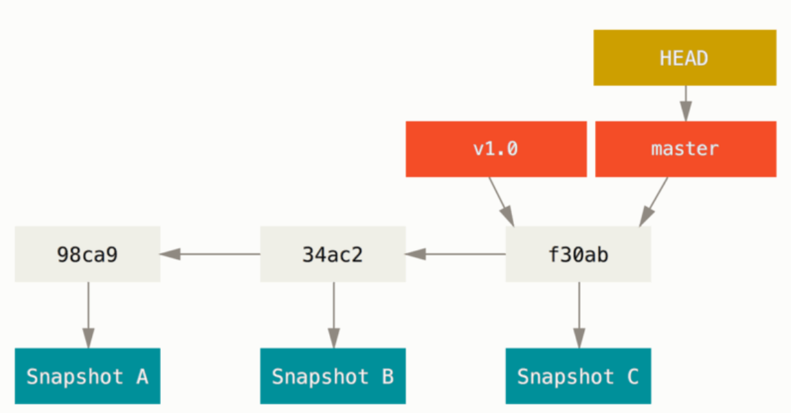
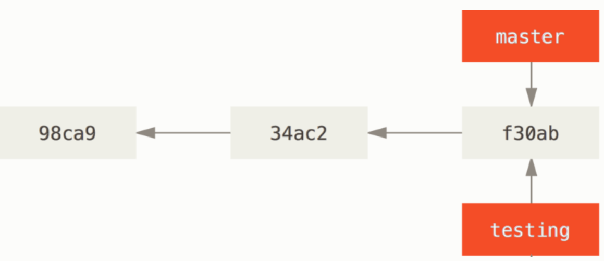
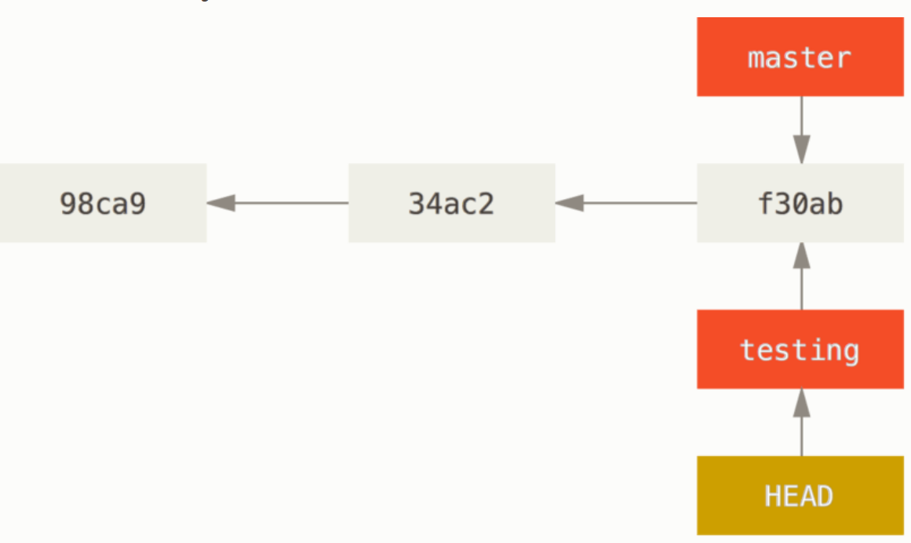
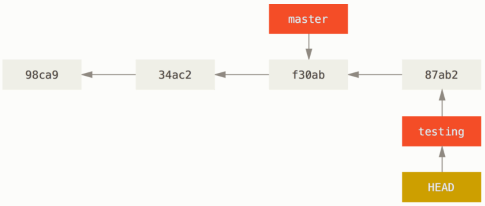
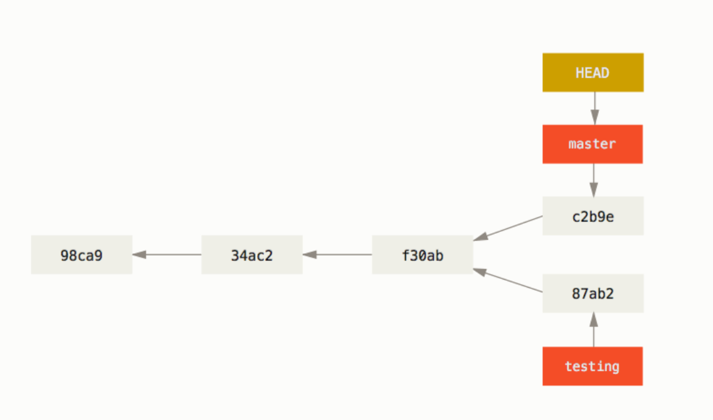

# 3.1 브랜치란 무엇인가

개발을 하다 보면 코드를 여러 개 복사해야 하는 일이 생김

코드를 통째로 복사하고 나서 **원래 코드와 상관없이 독립적으로 개발을 진행**

이렇게 독립적으로 개발하는 것이 바로 **브랜치**다.

Git의 브랜치는 매우 가볍다.

순식간에 브랜치를 새로 만들고 브랜치 사이를 이동

Git은 브랜치를 만들어 작업하고 나중에 Merge하는 방법을 권장

# 브랜치란 무엇인가

Git은 **데이터**를 Change Set이나 변경사항(diff)으로 기록하지 않고 일련의 **스냅샷을 기록**

커밋을 하면 Git은 Staging Area에 있는 데이터의 스냅샷에 대한 포인터, 저자나 커밋 메시지 같은 메타데이터, 이전 커밋에 대한 포인터 등을 포함하는 **커밋 개체(커밋 Object)**를 저장

- 이전 커밋 포인터가 있어 현재 커밋이 무엇을 기준으로 바뀌었는지 알 수 있다.
- 최초 커밋을 제외한 나머지 커밋은 이전 커밋 포인터가 적어도 하나씩 있다.
    
    브랜치를 합친 Merge 커밋은 이전 커밋 포인터가 여러 개 있다.
    

`ex` 파일이 3개 있는 디렉토리 하나, 파일을 Staging Area에 저장하고 커밋하는 예제

1. 파일을 Stage
    - Git 저장소에 파일을 저장(Blob)
    - Staging Area에 해당 파일의 체크섬을 저장
    
    ```tsx
    $ git add README test.rb LICENSE
    ```
    
2. `git commit`으로 커밋
    
    ```tsx
    $ git commit -m 'The initial commit of my project'
    ```
    
    - 먼저 루트 디렉토리와 각 하위 디렉토리의 트리 객체를 체크섬과 함께 저장소에 저장
    - 다음 커밋 개체를 만들고 메타데이터와 루트 디렉토리 트리 객체를 가리키는 포인터 정보를 커밋 개체에 넣어 저장
        
        → 그래서 필요하면 언제든지 스냅샷을 다시 만들 수 있다.
        

위 작업을 마치고 나면 Git 저장소에는 다섯 개의 데이터 개체가 생긴다.

- 각 파일에 대한 Blob 세 개
- 파일과 디렉토리 구조가 들어 있는 트리 개체 하나
- 메타데이터와 루트 트리를 가리키는 포인터가 담긴 커밋 개체 하나



---

다시 파일을 수정하고 커밋 → 이전 커밋이 무엇인지도 저장



---

Git의 브랜치는 커밋 사이를 가볍게 이동할 수 있는 포인터 같은 것

- 기본적으로 Git은 master(main) 브랜치를 생성
- 처음 커밋을 하게 되면 이 main 브랜치가 생성된 커밋을 가리킨다.
    
    이후 커밋을 만들면 main 브랜치는 자동으로 가장 마지막 커밋을 가리킨다.
    



**Note**

main 브랜치는 다른 것이 없다.

다만 모든 저장소에 main 브랜치가 존재하는 이유

- git init 명령으로 초기화할 때 자동으로 만들어진 이 브랜치를 다른 이름으로 변경하지 않기 때문

## 새 브랜치 생성하기

`git branch` 명령으로 testing 브랜치 생성

```tsx
$ git branch testing
```

새로 만든 브랜치도 마지막 커밋을 가리킨다.



→ 한 커밋 히스토리를 가리키는 두 브랜치

---

Git은 **‘HEAD’**라는 특수한 포인터가 있다.

이 포인터는 지금 작업하는 로컬 브랜치를 가리킨다.

- 브랜치를 새로 만들었지만, Git은 아직 master 브랜치를 가리킨다.
    
    `git branch` 명령은 브랜치를 만들기만 하고 브랜치를 옭기지 않는다.
    
    
    
    → 현재 작업 중인 브랜치를 가리키는 HEAD
    

git log  명령에 --decorate 옵션을 사용하면 브랜치가 어떤 커밋을 가리키는지 확인

```tsx
$ git log --oneline --decorate
**f30ab (HEAD -> master, testing)** add feature #32 - ability to add new formats to the central interface
34ac2 Fixed bug #1328 - stack overflow under certain conditions
98ca9 The initial commit of my project
```

“**f30ab (HEAD -> master, testing)” → 브랜치가 어떤 커밋을 가리키는지 확인**

## 브랜치 이동하기

`git checkout` 명령으로 다른 브랜치로 이동

testing 브랜치로 이동

```tsx
git checkout testing
```

이제 HEAD는 testing 브랜치를 가리킨다.



---

커밋을 새로 만들어 보자.

```tsx
$ vim test.rb
$ git commit -a -m 'made a change'
```



→ HEAD가 가리키는 testing 브랜치가 새 커밋을 가리킨다.

---

**💥이 부분이 흥미롭다.**

→ 새로 커밋해서 testing 브랜치는 최신 커밋 이동했지만, master 브랜치는 여전히 이전 커밋을 가리킨다.

master 브랜치도 돌아가보자.

```tsx
$ git checkout master
```


→ HEAD가 Checkout한 브랜치로 이동

“git checkout master” 명령이 한 2가지

1. master 브랜치가 가리키는 커밋을 HEAD가 가리키함
2. 워킹 디렉토리 파일도 그 시점으로 되돌려 놓는다.

→ 앞으로 커밋을 하면 다른 브랜치의 작업들과 별개로 진행되기 때문에 testing 브랜치에서 임시로 작업하고 원래 master 브랜치로 돌아와서 하던 일을 계속할 수 있다.

**Note**

**브랜치를 이동하면 워킹 디렉토리의 파일이 변경 → 기억하기!**

이전에 작업했던 브랜치로 이동하면 워킹 디렉토리의 파일은 그 브랜치에서 가장 마지막에 했던 작업 내용으로 변경된다.

master 브랜치에서 파일을 수정하고 다시 커밋

```tsx
$ vim test.rb
$ git commit -a -m 'made other changes'
```

프로젝트의 히스토리는 분리되어 진행된다. → 갈라지는 브랜치

우리는 브랜치를 하나 만들어 그 브랜치(testing)에서 일 좀 하고, 다시 원래 브랜치(master) 브랜치로 돌아와 다른 일을 했다. → 두 작업 내용은 서로 독립적으로 각 브랜치에 존재

커밋 사이를 자유롭게 이동하다가 때가 되면 두 브랜치를 Merge하면 된다.



→ 갈라지는 브랜치

git log 명령으로 쉽게 확인

`git log --oneline --decorate --graph --all` 

```tsx
$ git log --oneline --decorate --graph --all
* c2b9e (HEAD, master) made other changes
| * 87ab2 (testing) made a change
|/
* f30ab add feature #32 - ability to add new formats to the
* 34ac2 fixed bug #1328 - stack overflow under certain conditions
* 98ca9 initial commit of my project
```

→ 현재 브랜치가 가리키고 있는 히스토리가 무엇이고 어떻게 갈라져 나왔는지 보여준다.

Git 브랜치는 어떤 한 커밋을 가리키는 40글자 SHA-1 체크섬에 불과

→ 만들기도, 지우기도 쉽다.

브랜치가 필요할 때 프로젝트를 통째로 복사해야 하는 다른 버전 관리 도구와 Git의 차이는 극명

게다가 커밋을 할 때 이전 커밋의 정보를 저장 → Merge할 때 어디서부터(Merge Base) 합쳐야 하는지 안다.