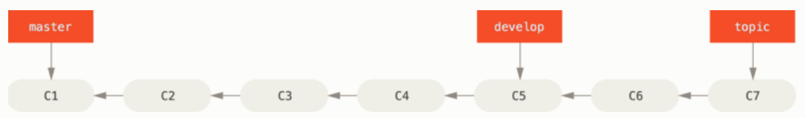
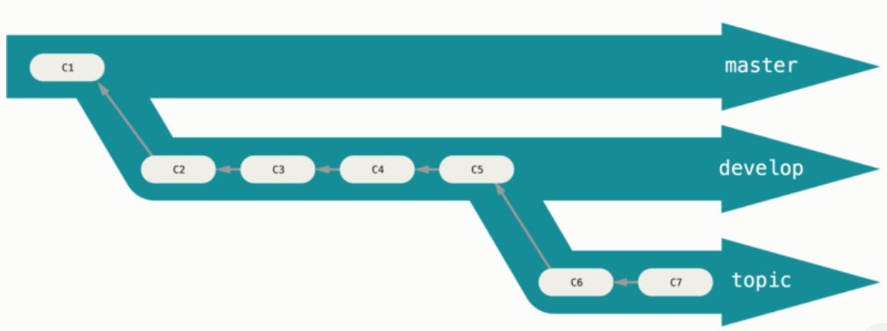
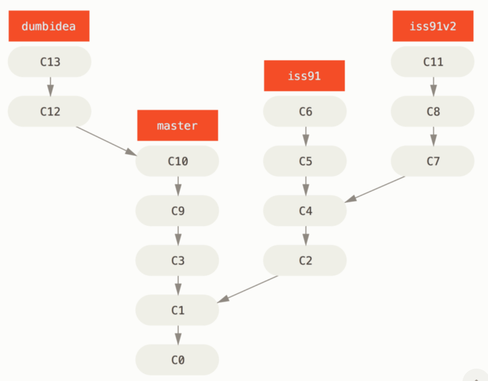
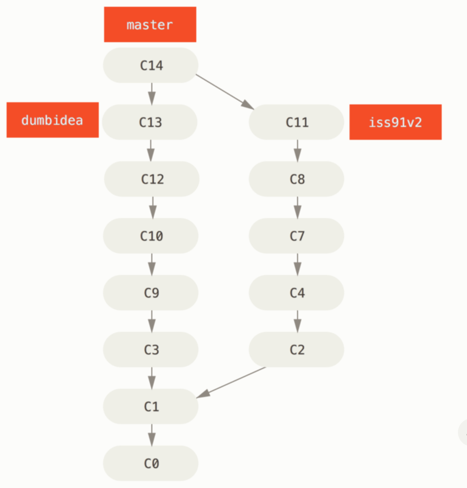

# 3.4 브랜치 워크플로

# 브랜치 워크플로

## Long-Running 브랜치

Git 개발자가 많이 선호하는 워크플로가 하나 있다.

- 배포할 코드만 master 브랜치에 Merge해서 안정 버전의 코드만 master 브랜치에 둔다.
- 개발을 진행하고 안정화가 진행 중인 브랜치는 `develop`이나 `next`라는 이름을 추가로 만들어 사용
    
    → 테스트를 거쳐 안정적이라고 판단되면 master 브랜치에 Merge한다.
    
- 토픽 브랜치(iss53 브랜치 같은 짧은 호흡의 브랜치)
    
    → 해당 토픽을 처리하고 테스트해서 안정적이면 그때 Merge
    

개발 브랜치는 적극적으로 히스토리를 만들어 나가고 안정 브랜치는 이미 만든 히스토리를 뒤따라가며 나아간다.

---

---

개발 브랜치에서 충분히 테스트하고 실전에 배치하는 과정으로 보면 된다.

---

---

중요한 개념: 브랜치를 이용해 여러 단계에 걸쳐서 안정화해 나아가면서 충분히 안정화가 됐을 때 안정 브랜치로 Merge

## 토픽 브랜치

토픽 브랜치: 어떤 한 가지 주제나 작업을 위해 만든 짧은 호흡의 브랜치

`ex` `master` 브랜치를 checkout한 상태에서의 작업

1. 한 이슈를 처리하기 위해 `iss91` 브랜치를 생성후 해당 작업을 수행
2. 같은 이슈를 다른 방법으로 해결해보고 싶어 `iss91v2`브랜치를 만들고 다른 방법을 시도
3. 다른 아이디어를 적용해보기 위해 다시 master 브랜치로 되돌아가 `dumbidea` 브랜치를 하나 더 생성

---

---

1. `iss91v2` 브랜치가 괜찮아서 적용하기로 결정
    
    `dumbidea` 브랜치도 적용하기로 결정
    
    `iss91` 브랜치는 버리고 다른 두 브랜치를 Merge
    

---

---

지금까지 한 작업은 전부 로컬에서만 처리하는 것이었다.