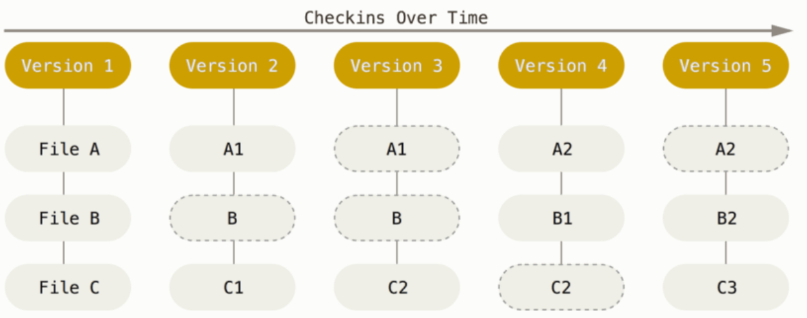
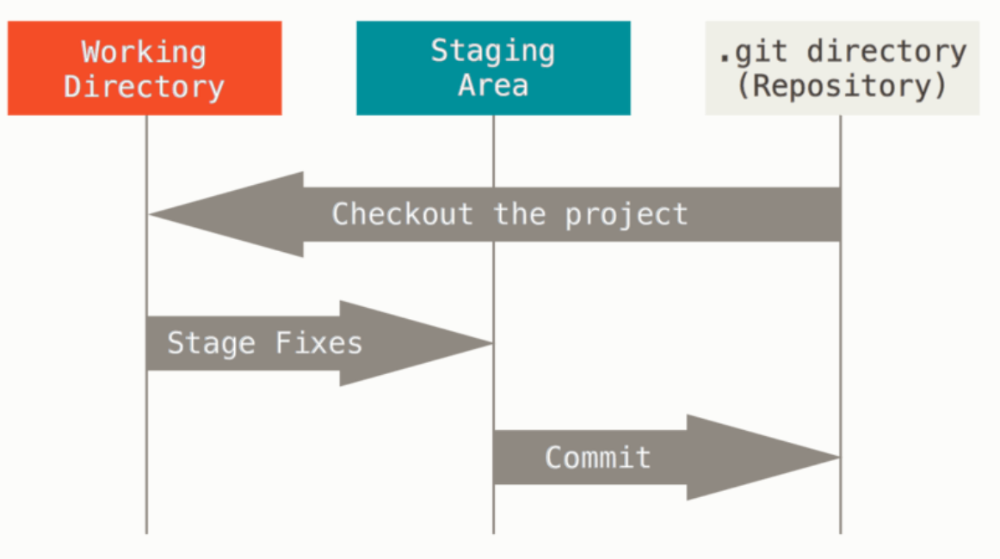

# 1.3 Git 기초

Git은 데이터를 파일 시스템 스냅샷의 연속으로 취급하고 크기가 아주 작다.

커밋하거나 프로젝트의 상태를 저장할 때, 파일이 존재하는 그 순간을 중요하게 여김

Git은 데이터를 **스냅샷의 스트림**처럼 취급

# 거의 모든 명령을 로컬에서 실행

프로젝트의 모든 히스토리가 로컬 디스크에 있기 때문에 모든 명령이 순식간에 실행

`ex` Git은 프로젝트의 히스토리를 조회할 때 서버 없이 조회

→ 로컬 데이터베이스에서 히스토리를 읽어 보여준다.

즉, 파일을 비교하기 위해 원격(remote)에 있는 서버에 접근하여 예전 버전을 가져올 필요 없다.

# 3가지 상태

Git은 파일을 **Committed, Modified, Staged** 이렇게 세 가지 상태로 관리

- Committed
    
    데이터가 로컬 데이터베이스에 안전하게 저장됐다는 것을 의미
    
- Modified
    
    수정한 파일을 아직 로컬 데이터베이스에 커밋하지 않은 것을 말한다.
    
- Staged
    
    현재 수정한 파일을 곧 커밋할 것이라고 표시한 상태를 의미
    

위 상태들은 Git 프로젝트의 **3가지 단계**와 연결

### **Git 디렉토리**

- Git이 프로젝트의 메타데이터와 객체 데이터베이스를 저장하는 곳
- 다른 컴퓨터의 있는 저장소를 Clone할 때 Git 디렉토리 생성

### 워킹 트리(워킹 디렉토리)

- 프로젝트의 특정 버전을 Checkout한 것
- 디스크에 있는 Git 디렉토리의 데이터베이스에서 파일을 가져와 워킹 트리를 만든다.

### Staging Area(Index)

- Git 디렉토리 안에 존재
- 단순한 파일, 곧 커밋할 파일에 대한 정보를 저장

### Git으로 하는 기본적인 일

1. 워킹 트리에서 파일을 수정
2. Staging Area에 파일을 Stage해 커밋할 스냅샷을 만든다.
    
    모든 파일 혹은 선택 파일을 추가
    
3. Staging Area에 있는 파일들을 커밋해 Git 디렉토리에 영구적인 스냅샷 저장

- Git 디렉토리에 있는 파일 → Committed한 상태
- 파일을 수정하고 Staging Area에 추가 → Staged
- Checkout하고 수정했지만, 아직 Staging Area에 추가X → Modified