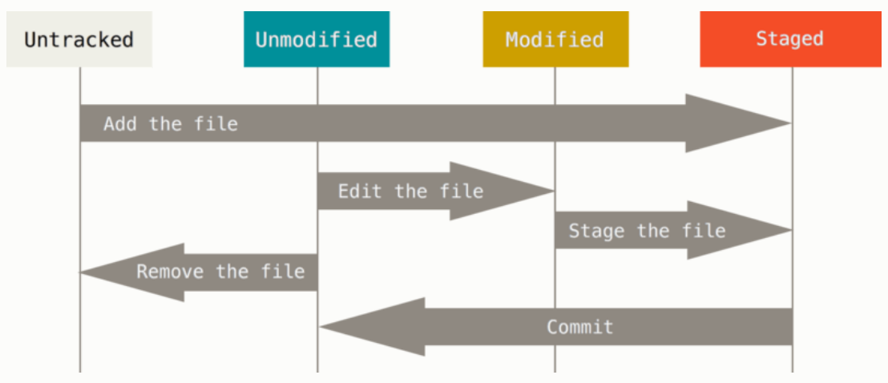

# 2.2 수정하고 저장소에 저장하기

# 수정하고 저장소에 저장하기

---

파일을 수정하고 파일의 스냅샷을 커밋해 보자.

→ 파일을 수정하다가 저장하고 싶으면 스냅샷을 커밋

워킹 디렉토리의 파일의 종류

- Tracked(관리 대상)
    
    이미 스냅샷에 포함되어 있던 파일
    
    Unmodified(수정하지 않음), Modified(수정함), Staged(커밋으로 저장소에 기록할 파일) 상태 중 하나 → Git이 알고 있는 파일
    
- Untracked(관리 대상 아님)
    
    워킹 디렉토리에 있는 파일 중 스냅샷에도 Staging Area에도 포함되지 않는 파일
    

마지막 커밋 이후 어떤 파일을 수정하면 Git은 그 파일을 Modified 상태로 인식

- 수정한 파일을 커밋하기 위해 파일을 Staged 상태로 만들고, Staged 상태의 파일을 커



## 파일의 상태 확인하기

파일 상태 확인 → `git status`

Clone한 후에 위 명령어 실행

```tsx
$ git status
On branch master
Your branch is up-to-date with 'origin/master'.
nothing to commit, working directory clean
```

- Tracked 파일은 하나도 수정X
- Untracked 파일은 아직 존재하지 않아 나타나지 않는다.

프로젝트에 README 파일 생성

- README 파일은 새로 만들 파일
    
    → 상태를 확인하면 Untracked files에 들어 있다.
    

```tsx
$ echo 'My Project' > README
$ git status
On branch master
Your branch is up-to-date with 'origin/master'.
Untracked files:
  (use "git add <file>..." to include in what will be committed)

    README

nothing added to commit but untracked files present (use "git add" to track)
```

Git은 Untracked 파일을 아직 스냅샷(커밋)에 넣어지지 않는 파일

- Tracked 상태가 되기 전까지는 Git은 절대 그 파일을 커밋하지 않는다.
    
    → README 파일을 추가해 Tracked 상태로 만들자.
    

## 파일을 새로 추적하기

`git add` 명령으로 Git은 README 파일을 추적한다.

```tsx
git add README
```

상태를 확인해보자.

→ README 파일은 tracked 상태이면서 커밋에 추가될 Staged 상태라는 것을 확인할 수 있다.

```tsx
$ git status
On branch master
Your branch is up-to-date with 'origin/master'.
Changes to be committed:
  (use "git reset HEAD <file>..." to unstage)

    new file:   README
```

“Changes to be committed”

→ 파일이 Staged 상태라는 것을 의미

- commit을 하면 `git add`를 실행한 시점의 파일이 커밋되어 저장소 히스토리에 남는다.
- git add 명령은 파일 또는 디렉토리를 argument로 받는다.
    
    디렉토리면 아래에 있는 모든 파일들까지 재귀적으로 추가
    

## Modified 상태의 파일을 Staged 하기

Tracked 상태인 파일을 수정하는 방법

[CONTRIBUTING.md](http://CONTRIBUTING.md) 파일 수정 후 상태 확인

```tsx
$ git status
On branch master
Your branch is up-to-date with 'origin/master'.
Changes to be committed:
  (use "git reset HEAD <file>..." to unstage)

    new file:   README

Changes not staged for commit:
  (use "git add <file>..." to update what will be committed)
  (use "git checkout -- <file>..." to discard changes in working directory)

    modified:   CONTRIBUTING.md
```

“Changes not staged for commit”

→ 수정한 파일이 Tracked 상태이지만 아직 Staged 상태는 아니다.

→ `git add` 명령어 실행

git add 명령어 

1. 파일을 새로 추적할 때 사용
2. 수정한 파일을 Staged 상태로 만들 때 사용
3. Merge 할 때 충돌난 상태의 파일을 Resolve 상태로 만들때도 사용

```tsx
$ git add CONTRIBUTING.md
$ git status
On branch master
Your branch is up-to-date with 'origin/master'.
Changes to be committed:
  (use "git reset HEAD <file>..." to unstage)

    new file:   README
    modified:   CONTRIBUTING.md
```

두 파일 모두 Staged 상태 → 다음 커밋에 포함

but, add한 파일에 수정 사항이 생겨 수정하면?

```tsx
$ vim CONTRIBUTING.md
$ git status
On branch master
Your branch is up-to-date with 'origin/master'.
Changes to be committed:
  (use "git reset HEAD <file>..." to unstage)

    new file:   README
    modified:   CONTRIBUTING.md

Changes not staged for commit:
  (use "git add <file>..." to update what will be committed)
  (use "git checkout -- <file>..." to discard changes in working directory)

    modified:   CONTRIBUTING.md
```

→ CONTRIBUTING.md가 Staged 상태이면서 동시에 Unstaged 상태로 나온다.

- 이 시점에서 커밋을 하면?
    
    → git commit 명령을 실행하는 시점의 버전이 커밋되는 게 아니라 마지막으로 git add 명령을 실행했을 떄의 버전이 커밋
    

그래서 git add 명령을 다시 실행해 최신 버전을 Staged 상태로 만들어야 한다.

```tsx
$ git add CONTRIBUTING.md
$ git status
On branch master
Your branch is up-to-date with 'origin/master'.
Changes to be committed:
  (use "git reset HEAD <file>..." to unstage)

    new file:   README
    modified:   CONTRIBUTING.md
```

## 파일 무시하기

어떤 파일은 Git이 관리할 필요가 없다.

→ 보통 로그 파일이나 빌드 시스템

파일을 무시하려면 .gitignore 파일을 생성 후 그 안에 무시할 파일 패턴을 작성

```tsx
$ cat .gitignore
*.[oa]
*~
```

## Staged와 Unstaged 상태의 변경 내용 보기

단순히 파일이 변경되었다는 사실이 아니라 어떤 내용이 변경되었는지 보기 위해선?

→ `git diff`

- Patch처럼 어떤 라인을 추가했고 삭제했는지 확인할 때 사용

README 파일 수정 후 Staged 상태

[CONTRIBUTING.md](http://CONTRIBUTING.md) 파일 수정만 해 둔다.

이 상태에서 git status 명령을 실행

```tsx
$ git status
On branch master
Your branch is up-to-date with 'origin/master'.
Changes to be committed:
  (use "git reset HEAD <file>..." to unstage)

    modified:   README

Changes not staged for commit:
  (use "git add <file>..." to update what will be committed)
  (use "git checkout -- <file>..." to discard changes in working directory)

    modified:   CONTRIBUTING.md
```

git diff 명령을 실행하면 아직 Staged 상태가 아닌 파일을 비교할 수 있다.

```tsx
$ git diff
diff --git a/CONTRIBUTING.md b/CONTRIBUTING.md
index 8ebb991..643e24f 100644
--- a/CONTRIBUTING.md
+++ b/CONTRIBUTING.md
@@ -65,7 +65,8 @@ branch directly, things can get messy.
 Please include a nice description of your changes when you submit your PR;
 if we have to read the whole diff to figure out why you're contributing
 in the first place, you're less likely to get feedback and have your change
-merged in.
+merged in. Also, split your changes into comprehensive chunks if your patch is
+longer than a dozen lines.

 If you are starting to work on a particular area, feel free to submit a PR
 that highlights your work in progress (and note in the PR title that it's
```

→ 이 명령은 워킹 디렉토리에 있는 것과 Staging Area에 있는 것을 비교해 수정하고 아직 Staged 하지 않은 것을 보여준다.

만약 커밋하려고 Staging Area에 넣은 파일의 변경 부분을 보고 싶으면 

→ `git diff --staged` 옵션을 사용

→ 위 명령은 저장소에 커밋한 것과 Staging Area에 있는 것을 비교

```tsx
$ git diff --staged
diff --git a/README b/README
new file mode 100644
index 0000000..03902a1
--- /dev/null
+++ b/README
@@ -0,0 +1 @@
+My Project
```

git diff 명령은 커밋한 후에 수정한 것들 전부를 보여주지 않는다 . 

→ Unstaged 상태인 것들만 보여준다.

수정한 파일을 모두 Staging Area에 넣었다면 git diff 명령은 아무것도 출력되지 않는다.

[CONTRIBUTING.md](http://CONTRIBUTING.md) 파일을  Stage한 후에 수정해도 git diff 명령을 사용

→ Staged와 Unstaged 상태를 비교

```tsx
$ git add CONTRIBUTING.md
$ echo '# test line' >> CONTRIBUTING.md
$ git status
On branch master
Your branch is up-to-date with 'origin/master'.
Changes to be committed:
  (use "git reset HEAD <file>..." to unstage)

    modified:   CONTRIBUTING.md

Changes not staged for commit:
  (use "git add <file>..." to update what will be committed)
  (use "git checkout -- <file>..." to discard changes in working directory)

    modified:   CONTRIBUTING.md
```

git diff 명령으로 Unstaged 상태인 것의 변경 부분을 확인

```tsx
$ git diff
diff --git a/CONTRIBUTING.md b/CONTRIBUTING.md
index 643e24f..87f08c8 100644
--- a/CONTRIBUTING.md
+++ b/CONTRIBUTING.md
@@ -119,3 +119,4 @@ at the
 ## Starter Projects

 See our [projects list](https://github.com/libgit2/libgit2/blob/development/PROJECTS.md).
+# test line
```

Staged 상태인 파일은 git diff --cached 옵션으로 확인 

--staged 와 —cached는 같은 옵션

```tsx
$ git diff --cached
diff --git a/CONTRIBUTING.md b/CONTRIBUTING.md
index 8ebb991..643e24f 100644
--- a/CONTRIBUTING.md
+++ b/CONTRIBUTING.md
@@ -65,7 +65,8 @@ branch directly, things can get messy.
 Please include a nice description of your changes when you submit your PR;
 if we have to read the whole diff to figure out why you're contributing
 in the first place, you're less likely to get feedback and have your change
-merged in.
+merged in. Also, split your changes into comprehensive chunks if your patch is
+longer than a dozen lines.

 If you are starting to work on a particular area, feel free to submit a PR
 that highlights your work in progress (and note in the PR title that it's
```

결과를 보기 쉽게 만들어주는 Diff  도구가 있으면 사용할 수 있다.

# 변경사항 커밋하기

수정한 것을 커밋하기위해 Staged Area에 파일을 정리

Unstaged 파일은 커밋이 되지 않는다.

→ 커밋하기 전, git status 명령으로 모든 것이 Staged 상태인지 확인 그 후에 커밋

```tsx
git commit
```

Git 설정에 지정된 편집기가 실행 

```tsx

# Please enter the commit message for your changes. Lines starting
# with '#' will be ignored, and an empty message aborts the commit.
# On branch master
# Your branch is up-to-date with 'origin/master'.
#
# Changes to be committed:
#	new file:   README
#	modified:   CONTRIBUTING.md
#
~
~
~
".git/COMMIT_EDITMSG" 9L, 283C
```

→ 첫 라인은 비워져있고 둘째 라인부터 git status 명령의 결과로 채워진다.

이 메시지를 포함할 수 있고 메시지를 전부 지우고 새로 작성해도 된다.

내용을 저장하고 편집기를 종료하면 Git은 입력된 내용으로 새 커밋을 하나 완성

메시지를 인라인으로 첨부

→ commit 명령을 실행할 때 `-m` 옵션을 사용

```tsx
$ git commit -m "Story 182: Fix benchmarks for speed"
[master 463dc4f] Story 182: Fix benchmarks for speed
 2 files changed, 2 insertions(+)
 create mode 100644 README
```

commit 명령이 출력하는 정보들

- 어떤 브랜치에 커밋
- 체크섬(463dc4f)
- 수정판 파일이 몇 개이고 삭제됐거나 추가한 라인이 몇 라인인지

커밋할 때마다 프로젝트의 스냅샷을 기록한다

→ 스냅샷끼리 비교하거나 예전 스냅샷으로 되돌릴 수 있다.

# Staging Area 생략하기

git commit 에 -a 옵션을 추가하면 Git은 Tracked 상태의 파일을 자동으로 Staging Area에 넣는다.

```tsx
$ git status
On branch master
Your branch is up-to-date with 'origin/master'.
Changes not staged for commit:
  (use "git add <file>..." to update what will be committed)
  (use "git checkout -- <file>..." to discard changes in working directory)

    modified:   CONTRIBUTING.md

no changes added to commit (use "git add" and/or "git commit -a")
$ git commit -a -m 'added new benchmarks'
[master 83e38c7] added new benchmarks
 1 file changed, 5 insertions(+), 0 deletions(-)
```

-a 옵션을 사용하면 모든 파일이 자동으로 추가 

편리한 옵션이지만 주의 깊게 사용해야  한다.

# 파일 삭제하기

Git에서 파일 제거하려면?

git rm 명령을 사용해 Tracked 상태의 파일을 삭제한 후(Staging Area에서 삭제하는 것) 커밋해야 한다.

이 명령은 워킹 디렉토리에 있는 파일도 삭제하기 때문에 실제로 파일도 지워진다.

단순히 워킹 디렉토리에서 파일을 삭제하고 git status 명령으로 상태를 확인하면 Git은 현재 

“Changed not staged for commit” 즉 Unstaged 상태라고 표시

```tsx
$ rm PROJECTS.md
$ git status
On branch master
Your branch is up-to-date with 'origin/master'.
Changes not staged for commit:
  (use "git add/rm <file>..." to update what will be committed)
  (use "git checkout -- <file>..." to discard changes in working directory)

        deleted:    PROJECTS.md

no changes added to commit (use "git add" and/or "git commit -a")
```

그리고 git rm 명령을 실행하면 삭제한 파일은 Staged 상태가 된다.

```tsx
$ git rm PROJECTS.md
rm 'PROJECTS.md'
$ git status
On branch master
Your branch is up-to-date with 'origin/master'.
Changes to be committed:
  (use "git reset HEAD <file>..." to unstage)

    deleted:    PROJECTS.md
```

커밋하면 파일은 삭제되고 Git은 이 파일을 더 추적하지 않는다.

**이미 파일을 수정했거나 Staging Area에 추가했다면 `-f` 옵션을 주어 강제로 삭제**

Staging Area에서만 제거하고 워킹 디렉토리에 있는 파일은 지우지 않고 남겨둘 수 있다.

→ 하드디스크에 있는 파일은 그대로, Git만 추적하지 않게 한다는 것

- .gitignore 파일에 추가하는 것을 빼먹었거나 대용량 로그 파일이나 컴파일된 파일인 .a 파일같은 것을 실수로 추가했을 때 사용
- --cached 옵션을 사용해 명령을 실행
    
    ```tsx
    $ git rm --cached README
    ```
    

- 여러 개의 파일을 한번 삭제
    
    ```tsx
    $ git rm log/\*.log
    ```
    
    → ***앞에 \을 사용하는 것을 기억**
    
    파일명 확장기능은 Git 자체에도 있기 때문에 필요하다.
    
    위 명령은 log 디렉토리에 있는 .log 파일을 모두 삭제
    
    ```tsx
    $ git rm \*~
    ```
    
    ~ 명령으로 끝나는 파일을 모두 삭제
    

# 파일 이름 변경하기

Git은 파일 이름이 변경됐다는 별도의 정보를 저장하지 않는다.

Git은 굳이 파일 이름이 변경되었다는 것을 추적하지 않아도 아는 방법이 있다.

아래와 같이 파일 이름을 변경할 수 있다.

```tsx
$ git mv README.md README
$ git status
On branch master
Your branch is up-to-date with 'origin/master'.
Changes to be committed:
  (use "git reset HEAD <file>..." to unstage)

    renamed:    README.md -> README
```

Git은 이름이 바뀐 사실을 알고 있다.

아래 명령어를 수행한 것과 동일하다.

```tsx
$ mv README.md README
$ git rm README.md
$ git add README
```