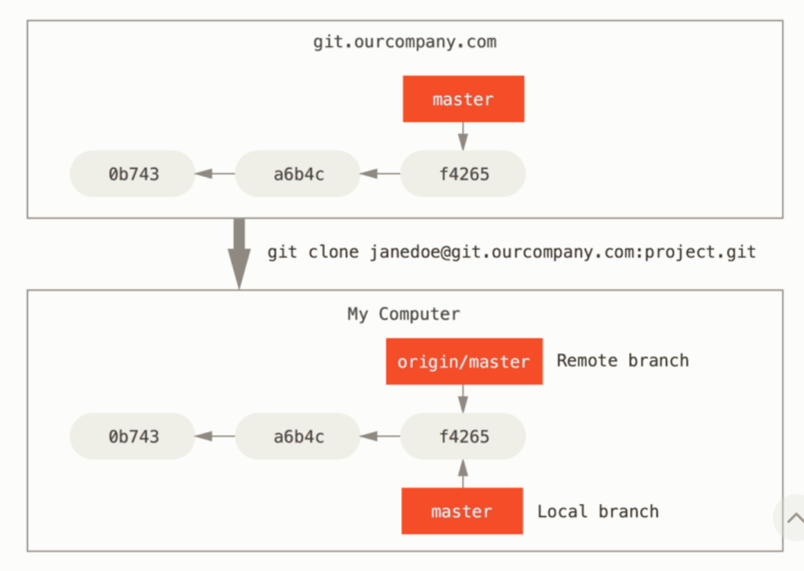
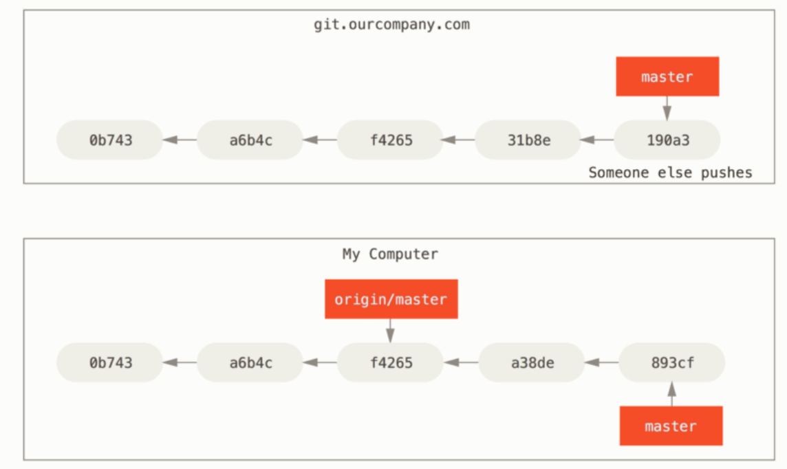
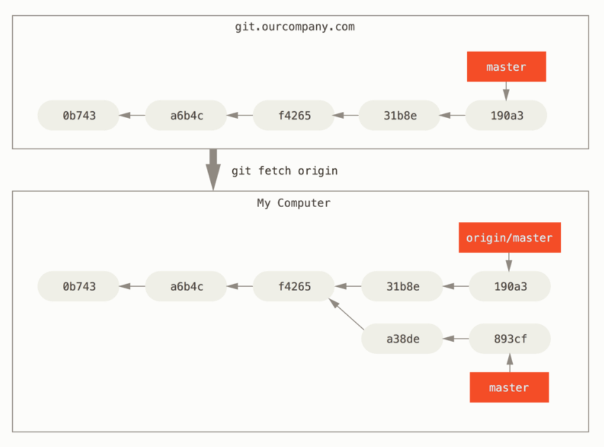
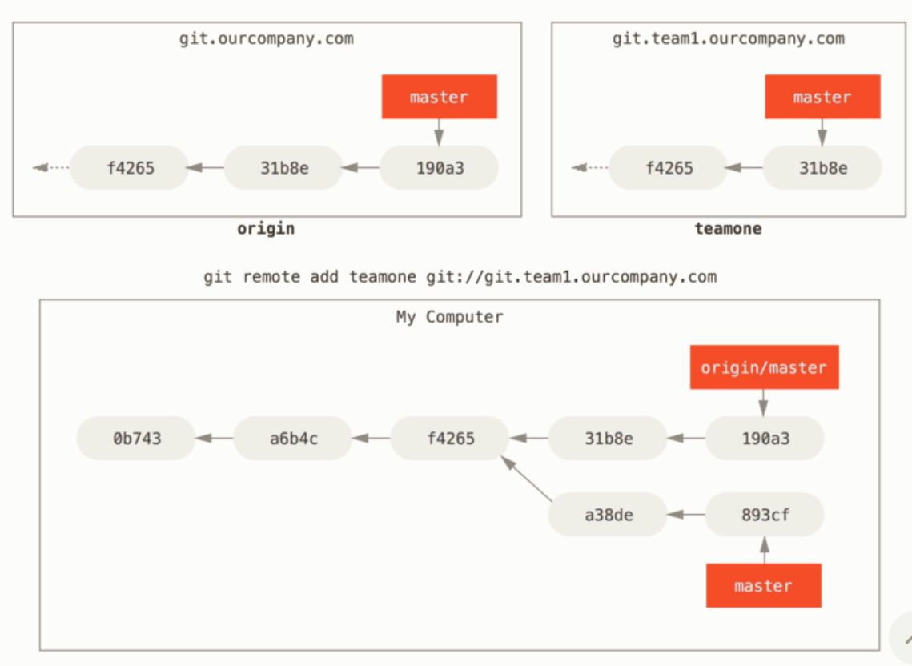

# 3.5 리모트 브랜치

# 리모트 브랜치

**리모트 Refs**: 리모트 저장소에 있는 포인터인 레퍼런스

→ 리모트 저장소에 있는 브랜치, 태그 등을 의미

`git ls-remote [remote]` 명령

: 모든 리모트의 Refs를 조회

`git remote show [remote]` 명령

: 모든 리모트 브랜치와 그 정보를 조회

### **리모트 트래킹 브랜치**

: 리모트 브랜치를 추적하는 레퍼런스이며 브랜치

- 리모트 트래킹 브랜치는 로컬에 존재
    
    리모트 서버에 연결할 때마다 리모트의 브랜치 업데이트 내용에 따라 자동으로 갱신
    
    리모트 저장소에 마지막으로 연결했던 순간에 브랜치가 무슨 커밋을 가리키고 있는지를 나탄낸다.
    

리모트 트래킹 브랜치의 이름의 형식은 `<remote>/<branch>` 

`ex` 리모트 저장소 origin의 master 브랜치를 확인하려면?

→ `origin/master`라는 이름으로 브랜치를 확인

다른 팀원이 iss53 브랜치를 서버로 Push

이때 서버의 iss53 브랜치가 가리키는 커밋은 로컬에서 `origin/iss53`이 가리키는 커밋

---

`git.ourcompany.com`이라는 Git 서버

1. 이 서버의 저장소를 하나 Clone하면 Git은 자동으로 origin이라는 이름을 붙인다.
2. origin으로부터 저장소 데이터를 모두 내려받고 master 브랜치를 가리키는 포인터 생성
    
    → 이 포인터는 origin/master 라고 부르고 멋대로 조종할 수 없다.
    
3. Git은 로컬의 master 브랜치가 origin/master를 가리키게 한다.
4. 이제 이 master 브랜치에서 작업을 시작

---



---

로컬에서 작업을 하는 도중 동시에 다른 팀원이 서버에 Push하고 master 브랜치를 업데이트

→ 팀원 간 히스토리는 서로 달라진다.

`but` 서버 저장소로부터 데이터를 주고 받지 않아서 origin/master 포인터는 그대로이다.

---



---

→ 로컬과 서버의 커밋 히스토리는 독립적

리모트 서버로부터 저장소 정보를 동기화

→ `git fetch origin` 명령 사용

1. origin 서버의 주소 정보를 찾아 새로운 정보가 있으면 모두 내려받고, 받은 데이터를 로컬 저장소에 업데이트
2. origin/master 포인터의 위치를 최신 커밋으로 이동시킨다.

---



---

개발용으로 사용할 Git 저장소를 팀 내부에 하나 추가

이 저장소의 주소는 `git.team1.ourcompany.com`

1. `git remote add` 명령으로 현재 작업 중인 프로젝트에 팀의 저장소를 추가
    
    이름을 `teamone`으로 짓고 서버 주소 대신 사용
    

---



---

→ 서버를 리모트 저장소로 추가

1. `git fecth teamone` 명령으로 `teamone` 서버의 데이터를 내려받는다.
    
    → 리모트 트래킹 브랜치 `teamone/master`가 teamone 서버의 master 브랜치를 가리키는 커밋을 가리키게 한다.
    

## Push하기

로컬의 브랜치를 서버로 전송하려면 리모트 저장소에 Push해야 한다.

1. 리모트 저장소에 전송하지 않고 로컬 브랜치에만 두는 비공개 브랜치를 만들 수 있다.
2. 다른 사람과 협업하기 위해 토픽 브랜치만 전송

serverfix라는 브랜치를 다른 사람과 공유할 때 

`git push <remote> <branch>` 명령을 사용

```jsx
$ git push origin serverfix
Counting objects: 24, done.
Delta compression using up to 8 threads.
Compressing objects: 100% (15/15), done.
Writing objects: 100% (24/24), 1.91 KiB | 0 bytes/s, done.
Total 24 (delta 2), reused 0 (delta 0)
To https://github.com/schacon/simplegit
 * [new branch]      serverfix -> serverfix
```

리모트 저장소에 serverfix라는 이름 대신 다른 이름을 사용하기 위해 

`git push origin serverfix:awesomebranch` 처럼 사용

나중에 누군가 저장소를 Fetch하고 나서 서버에 있는 serverfix 브랜치에 접근할 때 `origin/severfix`라는 이름으로 접근

```jsx
$ git fetch origin
remote: Counting objects: 7, done.
remote: Compressing objects: 100% (2/2), done.
remote: Total 3 (delta 0), reused 3 (delta 0)
Unpacking objects: 100% (3/3), done.
From https://github.com/schacon/simplegit
 * [new branch]      serverfix    -> origin/serverfix
```

Fetch 명령으로 리모트 트래킹 브랜치를 내려받는다고 해서 로컬 저장소에 수정할 수 있는 브랜치가 새로 생기는 것이 아니다. 

→ `serverfix`라는 브랜치가 생기는 것이 아니라 수정 못하는 `origin/serverfix` 브랜치 포인터가 생길 뿐이다.

새로 받은 브랜치의 내용을 Merge 하려면 `git merge origin/serverfix` 명령을 사용