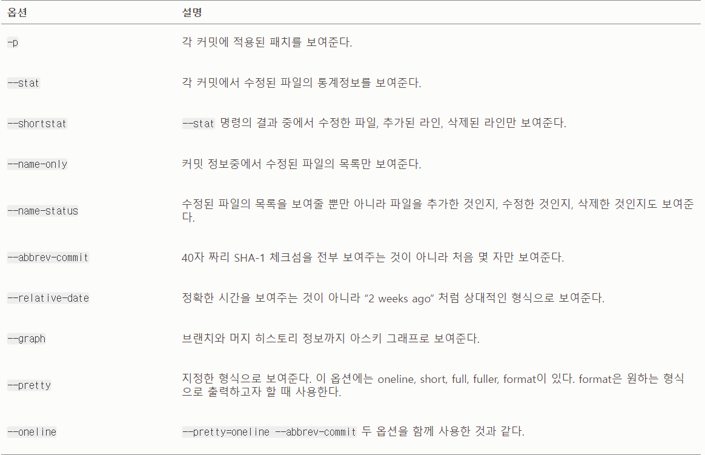
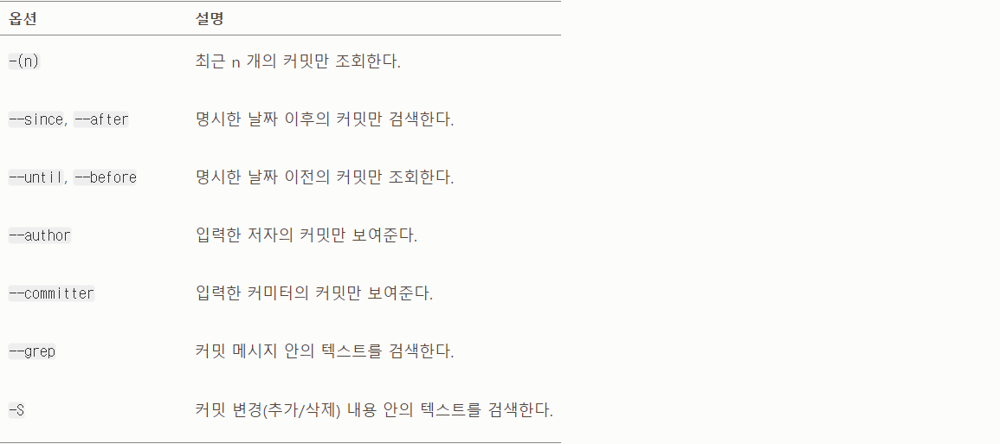

# 2.3 커밋 히스토리 조회하기

# 커밋 히스토리 조회하기

---

Git에는 히스토리를 조회하는 명령어가 있다.

→ `git log`

이 예제는 “simplegit” 프로젝트를 사용 → 프로젝트를 clone

```tsx
git clone https://github.com/schacon/simplegit-progit
```

이 프로젝트 디렉토리에서 `git log` 명령어 실행

```tsx
$ git log
commit ca82a6dff817ec66f44342007202690a93763949
Author: Scott Chacon <schacon@gee-mail.com>
Date:   Mon Mar 17 21:52:11 2008 -0700

    changed the version number

commit 085bb3bcb608e1e8451d4b2432f8ecbe6306e7e7
Author: Scott Chacon <schacon@gee-mail.com>
Date:   Sat Mar 15 16:40:33 2008 -0700

    removed unnecessary test

commit a11bef06a3f659402fe7563abf99ad00de2209e6
Author: Scott Chacon <schacon@gee-mail.com>
Date:   Sat Mar 15 10:31:28 2008 -0700

    first commit
```

특별한 옵션없이 `git log` 명령을 실행하면 저장소의 커밋 히스토리를 시간순으로 보여준다.

→ 가장 최근 커밋이 먼저 나온다.

→ 이어서 SHA-1 체크섬, 저자 이름, 저자 이메일, 커밋한 날짜, 커밋 메시지를 보여준다.

`git log` 명령은 다양한 옵션을 지원

**`-p`, `--patch`는 굉장히 유용한 옵션**

`-p`는 각 커밋의 diff 결과를 보여준다. 

`-2`가 있는데 최근 두 개의 결과만 보여주는 옵션

```tsx
$ git log -p -2
commit ca82a6dff817ec66f44342007202690a93763949
Author: Scott Chacon <schacon@gee-mail.com>
Date:   Mon Mar 17 21:52:11 2008 -0700

    changed the version number

diff --git a/Rakefile b/Rakefile
index a874b73..8f94139 100644
--- a/Rakefile
+++ b/Rakefile
@@ -5,7 +5,7 @@ require 'rake/gempackagetask'
 spec = Gem::Specification.new do |s|
     s.platform  =   Gem::Platform::RUBY
     s.name      =   "simplegit"
-    s.version   =   "0.1.0"
+    s.version   =   "0.1.1"
     s.author    =   "Scott Chacon"
     s.email     =   "schacon@gee-mail.com"
     s.summary   =   "A simple gem for using Git in Ruby code."

commit 085bb3bcb608e1e8451d4b2432f8ecbe6306e7e7
Author: Scott Chacon <schacon@gee-mail.com>
Date:   Sat Mar 15 16:40:33 2008 -0700

    removed unnecessary test

diff --git a/lib/simplegit.rb b/lib/simplegit.rb
index a0a60ae..47c6340 100644
--- a/lib/simplegit.rb
+++ b/lib/simplegit.rb
@@ -18,8 +18,3 @@ class SimpleGit
     end

 end
-
-if $0 == __FILE__
-  git = SimpleGit.new
-  puts git.show
-end
```

이 옵션은 동료가 무엇을 커밋했는지 리뷰하고 빨리 조회하는데 유용

`**--stat**` 옵션으로 각 커밋의 통계 정보를 조회

```tsx
$ git log --stat
commit ca82a6dff817ec66f44342007202690a93763949
Author: Scott Chacon <schacon@gee-mail.com>
Date:   Mon Mar 17 21:52:11 2008 -0700

    changed the version number

 Rakefile | 2 +-
 1 file changed, 1 insertion(+), 1 deletion(-)

commit 085bb3bcb608e1e8451d4b2432f8ecbe6306e7e7
Author: Scott Chacon <schacon@gee-mail.com>
Date:   Sat Mar 15 16:40:33 2008 -0700

    removed unnecessary test

 lib/simplegit.rb | 5 -----
 1 file changed, 5 deletions(-)

commit a11bef06a3f659402fe7563abf99ad00de2209e6
Author: Scott Chacon <schacon@gee-mail.com>
Date:   Sat Mar 15 10:31:28 2008 -0700

    first commit

 README           |  6 ++++++
 Rakefile         | 23 +++++++++++++++++++++++
 lib/simplegit.rb | 25 +++++++++++++++++++++++++
 3 files changed, 54 insertions(+)
```

이 옵션은 어떤 파일이 수정됐는지, 얼마나 많은 파일이 변경됐는지, 또 얼마나 많은 라인을 추가하거나 삭제했는지 보여준다. (요약 정보는 가장 뒤쪽에 보여준다.)

`--pretty` 옵션

- 히스토리 기본 형식 이외의 여러 가지 중 하나를 선택
    
    몇개를 선택할 수 있는 것은 옵션의 값마다 다르다.
    
- `oneline` 옵션은 각 커밋을 한 라인씩 출력
    
    많은 커밋을 한 번에 조회할 때 유용
    
- `short, full, fuller` 옵션은 정보를 조금씩 가감해서 보여준다.

```tsx
$ git log --pretty=oneline
ca82a6dff817ec66f44342007202690a93763949 changed the version number
085bb3bcb608e1e8451d4b2432f8ecbe6306e7e7 removed unnecessary test
a11bef06a3f659402fe7563abf99ad00de2209e6 first commit
```

- `format` 옵션
    - 나만의 포멧으로 결과를 출력할 때 사용
    - 결과를 다른 프로그램으로 파싱하고자 할 때 유용
    
    ```tsx
    $ git log --pretty=format:"%h - %an, %ar : %s"
    ca82a6d - Scott Chacon, 6 years ago : changed the version number
    085bb3b - Scott Chacon, 6 years ago : removed unnecessary test
    a11bef0 - Scott Chacon, 6 years ago : first commit
    ```
    

- oneline 옵션과 format 옵션은 --graph 옵션과 함께 사용
    
    브랜치와 머지 히스토리를 보여주는 아스키 그래프를 출력
    
    ```tsx
    $ git log --pretty=format:"%h %s" --graph
    * 2d3acf9 ignore errors from SIGCHLD on trap
    *  5e3ee11 Merge branch 'master' of git://github.com/dustin/grit
    |\
    | * 420eac9 Added a method for getting the current branch.
    * | 30e367c timeout code and tests
    * | 5a09431 add timeout protection to grit
    * | e1193f8 support for heads with slashes in them
    |/
    * d6016bc require time for xmlschema
    *  11d191e Merge branch 'defunkt' into local
    ```
    

**git log 주요 옵션**

유용하게 사용할 수 있는 옵션



## 조회 제한 조건

git log 명령은 조회 범위를 제한하는 옵션도 있다.

- 히스토리 전부가 아니라 부분만 조회
- 사용법: `-<n>`
    
    n은 최근 n개의 커밋을 의미
    

**`--since`, `--untill` 옵션**

- 시간을 기준으로 조회하는 옵션으로 매우 유용하다.

`ex` 지난 2주 동안 만들어진 커밋을 조회

```tsx
$ git log --since=2.weeks
```

- 이 옵션은 다양한 형식을 지원
    
    “2008-01-15” → 정확한 날짜
    
    “2 years 1 day 3 minutes ago” → 상대적인 기간
    

`--author` 옵션

- 저자를 지정하여 검색

`--grep` 옵션

- 커밋 메시지에서 키워드를 검색

위 두 옵션을 함께 사용하여 모두 만족하는 커밋을 찾으려면?

→ `--all-match` 옵션도 반드시 함께 사용

`**-S` 옵션**

- 코드에 추가되거나 제거된 내용 중에 특정 텍스트가 포함되어 있는지를 검색

`ex` 어떤 함수가 추가되거나 제거된 커밋만을 검색

```tsx
$ git log -S function_name
```

파일 경로로 검색하는 옵션

- 디렉토리나 파일 이름을 사용하여 그 파일이 변경된 log의 결과를 검색
- --와 함께 경로 이름을 사용
    
    명령어 끝 부분에 작성
    
    `ex` `git log--path1 path2`
    

**git log 조회 범위를 제한하는 옵션** **표**

