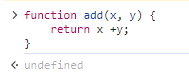
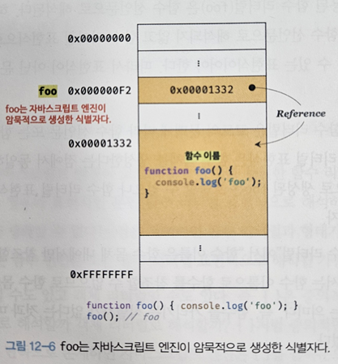
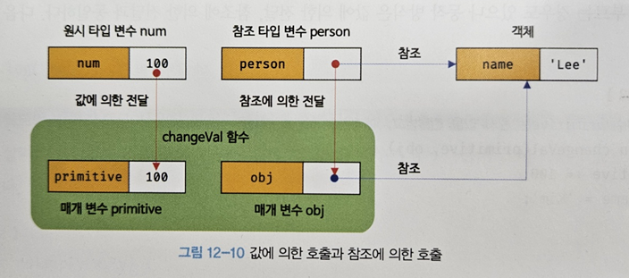

# 12장 함수

# 12.4 함수 정의

## 12.4.1 함수 선언문

함수 선언문을 사용해 함수를 정의하는 방식

```jsx
function add(x, y) {
    return x + y;
}

console.dir(add);

console.log(add(2, 5));
```

함수 선언문은 함수 리터럴과 형태가 동일

`but` 함수 리터럴은 함수 이름 생략이 가능하지만 함수 선언문은 함수 이름을 생략할 수 없다.

```jsx
function (x, y) {
	return x + y;
} // 에러 발생
```

**함수 선언문은 표현식이 아닌 문**



---

→ 만약 표현식이라면 undefined 대신 표현식으로 평가되어 생성된 함수가 출력되어야 함

표현식이 아닌 문은 변수에 할당할 수 없다.

다음 예제를 보자.

```jsx
const add = function add(x, y) {
    return x + y;
};

console.log(add(2, 5)); // 7
```

→ 함수 선언문이 변수에 할당되는 것처럼 보인다!!

**위와 같이 동작하는 이유**

: JS 엔진이 코드의 문맥에 따라 함수 리터럴을 **함수 선언문으로 해석하는 경우**와 **함수 표현식으로 해석하는 경우**가 있기 때문이다.

함수 이름이 있는 함수 리터럴을 단독으로 사용(피연산자로 사용하지 않는 경우)

→ 함수 선언문으로 해석

함수 리터럴이 값으로 평가되어야 하는 문맥(변수에 할당하거나 피연산자로 사용)

→ 함수 표현식으로 해석

함수 선언문이든 함수 리터럴 표현식이든 함수가 생성되는 것은 동일

`but` 함수를 생성하는 내부 동작에 차이가 있다.

```jsx
function foo() {
    console.log("foo");
}
foo();

(function bar() {
    console.log("bar");
});
bar(); // ReferenceError -> 값 자체를 참조할 수 없다.
```

1. 단독으로 사용된 함수 **리터럴(foo)은 함수 선언문**으로 해석
2. 그룹 연산자 ( ) 내에 있는 함수 **리터럴(bar)는 함수 리터럴 표현식**으로 해석
    
    → 그룹 연산자의 피연산자는 값으로 평가될 수 있는 표현식이어야 하기 때문에 함수 선언문은 피연산자로 사용할 수 없다.
    

함수 선언문으로 생성된 foo은 호출할 수 있으나 함수 리터럴 표현식으로 생성된 bar는 호출할 수 없었다. 

`why?`

**함수 이름은 함수 몸체 내에서만 참조할 수 있는 식별자다.**

→ 함수 몸체 외부에서는 함수 이름으로 함수를 호출할 수 없다.

foo 함수는 어떻게 호출할 수 있었을까?

→ foo는 자바스크립트 엔진이 암묵적으로 생성한 식별자이다.



---

**자바스크립트 엔진은 함수 선언문을 해석해 함수 객체를 생성한다.** 

이때, 함수 이름은 함수 몸체 내부에서만 유효한 식별자이므로 함수 이름과는 별도로 생성된 함수 객체를 가리키는 식별자가 필요

→ 엔진은 함수 이름과 동일한 이름의 식별자를 암묵적으로 생성하고, 거기에 함수 객체를 할당

아래 코드를 다시 한번 보자.

```jsx
const add = function add(x, y) {
    return x + y;
};

console.log(add(2, 5));
```

**함수는 함수 이름으로 호출하는 것이 아니라 함수 객체를 가리키는 식별자로 호출한다.**

→ 함수 이름 add가 아니라 엔진이 암묵적으로 생성한 **식별자 add**인 것이다.

## 12.4.2 함수 표현식

함수는 객체 타입 값

자바스크립트 함수는 값의 성질을 같는다.

→ 이처럼 값의 성질을 갖는 객체를 **일급 객체**라고 한다.

**일급객체**

: 함수를 값처럼 자유롭게 사용할 수 있다는 의미

**함수 표현식**

: 함수는 일급 객체이므로 함수 리터럴로 생성한 함수 객체를 변수에 할당하는 방법

```jsx
const add = function (x, y) {
    return x + y;
};

console.log(add(2, 5));
```

함수 리터럴의 함수 이름은 생략 가능 → 이러한 함수를 익명 함수라고 한다.

함수 호출은 함수 이름이 아니라 함수 객체를 가리키는 식별자를 사용해야 한다.

```jsx
const add = function foo(x, y) {
    return x + y;
};

console.log(foo(2, 5)); // ReferenceError
```

**함수 선언문 → “표현식이 아닌 문”**

**함수 표현식 → “표현식인 문”**

## 12.4.3 함수 생성 시점과 함수 호이스팅

`ex`

```jsx
console.dir(add);
console.dir(sub);

console.log(add(2, 5));
console.log(sub(2, 5));

function add(x, y) {
    return x + y;
}

const sub = function (x, y) {
    return x + y;
};
```

- 함수 선언문으로 정의한 함수 → 함수 선언문 이전에 호출
- 함수 표현식으로 정의한 함수 → 함수 표현식 이전에 호출X

→ 두 함수의 생성 시점이 다르기 때문이다.

**함수 선언문 런타임 이전에 함수 객체가 먼저 생성되고 함수 이름과 동일한 이름의 식별자를 암묵적으로 생성하고 생성된 함수 객체를 할당**

→ 선언문 이전에 함수를 참조할 수도 있고 호출할 수도 있다.

→ **함수 선언문이 선두로 끌어 올려진 것처럼 동작: 함수 호이스팅**

함수 호이스팅과 변수 호이스팅의 차이

- 변수는 undefined로 초기화
- 함수 선언문은 암묵적으로 생성된 식별자는 함수 객체로 초기화
    
    → 변수 선언문 이전에 변수를 참조하면 undefined 
    
    함수 선언문으로 정의한 함수는 호출이 가능
    

# 12.6 참조에 의한 전달과 외부 상태의 변경

**원시 값: 값에 의한 전달**

**객체: 참조에 의한 전달**

매개 변수도 변수와 동일하게 취급

`ex`

```jsx
function changeVal(primitive, obj) {
    primitive += 100;
    obj.name = "kim";
}

const num = 100;
const person = {name: "Lee"};

console.log(num);
console.log(person);

changeVal(num, person);

console.log(num);

console.log(person);
```

원시 타입 인수

- 값 자체가 복사되어 매개변수에 전달
    
    → 함수 안에서 그 값을 변경해도 원본은 훼손되지 않는다.
    

객체 타입 인수

- 참조 값이 복사되어 매개변수에 전달
    
    → 참조 값을 통해 객체를 변경할 경우 원본이 훼




---

위와 같이 함수가 외부 상태를 변경하면 상태 변화를 추적하기 어렵다.

이러한 문제의 해결 방법 중 하나는 **불변 객체**를 만들어 사용하는 것

: 객체의 복사본을 만들어 원본 객체를 원시 값처럼 변경 불가능한 값으로 동작하게 만드는 것

# 12.7 다양한 함수의 형태

## 12.7.1 즉시 실행 함수

: 함수 정의와 동시에 즉시 호출되는 함수

- 단 한번만 호출되며 다시 호출할 수 없다.

`ex`

```jsx
(function () {
    const a = 3;
    const b = 5;
    return a * b;
}());
```

- 익명 함수를 사용하는 것이 일반적
- 그룹 연산자 ( ) 내 기명함수를 사용할 수 있지만 리터럴로 평가되어 함수 몸체에서만 참조할 수 있다. → 즉시 실행 함수를 다시 호출할 수 없다.

일반 함수처럼 값을 반환할 수 있고 인수를 전달할 수 있다.

```jsx
let res = (function () {
    const a = 3;
    const b = 5;
    return a * b;
}());

console.log(res);

res = (function (a, b) {
    return a * b;
}(3, 5));

console.log(res);
```

즉시 실행 함수 내에 코드를 모아 두면 변수나 함수 이름의 충돌을 방지

## 12.7.4 콜백 함수

`ex`

```jsx
function repeat1(n) {
    for (let i = 0; i < n; i++) console.log(i);
}

repeat1(5);

function repeat2(n) {
    for (let i = 0; i < n; i++) {
        if (i % 2) console.log(i);
    }
}

repeat2(5);
```

위 함수들은 반복하는 일은 공통적으로 수행하지만 반복하면서 하는 일의 내용이 다르다.

→ 함수 일부분만이 다르기 때문에 매번 함수를 새롭게 정의해야 한다.

위 문제를 함수 합성을 통해 해결하자.

→ 변하지 않는 공통 로직은 미리 정의해 두고, 변경되는 로직은 추상화를 통해 함수 외부에서 내부로 전달

```jsx
function repeat(n, f) {
    for (let i = 0; i < n; i++) {
        f(i);
    }
}

const logAll = function (i) {
    console.log(i);
};

repeat(5, logAll);

const logOdds = function (i) {
    if (i % 2) console.log(i);
};

repeat(5, logAll);
```

함수는 일급 객체이므로 매개변수를 통해 함수를 전달할 수 있다.

**함수를 매개변수를 통해 다른 함수의 내부로 전달되는 함수 → 콜백함수**

**콜백함수를 전달 받는 함수 → 고차 함수**

**콜백 함수가 고차 함수 내부에서만 호출**된다면 콜백 함수를 익명 함수 리터럴로 정의해 곧바로 고차 함수에 전달하는 것이 일반적이다.

```jsx
repeat(5, function (i) {
    if (i % 2) console.log(i);
});
```

→ 이 때의 콜백 함수는 고차 함수가 호출될 때마다 평가되어 함수 객체를 생성한다. 따라서 콜백함수를 다른 곳에서 호출할 필요가 있거나, 콜백함수를 전달받는 고차함수가 자주 호출된다면 함수 외부에서 콜백함수를 정의하는 것이 효율적이다.

콜백함수는 비동기 처리(이벤트 처리, Ajax 통신, 타이머 함수 등)에 활용되는 중요한 패턴

## 12.7.5 함수형 프로그래밍이란?

순수 함수와 보조 함수의 조합을 통해 외부 상태를 변경하는 부수 효과를 최소화해서 불변성을 지향하는 프로그래밍 패러다임

1. 조건문과 반복문을 제거해서 복잡성을 해결
2. 변수 사용을 억제하거나 생명주기를 최소화해서 상태 변경을 피해 오류를 최소화