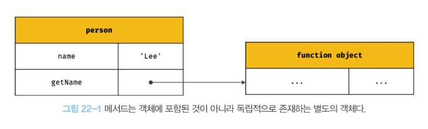
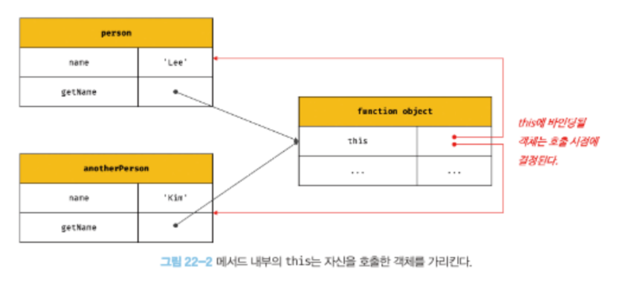
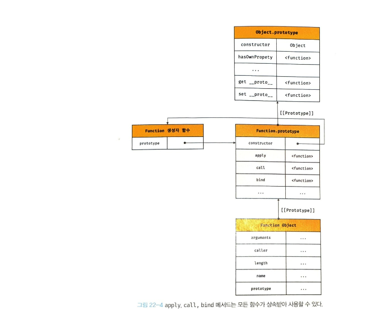

# 22장 this

# 22.1 this 키워드

객체란?

- 상태(state)를 나타내는 프로퍼티
- 동작(behavior)를 나타내는 메서드

this는 자신이 속한 객체 또는 자신이 생성할 인스턴스를 가리키는 자기 참조 변수

this가 가리키는 값, 즉 this 바인딩은 함수 호출 방식에 의해 동적으로 결정된다.

객체 리터럴의 메서드 내부에서의 this

→ 메스드를 호출한 객체, 즉 circle을 가리킨다.

```jsx
const circle = {
    radius: 5,
    getDiameter() {
        return 2 * this.radius;
    },
};

console.log(circle.getDiameter());
```

생성자 함수 내부의 this

→ 생성자 함수가 생성할 인스턴스를 가리킨다.

```jsx
function Cricle(radius) {
    this.radius = radius;
}

Cricle.prototype.getDiameter = function () {
    console.log(this.radius);
};

const circle = new Circle(5);
console.log(circle.getDiameter());
```

자바스크립트의 this는 함수가 호출되는 방식에 따라 this에 바인딩될 값이 결정된다.

→ this의 동적 바인딩

```jsx
// this는 어디서든 참조가 가능하다.
// 전역에서 this는 전역 객체 window를 가리킨다.
console.log(this);

function square(number) {
// 일반 함수 내부에서 this는 전역 객체 window를 가리킨다.
    console.log(this);
    return number * number;
}

square(2);

const person = {
    name: "Lee",
    getName() {
			// 메서드 내부에서 this는 메서드를 호출한 객체를 가리킨다.
        console.log(this);
        return this.name;
    },
};
console.log(person.getName());

function Person(name) {
    this.name = name;
		// 생성자 함수 내부에서 this는 생성자 함수가 생성할 인스턴스를 가리킨다.
    console.log(this);
}

const me = new Person("Jinpyo");
```

# 22.2 함수 호출 방식과 this 바인딩

this 바인딩은 함수 호출 방식, 즉 함수가 어떻게 호출되었는가에 따라 동적으로 결정된다.

## 1. 일반 함수로 호출

일반 함수로 호출된 모든 함수(중첩함수, 콜백함수 포함) 내부의 this에는 전역 객체가 바인딩 된다.

일반 함수로 호출될 때 메서드 내의 중첩 함수 또는 콜백 함수의 this가 전역 객체를 바인딩하는 것은 문제가 있다.

다음과 같이 해결

```jsx
var value = 1;

const obj = {
    value: 100,
    foo() {
        const that = this;

        setTimeout(function () {
            console.log(that.value);
        }, 100);
    },
};

obj.foo();
```

화살표 함수를 사용해 this 바인딩을 일치시킬 수 있다.

```jsx
var value = 1;

const obj = {
    value: 100,
    foo() {
        setTimeout(() => console.log(this.value), 100);
    },
};

obj.foo();

```

## 22.2.2 메서드 호출

메서드 내부의 this

→ 메서드를 호출한 객체가 바인딩 된다.

메서드 내부의 this는 메서드를 소유한 객체가 아니라 메서드를 호출한 객체에 바인딩된다는 것에 주의

```tsx
const person = {
    name: "Lee",
    getName() {
        return this.name;
    },
};

console.log(person.getName()); // Lee
```

getName 메서드는 person 객체에 메서드로 정의

- 메서드는 프로퍼티에 바인딩된 함수
    
    → 즉, getName 프로퍼티가 가리키는 함수 객체는 person 객체에 포함된 것이 아니라 독립적으로 존재하는 별도의 객체이다.
    
    getName 프로퍼티가 함수 객체를 가리키고 있을 뿐
    



---

getName 프로퍼티가 가리키고 있는 함수 객체: getName 메서드

즉, getName 메서드는 다른 객체의 프로퍼티에 할당하는 것으로 다른 객체의 메서드가 될 수 있고

일반 변수에 할당하여 일반 함수로 호출될 수 있다.

```tsx
const person = {
    name: "Lee",
    getName() {
        return this.name;
    },
};

console.log(person.getName()); // Lee

const anotherPerson = {
    name: "Kim",
};

anotherPerson.getName = person.getName;

console.log(anotherPerson.getName());

const getName = person.getName;

console.log(getName()); // 일반함수로써 호출된 getName의 this는 전역객체를 가리킨다.
```

따라서 메서드 내부의 this는 프로퍼티로 메서드를 가리키는 객체와 관계없고 메서드를 호출한 객체에 바인딩된다.



## 22.2.3 생성자 함수 호출

생성자 함수 내부의 this에는 생성자 함수가 생성할 인스턴스에 바인딩

```tsx
function Circle(radius) {
    this.radius = radius;
    this.getDiameter = function () {
        return 2 * radius;
    };
}

const circle1 = new Circle(5);
const circle2 = new Circle(10);

console.log(circle1.getDiameter());
console.log(circle2.getDiameter());
```

생성자 함수: 객체(인스턴스)를 생성하는 함수

## 22.2.4 Function.prototype.apply/call/bind 메서드에 의한 간접 호출

apply, call, bind 메서드는 Function.prototype의 메서드

→ 모든 함수가 상속받아 사용할 수 있다.

---



---

### this 동적 바인딩 정리

| 함수 호출 방식 | this 바인딩 |
| --- | --- |
| 일반 함수 호출 | 전역 객체 |
| 메서드 호출 | 메서드를 호출한 객체 |
| 생성자 함수 호출 | 생성자 함수가 (미래에) 생성할 인스턴스 |
| Function.prototype.apply/call/bind 메서드에 의한 간접 호출 | Function.prototype.apply/call/bind 메서드에 첫번째 인수로 전달한 객체 |