# 1. 노드 시작하기

# 1.1 핵심 개념 이해하기

노드 공식 사이트에서의 노드에 대한 정의

→ **Node.js는 Chrome V8 Javascript 엔진으로 빌드된 자바스크립트 런타임**

## 1.1.1 서버

---

노드는 서버 애플리케이션을 실행하는 데 제일 많이 사용

**서버는 네트워크를 통해 클라이언트에 정보나 서비스를 제공하는 컴퓨터 또는 프로그램**

클라이언트: 요청을 보내는 주체

---

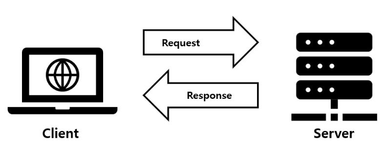

---

`ex` 길벗 출판사의 웹사이트를 방문

1. 주소창에 길벗 출판사의 웹사이트 주소(https://www.gilbut.co.kr)를 입력(요청)
2. 브라우저는 주소에 해당하는 길벗출판사의 컴퓨터 위치 파악
3. 이 컴퓨터로부터 길벗출판사의 웹사이트 페이지를 받아와 요청자의 브라우저(클라이언트)에 띄운다.(응답) 

→ 위와 같은 일을 하는 컴퓨터를 ‘서버’라 부른다.

웹이나 앱을 사용할 때는 나의 데이터(아이디, 비밀번호, 이메일 등)와 서비스의 데이터가 생성

→ 데이터를 저장하고, 저장한 곳에서 클라이언트로 데이터를 받아와야 한다.

→ 이곳이 바로 **서버**

서버라해서 요청에 대한 응답한 하는 것이 아니다. 다른 서버에 요청을 보낼 수 있다.

→ 요청을 보낸 서버가 클라이언트 역할

서버는 응답을 No할 수도 있다.

노드는 자바스크립트 프로그램이 서버로서 기능하기 위한 도구를 제공해 서버 역할을 수행

## 1.1.2 자바스크립트 런타임

---

노드는 자바스크립트 런타임

런타임: 특정 언어로 만든 프로그램들을 실행할 수 있는 환경

기존에는 자바스크립트 프로그램을 웹 브라우저 위에서만 실행할 수 있었다.


---

노드는 V8과 더불어 libuv라는 라이브러리를 사용

libuv 라이브러리는 노드의 특성인 이벤트 기반, 논블로킹I/O 모델을 구현

## 1.1.3 이벤트 기반

---

**이벤트 기반**

→ **이벤트가 발생했을 때, 미리 지정해둔 작업을 수행하는 방식을 의미**, 이벤트로는 클릭이나 네트워크 요청이 있을 수 있다.

이벤트 기반 시스템에서는 특정 이벤트가 발생할 때 무엇을 할지 미리 등록해야 한다.

→ 이벤트 리스너에 콜백함수를 등록한다고 표현

`ex` 버튼을 클릭할 때 경고창을 띄우도록 설정

- 클릭 이벤트 리스너에 경고창을 띄우는 콜백함수를 등록
    
    → 클릭 이벤트가 발생할 때 콜백 함수가 실행돼 경고창을 띄운다.
    

**노드도 이벤트 기반 방식으로 동작**

- 발생한 이벤트가 없거나 발생했던 이벤트를 다 처리 → 다음 이벤트가 발생할 때까지 대기

---

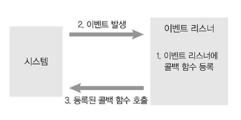

---

이벤트 기반 모델 → **이벤트 루프**라는 개념 등장

- 여러 이벤트가 동시에 발생했을 때, 어떤 순서로 콜백 함수를 호출할 지 이벤트 루프가 판단

노드는 자바스크립트 코드의 맨 위부터 한 줄씩 실행

- 함수 호출 부분 발견 → 함수를 호출 스택이 저장

```jsx
function first() {
    second();
    console.log('첫번째');
}

function second() {
    third();
    console.log('두번째');
}

function third() {
    console.log('세번째');
}
first();
```

first 함수 호출 → 그 안에 second 함수 호출 → third 함수 호출

- 호출된 순서와는 반대로 실행이 완료

→ 콘솔에는 세 번째, 두 번째, 첫 번째 순으로 찍힌다.

---

호출 스택

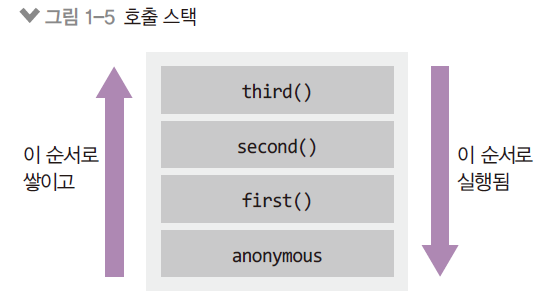

`anonymous` 함수 → 처음 실행 시 **전역 콘텍스트**

전역 콘텍스트: 함수가 호출되었을 때 생성되는 환경

함수는 실행되는 동안 호출 스택에 머물러 있다가 실행이 완료되면 호출 스택에서 제거

---

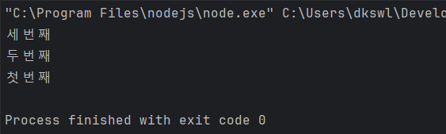

---

특정 밀리초 이후에 코드를 실행하는 `setTimeout`을 사용

```jsx
function run() {
    console.log("3초 후 실행");
}

console.log("시작");
setTimeout(run, 3000);

console.log("끝");
```

결과

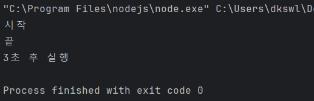

3초 뒤 run 함수를 실행하는 코드

---

**이벤트 루프**

- 이벤트 발생 시 호출할 콜백 함수를 관리
- 호출된 콜백 함수의 실행 순서를 결정

**백그라운드**

- setTimeout 같은 타이머나 이벤트 리스너들이 대기하는 곳
- 여러 작업이 동시에 실행될 수 있다.

**태스크 큐**

- 이벤트 발생 후, 백그라운에서 태스크 큐로 타이머나 이벤트 리스너의 콜백함수를 보낸다.
- 콜백 큐라고도 한다. 콜백들은 완료된 순서대로 줄을 서 있지만, 특정한 경우 순서가 바뀌기도 한다.

위 코드가 실행되는 내부 과정

---


---

태스크 큐는 실제로 여러 개의 큐로 이뤄져 있다.

`그림 1-7`

- anonymous까지 실행이 완료되어 호출 스택이 비어있다.
- 이벤트 루프는 호출 스택이 비어 있으면 태스크 큐에서 하나씩 함수를 가져와 호출 스택에 넣고 실행

---

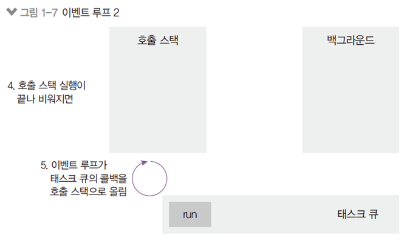

---

`그림 1-8`

- 이벤트 루프가 run 콜백을 태스크 큐에서 호출 스택으로 올린 상황
    
    → run이 실행, 실행 완료 후 호출 스택에서 제거
    
- 이벤트 루프는 태스크 큐에 콜백함수가 들어올 때까지 계속 대기

---

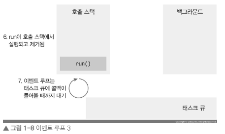

---

`if` 호출 스택에 함수가 많이 들어가 있으면 3초가 지난 후에도 run함수가 실행되지 않을 수 있다.

→ setTimeout의 시간이 정확하지 않을 수 있다.

## 1.1.4 논블로킹 I/O

---

이벤트 루프를 잘 활용하면 오래 걸리는 작업을 효율적으로 처리

작업의 2가지 종류

1. 동시에 실행될 수 있는 작업
2. 동시에 실행될 수 없는 작업

우리가 작성한 자바스크립트 코드는 동시에 실행X

`but` I/O 작업 같은 것은 동시에 처리될 수 있다.

노드는 입출력 작업을 할 때 **논블로킹 방식**으로 처리하는 방법 제공

**논블로킹: 이전 작업이 완료될 때까지 대기하지 않고 다음 작업을 수행** ↔ 블로킹

---

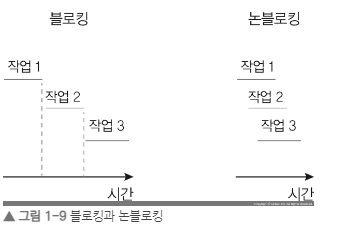

---

블로킹 방식보다 논블로킹 방식이 같은 작업을 더 짧은 시간에 처리

`but` 작업들이 모두 동시에 처리될 수 있는 작업이어야 한다.

노드는 I/O 작업을 백그라운드로 넘겨 동시에 처리

→ 동시에 처리될 수 있는 작업을 최대한 묶어 백그라운드로 넘겨야 시간 절약

---

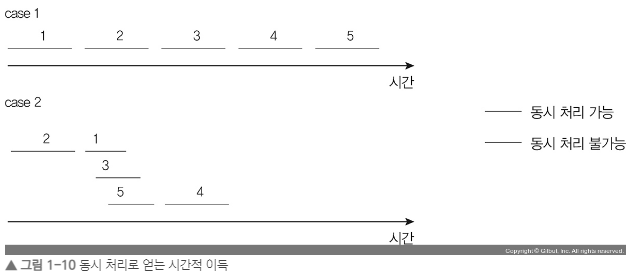

---

위와 같이 작업 순수에 따라 큰 성능 차이가 난다.

→ 논블로킹 방식으로 코딩하는 습관을 기르자.

`ex` 블로킹 방식의 코드

```jsx
function longRunningTask() {
    // 오래 걸리는 작업
    console.log('작업 끝');
}

console.log('시작');
longRunningTask();

console.log('다음 작업');
```

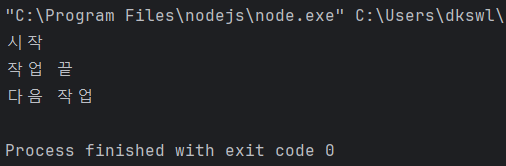

---

작업을 수행하는 데 오래 걸리는 `longRunningTask` 함수

→ 이 함수가 블로킹 방식의 I/O 작업을 수행

→ 이 작업이 완료되기 전까지 `console.log(’다음 작업’)`이 호출되지 않는다.

`setTimeout` 함수를 사용해 코드 변경

```jsx
function longRunningTask() {
    // 오래 걸리는 작업
    console.log("작업 끝");
}

console.log("시작");
setTimeout(longRunningTask, 0);
console.log("다음 작업");
```

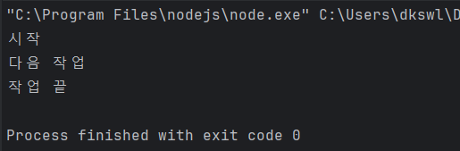

---

`setTimeout(콜백, 0)` → 코드를 논블로킹으로 만들기 위해 사용하는 기법 중 하나

`setTimeout`의 콜백 함수인 `longRunningTask`가 태스크 큐로 보내져 순서대로 실행X

→ 다음 작업 먼저 실행된 후, 오래 걸리는 작업이 완료

다만, 논블로킹 방식으로 코드를 직접 작성한다 해도 전체 소요 시간이 짧아지지는 않는다.

→ 우리의 코드는 서로 동시에 실행되지 않기 때문

`but` I/O 작업이 없다고해서 의미없는 것은 아니다.

→ 논블로킹을 통해 실행 순서를 바꿔줌으로써 오래 걸리는 작업 때문에 간단한 작업들이 대기하는 상황을 막을 수 있다.

→ **논블로킹과 동시가 같은 의미가 아니라는 것**

## 1.1.5 싱글 스레드

---

싱글 스레드 → 스레드가 하나

**프로세스와 스레드의 차이**

**프로세스**

- 운영체제에서 할당하는 작업의 단위
- 노드나 웹브라우저 같은 프로그램 → 개별적인 프로세스
- 프로세스 간에는 메모리 등 자원을 공유하지 않는다.

**스레드**

- 프로세스 내에서 실행되는 흐름의 단위
- 프로세스는 스레드를 여러 개 생성해 여러 작업을 동시에 처리 가능
- 스레드는 부모 프로세스의 자원을 공유
    
    → 같은 주소의 메모리에 접근 가능해 데이터를 공유
    

---

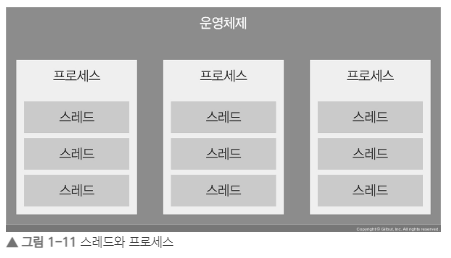

---

**노드는 싱글스레드**

`but` 싱글 스레드로 동작X

1. 노드를 실행하면 프로세스 하나 생성
2. 그 프로세스에서 스레드들을 생성
    
    → 그 중에 우리가 직접 제어할 수 있는 스레드는 단 한개
    

하나의 스레드만 직접 조작할 수 있다.

→ 요청이 많이 들어오면 한 번에 하나씩 요청을 처리

블로킹이 발생할 것 같은 경우 논블로킹 방법으로 대기 시간을 최대한 줄인다.

멀티 스레드가 싱글 스레드보다 좋을까?

---

`ex` 

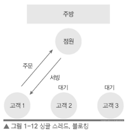

---

위와 같은 모델은 싱글 스레드(점원), 블로킹 모델 → 비효율적

---

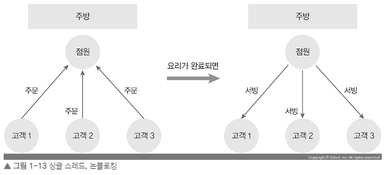

---

이제 손님의 주문을 받고, 주방에 주문 내역을 넘긴 뒤 다음 손님의 주문을 받는다.

주방에서 요리가 완료되는 순서대로 손님에게 서빙

요리의 특성(블로킹 or 논블로킹)에 따라 완료되는 순서가 다를 수 있다.

→ 싱글 스레드, 논 블로킹 모델 → 노드가 채택하고 있는 방식

점원은 한 명이지만 혼자서 많은 일을 처리

`but` 점원이 나오지 않으면 문제가 생긴다. 또한 요리 시간이 오래걸리면 주문이 많이 들어왔을 때 무리가 갈 수 있다.

---

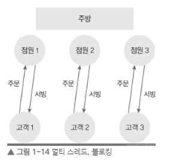

---

멀티 스레드 방식

손님마다 직원을 붙어준다.

문제점

1. 손님의 수가 늘어날수록 점원의 수도 늘어난다.
2. 손님 수가 줄었을 때 노는 점원이 생긴다.

멀티 스레드 방식으로 프로그래밍을 하는 것은 상당히 어렵다.

→ 대신 **멀티 프로세싱 방식**을 사용(I/O 요청에는 더 효율적)

---

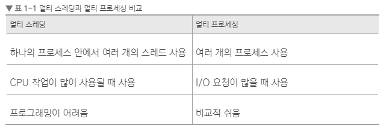

---

노드는 멀티 프로세싱을 많이 한다.

# 1.2 서버로서의 노드

---

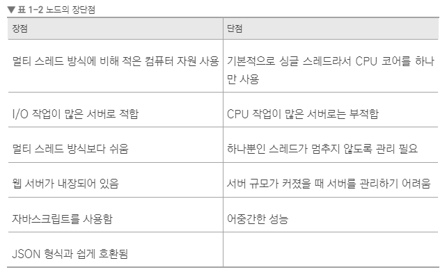

---