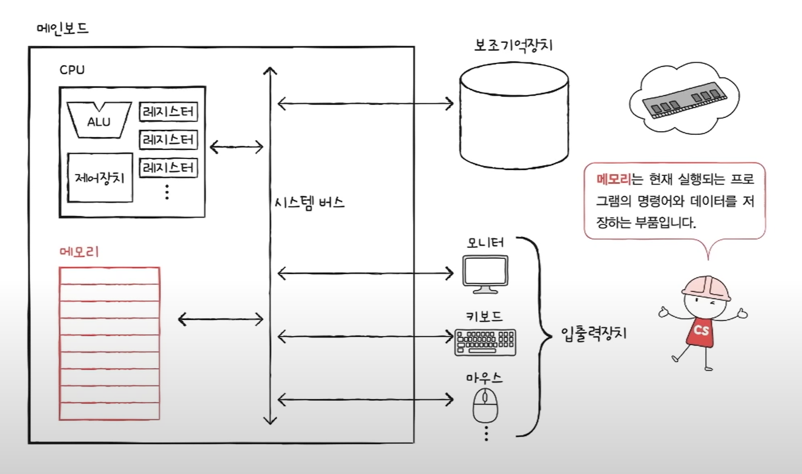
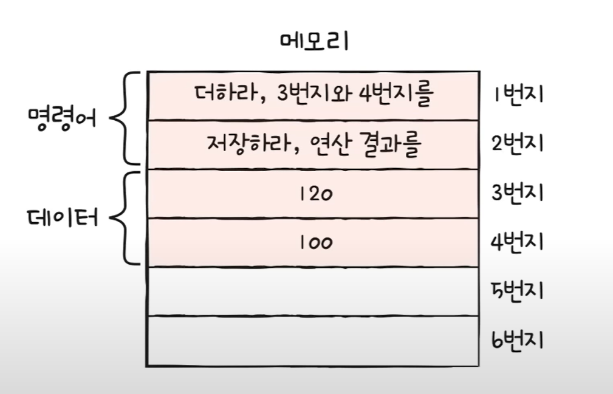
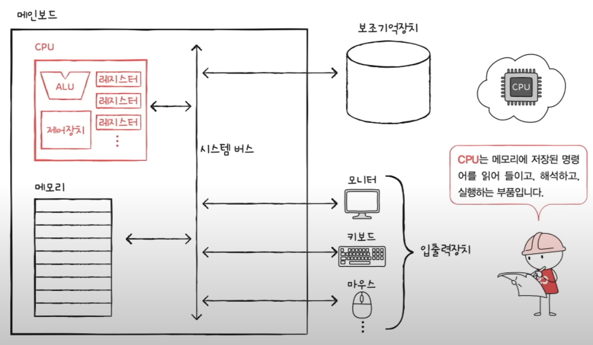
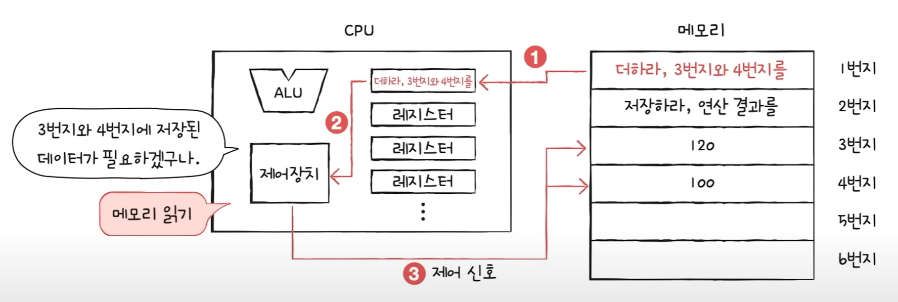
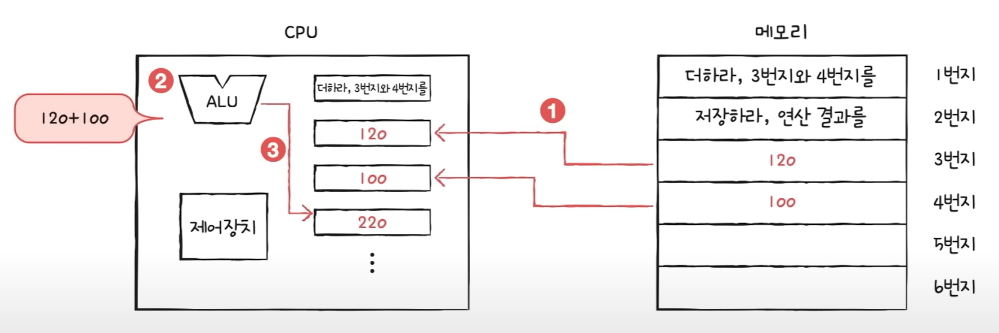
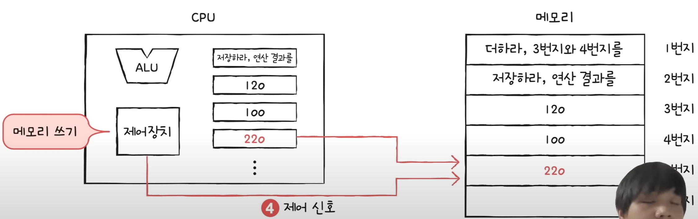
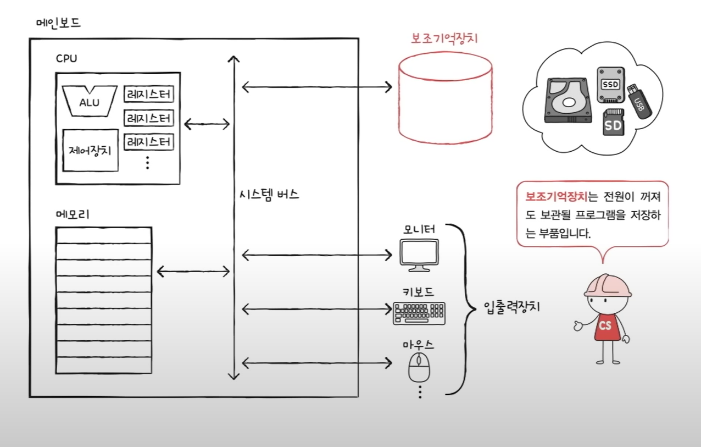
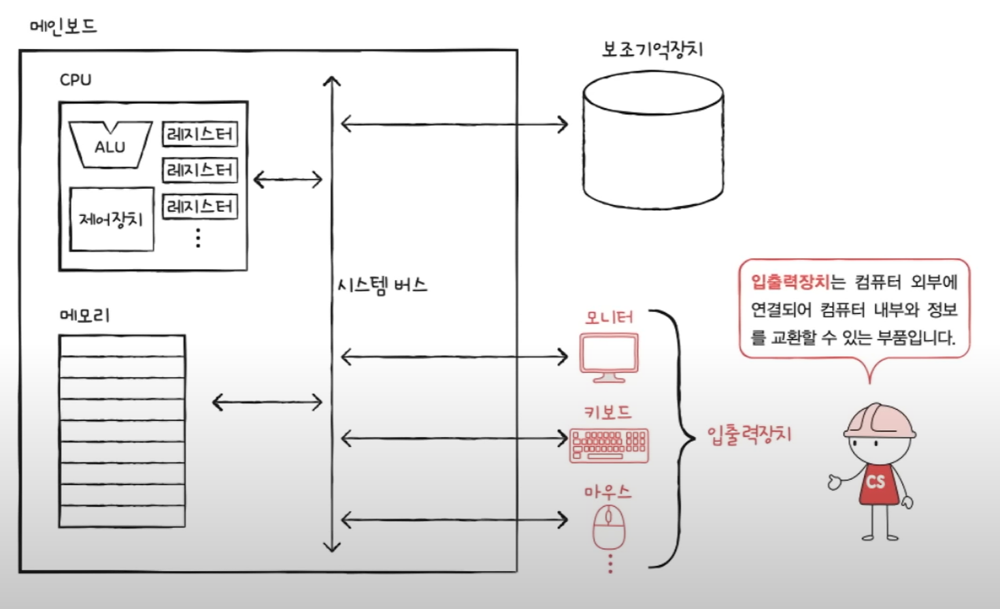
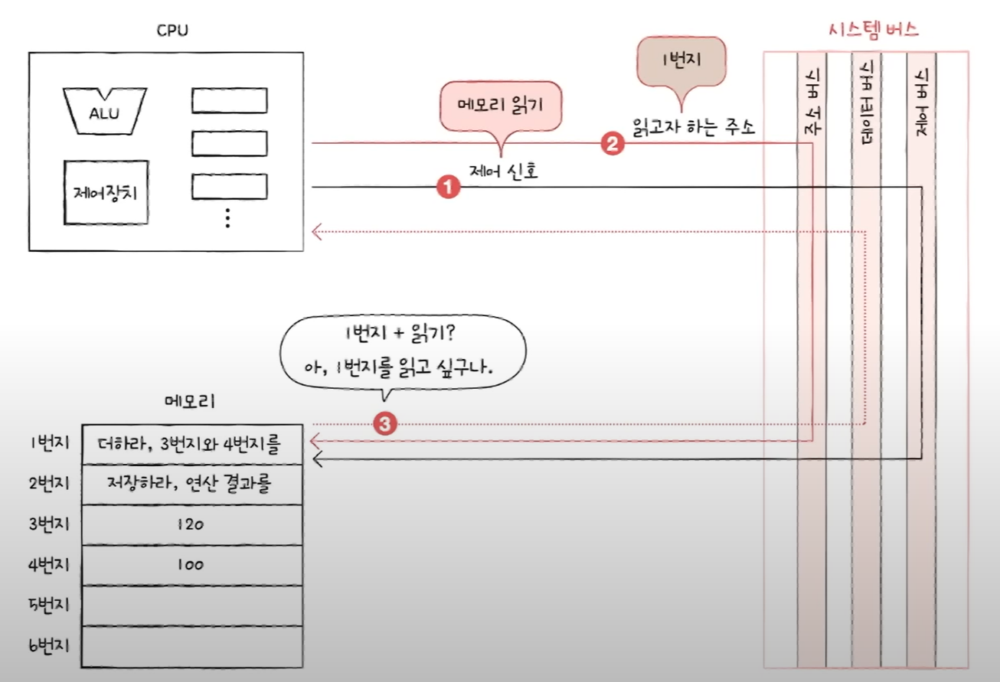
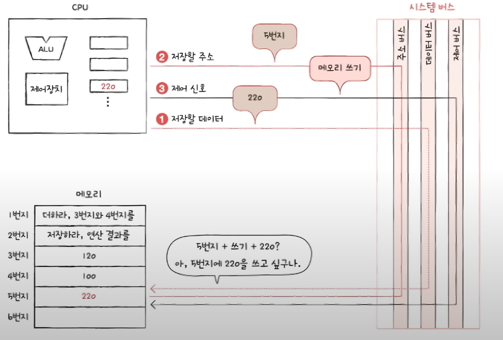

# 컴퓨터 구조

# 컴퓨터 구조의 큰그림

## 컴퓨터의 네 가지 핵심 부품

### 메모리(RAM)

1. 메모리는 실행되는 프로그램의 명령어와 데이터를 저장한다.
2. 프로그램이 실행되려면 메모리에 저장되어 있어야 한다.
3. 메모리에 저장된 값의 위치는 주소로 알 수 있다.

메모리는 **현재 실행**되는 프로그램의 명령어와 데이터를 저장하는 부품

명령어와 데이터가 저장되어있는 메모리는 위치 정보(인덱스)를 갖고 있다.

### CPU

1. 메모리에 저장된 값을 읽어 들이고, 해석하고, 실행하는 장치
2. CPU 내부에는 ALU, 레지스터, 제어장치가 있다.
    1. ALU는 계산하는 장치
    2. 레지스터는 임시 저장 장치
    3. 제어장치는 제어 신호를 발생시키고 명령어를 해석하는 장치

CPU는 메모리에 저정된 명령어를 읽어 들이고, 해석하고, 실행하는 부품

**CPU 내부 장치**

- ALU: 계산기
- 레지스터: CPU 내부의 작은 저장장치
- 제어장치: **제어 신호**를 내보내고, 명령어를 해석하는 장치
    - 제어신호: 컴퓨터 부품들을 관리하고 작동시키기 위한 전기 신호
        
        `ex` 메모리 읽기 신호, 메모리 쓰기 신호
        

**CPU 연산 과정**

### 보조 기억 장치

- 메모리는 보조기억 장치에 비해 비싸다.
- 메모리는 전원이 꺼지면 저장된 내용을 잃는다. → 휘발성 메모리

보조기억장치는 전원이 꺼져도 보관될 프로그램을 저장하는 부품이다.

### 입출력장치

입출력장치는 컴퓨터 외부에 연결되어 컴퓨터 내부와 정보를 교환할 수 있는 부품

### 컴퓨터 부품들을 연결해주는 부품: 메인보드, 버스

- 메인보드에 연결된 부품은 버스를 통해 정보를 주고 받는다.
- 버스는 컴퓨터의 부품끼리 정보를 주고받는 일종의 통로
- 다양한 종류의 버스가 있음
- 컴퓨터의 핵심 부품을 연결하는 버스는 시스템 버스

**시스템 버스의 내부 구성**

- 주소 버스: 주소를 주고 받는 통로
- 데이터 버스: 명령어와 데이터를 주고 받는 통로
- 제어 버스: 제어 신호를 주고 받는 통로

**메모리 읽기**

**메모리 쓰기**

