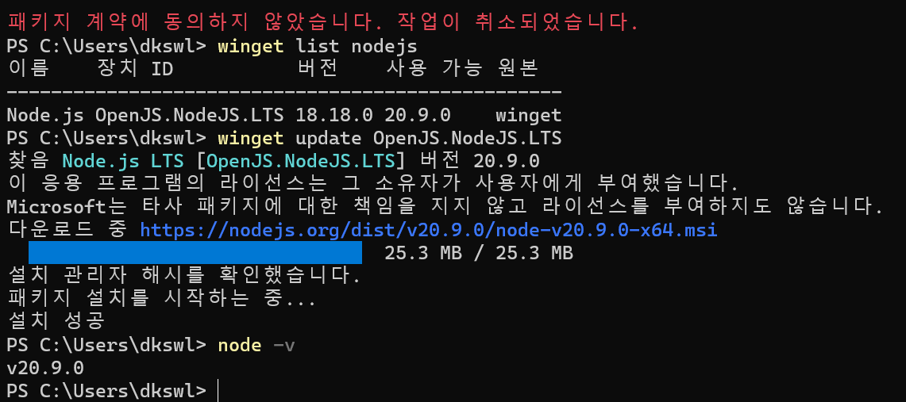
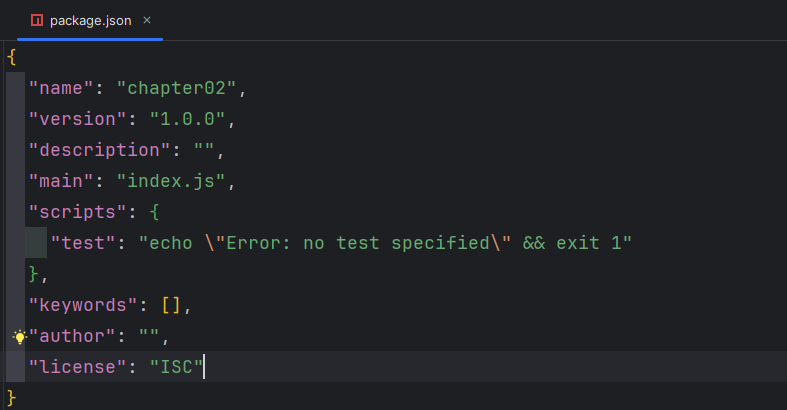
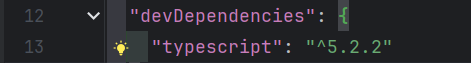
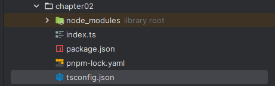
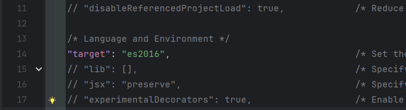
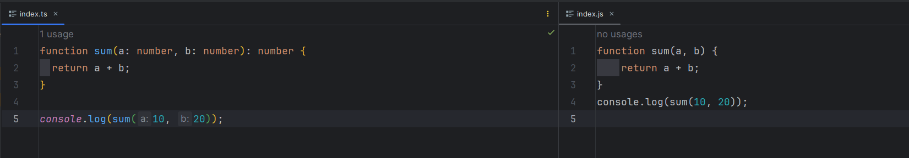

# 2023.11.17 세미나

## 1. 변수 선언 키워드 const나 let 사용

## 2. 모듈 번들러(module bundler)

- Module + Bundling이 혼합된 단어
    
    모듈: 분리된 코드 조각
    
    번들링: 묶는다.
    
- 모듈은 분리된 파일을 의미한다.
    
    다른 모듈에 접근할 수 있도록 export 키워드 사용
    
    분리된 모듈을 불러오기 위해 import 키워드 사용
    
- 모듈 번들러는 여러 JS 파일을 하나로 결합하여 단일 파일로 만드는 것
    
    웹팩, 롤업처럼 다양한 개발 도구가 존재
    
- 호환성을 위해 동작한다.

## 3. JSDOC 사용할 때

- 남에게 제공하는 라이브러리나 프레임워크
- 큰 규모의 프로젝트

## 4. Legacy 프로그램과 데이터

- 과거로부터 물려 내려온 프로그램과 데이터

## 5. winget으로 nodejs 버전 업데이트

---



---

1. `winget list` 명령

```jsx
winget list nodejs
```

→ 현재 컴퓨터에 설치된 애플리케이션 목록을 표시

1. `winget search` 명령

```jsx
winget search nodejs
```

→ 설치 가능한 애플리케이션을 표시

1. `winget upgrade` 명령

```jsx
winget upgrade [장치 ID]
```

→ 지정된 애플리케이션을 업그레이드 

## 6. pnpm을 이용한 타입스크립트 프로젝트 시작

1. 다음 명령어를 입력하여 현재 프로젝트가 pnpm으로 관리되도록 pnpm 설정 파일 생성
    
    ```jsx
    pnpm init 
    ```
    

1. 위 명령어 실행 결과 package.json 파일 생성
    
    ---
    
    
    
    ---
    

1. 다음 명령어를 입력해 현재 프로젝트에 타입스크립트 npm 패키지 설치
    
    ```jsx
    pnpm add typescript -D
    ```
    
    그럼 다음과 같이 개발 버전 타입스크립트 패키지가 설치된 것을 확인
    
    ---
    
    
    
    ---
    

1. 프로젝트 폴더에 `tsconfig.json` 파일 생성하기
    
    **tsconfig란?**
    
    → ts 파일을 js로 컴파일할 때 어떻게 변환할 것인지 설정을 하는 파일
    
    ```jsx
    pnpm tsc --init
    ```
    
    tsconfig 파일이 생성된 것을 확인할 수 있다.
    
    ---
    
    
    
    ---
    

1. tsconfig.json 파일에 target 옵션이 있는 것을 확인
    
    ---
    
    
    
    ---
    
    **target 옵션이란?**
    
    : 타입스크립트 파일을 어떤 버전의 자바스크립트로 바꿔줄지 설정하는 부분
    
    → 배포할 시 고려해야할 설정
    

1. 이제 변환 작업(컴파일)을 위해 다음 명령어 입력
    
    ```jsx
    pnpm exec tsc [변환할 ts 파일]
    ```
    
    → 전역에 설치된 tsc 패키지가 아닌 해당 프로젝트 폴더의 node_modules에 있는 tsc 패키지를 사용해 컴파일을 수행
    
    **tsc**
    
    : 타입스크립트 컴파일러
    
    **pnpm exec**
    
    : npx와 같은 역할
    

1. index.ts → index.js로 변환 된 것을 확인
    
    ---
    
    
    
    ---
    

## 7. 미션

문제

```jsx
/**
 * 'https://jsonplaceholder.typicode.com/todos/1'
 * 위 주소를 호출하여 주소에 해당하는 데이터를 반환하는 함수를 만드시오.
 * 단, 반환 값의 데이터 타입을 설정해야 한다.
 */
```

정답

```tsx
fetchTodo = async (): Promise<{ userId: number, id: number, title: string, completed: boolean }> => {
  const response = await fetch('https://jsonplaceholder.typicode.com/todos/1');
  const todo = await response.json();
  return todo;
};

fetchTodo().then(todo => console.log('Todo:', todo));
```

결과

```tsx
$ ts-node data_type.ts 
Todo: { userId: 1, id: 1, title: 'delectus aut autem', completed: false }
```