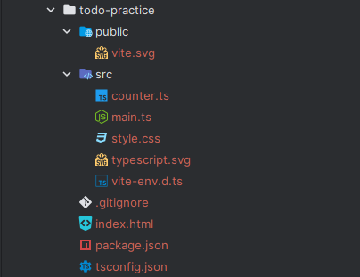
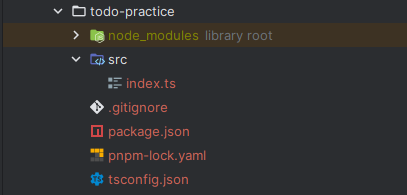
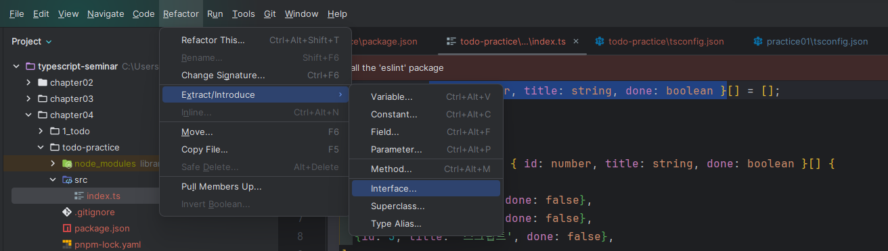

# 2023.11.24 세미나

### 1. vite 패키지를 활용한 프로젝트 생성

```tsx
pnpm create vite [프로젝트 이름]
```

프로젝트가 생성된 것을 확인할 수 있다.

---



---

### 2. pnpm 업데이트

```tsx
corepack prepare pnpm@latest --activate
```

### 3. tsconfig.json lib 옵션

`**tsconfig.json**`

```tsx
{
  "compilerOptions": {
    "target": "ES2020",
    "useDefineForClassFields": true,
    "noImplicitAny": true,
    "module": "ESNext",
    "lib": [
      "ES2020",
      "DOM",
      "DOM.Iterable"
    ],
    "skipLibCheck": true,
    "outDir": "./dist",
    "baseUrl": "./",
    "paths": {
      "@/*": [
        "src/*"
      ],
      "@main/*": [
        "src/main/*"
      ],
      "@test/*": [
        "src/test/*"
      ]
    },
    /* Bundler mode */
    "moduleResolution": "bundler",
    "allowImportingTsExtensions": false,
    "resolveJsonModule": true,
    "isolatedModules": true,
    "noEmit": false,
    /* Linting */
    "strict": true,
    "noUnusedLocals": true,
    "noUnusedParameters": true,
    "noFallthroughCasesInSwitch": true
  },
  "include": [
    "src/**/*.ts"
  ],
  "exclude": [
    "node_modules",
    "dist"
  ]
}
```

`**lib**` 옵션의 의미

- 서버쪽 → 런타임 / 프론트쪽 → 웹브라우저
- 소스코드를 돌리는 것에 있어 필요한 라이브러리를 지정
    
    → main.ts에서 DOM을 사용하기 위해 쓰인 것
    

### 4. tsconfig.json 기본 옵션 추가 설정

`**tsconfig.json**`

```tsx
"baseUrl": "./",
    "paths": {
      "@/*": [
        "src/*"
      ],
      "@main/*": [
        "src/main/*"
      ],
      "@test/*": [
        "src/test/*"
      ]

...

"include": [
    "src/**/*.ts"
  ],
  "exclude": [
    "node_modules",
    "dist"
  ]
```

### 5. vite-node 패키지

- ts-node와 같은 기능인 패키지
    
    → JS/TS 파일 즉시 실행
    

설치

```tsx
pnpm add -D vite-node
```

### 6. 패키지 버전 업데이트

```tsx
pnpm up
```

→ 최신 버전의 패키지를 install

현재 패키지 설정 파일 내용

`**package.json**`

```tsx
{
  "name": "todo-practice",
  "private": true,
  "version": "0.0.0",
  "type": "module",
  "scripts": {
    "dev": "vite",
    "build": "tsc && vite build",
    "preview": "vite preview"
  },
  "devDependencies": {
    "typescript": "^5.3.2",
    "vite": "^5.0.2",
    "vite-node": "^0.34.6"
  }
}
```

### 7. 실습에 불필요한 파일들 제거

현재 파일 상태

---




---

### 3. 실습 진행 후 리펙토링 하기

실습 진행 후 프로젝트 파일

`**index.ts**`

```tsx
let todoItems: { id: number, title: string, done: boolean }[] = [];

// api
function fetchTodoItems(): { id: number, title: string, done: boolean }[] {
  const todos = [
    {id: 1, title: '안녕', done: false},
    {id: 2, title: '타입', done: false},
    {id: 3, title: '스크립트', done: false},
  ];
  return todos;
}

// crud methods
function fetchTodos(): Todo[] {
  return fetchTodoItems();
}

function addTodo(todo: { id: number, title: string, done: boolean }): void {
  todoItems.push(todo);
}

function deleteTodo(index: number): void {
  todoItems.splice(index, 1);
}

function completeTodo(index: number, todo: { id: number, title: string, done: boolean }): void {
  todo.done = true;
  todoItems.splice(index, 1, todo);
}

// business logic
function logFirstTodo(): { id: number, title: string, done: boolean } {
  return todoItems[0];
}

function showCompleted(): { id: number, title: string, done: boolean }[] {
  return todoItems.filter(item => item.done);
}

// TODO: 아래 함수의 내용을 채워보세요. 아래 함수는 `addTodo()` 함수를 이용하여 2개의 새 할 일을 추가하는 함수입니다.
function addTwoTodoItems() {
  // addTodo() 함수를 두 번 호출하여 todoItems에 새 할 일이 2개 추가되어야 합니다.
  addTodo({id: 4, title: '진표', done: false});
  addTodo({id: 4, title: 'handsome', done: false});
}

// NOTE: 유틸 함수
function log() {
  console.log(todoItems);
}

todoItems = fetchTodoItems();
addTwoTodoItems();
log();
```

**GUI를 활용한 리펙토링**

---




---

리펙토링 후 index.ts

```tsx
interface Todo {
  id: number;
  title: string;
  done: boolean;
}

let todoItems: Todo[] = [];

// api
function fetchTodoItems(): Todo[] {
  const todos = [
    {id: 1, title: '안녕', done: false},
    {id: 2, title: '타입', done: false},
    {id: 3, title: '스크립트', done: false},
  ];
  return todos;
}

// crud methods
function fetchTodos(): Todo[] {
  const todos = fetchTodoItems();
  return todos;
}

function addTodo(todo: Todo): void {
  todoItems.push(todo);
}

function deleteTodo(index: number): void {
  todoItems.splice(index, 1);
}

function completeTodo(index: number, todo: Todo): void {
  todo.done = true;
  todoItems.splice(index, 1, todo);
}

// business logic
function logFirstTodo(): Todo {
  return todoItems[0];
}

function showCompleted(): Todo[] {
  return todoItems.filter(item => item.done);
}

// TODO: 아래 함수의 내용을 채워보세요. 아래 함수는 `addTodo()` 함수를 이용하여 2개의 새 할 일을 추가하는 함수입니다.
function addTwoTodoItems() {
  // addTodo() 함수를 두 번 호출하여 todoItems에 새 할 일이 2개 추가되어야 합니다.
  addTodo({id: 4, title: '진표', done: false});
  addTodo({id: 4, title: 'handsome', done: false});
}

// NOTE: 유틸 함수
function log() {
  console.log(todoItems);
}

todoItems = fetchTodoItems();
addTwoTodoItems();
log();
```