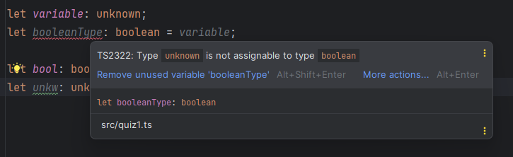

# 2024.01.11 Seminar

## 1. 타입추론에 의지해야 할까?

타입 추론에 의지하는 것보다 데이터 타입을 명시하는 것을 권장한다.

`why?`

타입 추론은 데이터 타입을 적어주지 않아도 되어 코드를 편하고 간결하게 작성할 수 있다. 하지만 IDE에서 데이터 타입에 대한 자동완성 기능도 제공해주어 타입을 명시하는 것이 힘이 들지 않는다. 그리고 타입을 명시해 코드의 가독성을 높이는 것이 좋다.

## 2. 타입 추론 vs 타입 단언 vs 타입 명시

타입 추론과 타입 단언보다는 타입을 명시하는 것이 좋다. 타입 단언은 런타임 에러는 해결하지 못하기 때문이다.

## 3. unknown 타입 vs any 타입

### unknown이란?

- Typescipt 3.0 버전부터 추가된 타입
- any와 비슷하게 동작하는 타입
    
    → 모든 타입의 값을 할당받는다.(never 타입 제외)
    

### unknown과 any의 차이점

- **unknown 타입은 any 타입 외의 어떤 타입에도 할당할 수 없다.**
- 반면 any는 never 타입을 제외한 모든 것에 할당이 가능하다.

`ex`

```tsx
let variable: unknown;
let booleanType: boolean = variable; // unknown 타입은 다른 타입에 값을 할당하려고 하면 
																		 // 에러가 발생한다.

let bool: boolean = true;
let unkw: unknown = bool;
```



→ 이렇게 unknown 타입은 어떤 것에 대입하는 것이 안되기 때문에 any 타입보다 더욱 안전하다.

### any 타입의 문제점

```tsx
let anyValue: any;
let boolT  = anyValue;
```

→ any 타입은 never 타입을 제외한 모든 타입에 할당하는 것이 가능하다.

```tsx
const anyType: any = true;
const hi: string = anyType;
console.log(hi.toUpperCase());
```

any 타입은 어느 타입에도 할당할 수 있기 때문에 위와 같은 코드를 작성하더라도 오류가 발생하지 않는다.

하지만 런타입에서는 true.toUpperCase()를 하는 것과 다름없기 때문에 런타입 에러를 발생시킨다.

### unknown 타입은 프로퍼티 접근, 메소드 호출, 인스턴스 생성이 안된다.

```tsx
let anyValue: any;
anyValue.toUpperCase();
```

any 타입은 메서드 호출에 제한이 없다. 따라서 anyValue가 string이라는 보장이 없는데도 toUpperCase()를 호출하고 있지만 타입스크립트는 이를 허용한다.

 

```tsx
let unknownValue: unknown;
unknownValue.toUpperCase(); // 에러 발생
```

unknown 타입은 에러가 발생한다. 

→ 타입좁히기 없이는 메서드 호출, 인스턴스 생성, 프로퍼티 접근을 할 수 없다.

[9. unknown Type - jbee.io](https://blog.jbee.io/typescript/9.+unknown+Type)

## null 처리 보다 빈 객체를 넘겨서 없애는 방법이 좋다.

## 자바스크립트 이터러블, 이터레이터 개념 공부