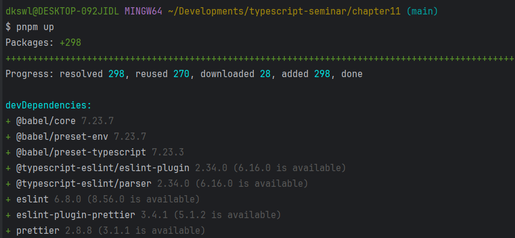
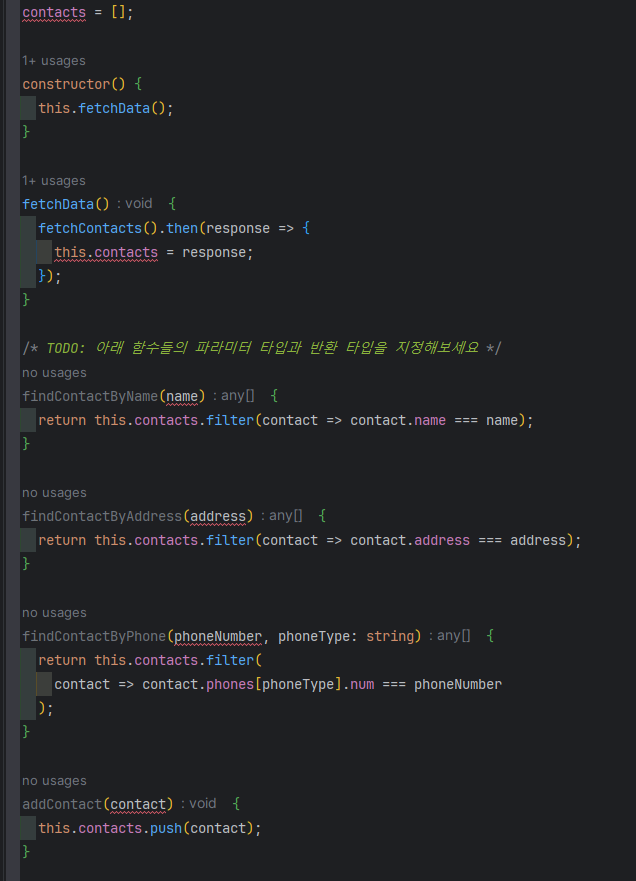
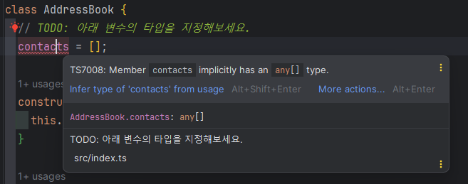
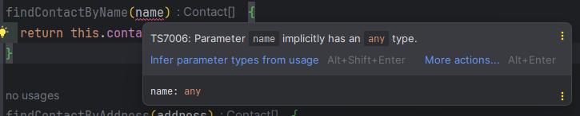
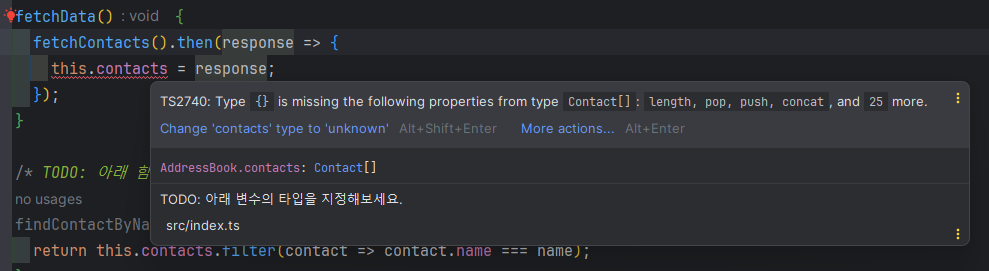
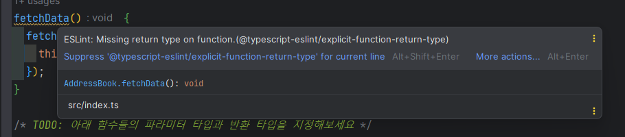
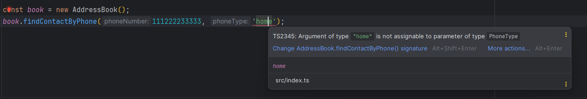

# 11장 전화번호부 앱

# 11.1 프로젝트 환경 구성

예제 소스 코드를 내려받는다.

프로젝트에 필요한 노트 패키지를 설치

명령어

```jsx
pnpm up
```



# 11.2 프로젝트 폴더 구조

## 11.2.5 tsconfig.json 파일

: 타입스크립트 관련 설정이 담겨 있는 타입스크립트 설정 파일

`**tsconfig.json**`

```tsx
{
  "compilerOptions": {
    "allowJs": true,
    "checkJs": true,
    "target": "es5",
    "lib": ["es2015", "dom", "dom.iterable"],
    "noImplicitAny": false
  },
  "include": ["./src/**/*"]
}
```

`compilerOptions` 속성: 타입스크립트 컴파일과 관련된 옵선을 지정

- allowJs 속성: 타입스크립트 컴파일 대상에 자바스크립트도 포함할지 정하는 옵션
- checkJs 속성: 프로젝트 내 자바스크립트 파일에 타입스크립트 컴파일 규칙을 적용할지 정하는 옵션
- noImplicitAny 속성: 타입이 지정되어 있지 않으면 암묵적으로 any로 간주할 지 설정하는 옵션

`target` 속성: 타입스크립트 코드가 자바스크립트 코드로 컴파일 되었을 때 자바스크립트 코드가 실행될 환경을 지정

`lib` 속성: 자바스크립트 기본 문법이나 브라우저 API 등 자주 사용되는 문법에 대해 작성된 타입스크립트 선언 파일의 사용 여부를 정하는 옵션

# 11.3 프로젝트 로직

## 11.3.1 인터페이스 코드

```tsx
interface PhoneNumberDictionary {
  [phone: string]: {
    num: number;
  };
}

interface Contact {
  name: string;
  address: string;
  phones: PhoneNumberDictionary;
}
```

위 코드는 전화번호부 연락처 관련 타입을 정의한 코드

`Contact` 인터페이스에 이름, 주소, 전화번호 목록이 정의되어 있고, 전화번호 목록이 `PhoneNumberDictionary` 라는 별도의 인터페이스에 정의되어 있다.

- `[phone: string]` → 인터페이스의 인덱스 시그니처 문법
    
    : 문자열로 정의된 속성은 어떤 이름이든 속성으로 사용할 수 있다는 의미
    

## 11.3.2 api 함수

```tsx
// api
// TODO: 아래 함수의 반환 타입을 지정해보세요.
function fetchContacts() {
  // TODO: 아래 변수의 타입을 지정해보세요.
  const contacts = [
    {
      name: 'Tony',
      address: 'Malibu',
      phones: {
        home: {
          num: 11122223333,
        },
        office: {
          num: 44455556666,
        },
      },
    },
    {
      name: 'Banner',
      address: 'New York',
      phones: {
        home: {
          num: 77788889999,
        },
      },
    },
    {
      name: '마동석',
      address: '서울시 강남구',
      phones: {
        home: {
          num: 213423452,
        },
        studio: {
          num: 314882045,
        },
      },
    },
  ];
  return new Promise(resolve => {
    setTimeout(() => resolve(contacts), 2000);
  });
}
```

fetchContacts()를 호출하면 2초 후 contacts 변수에 담긴 배열을 반환

→ 프로미스로 비동기 처리 문법을 사용

## 11.3.3 전화번호부 클래스

```tsx
class AddressBook {
  // TODO: 아래 변수의 타입을 지정해보세요.
  contacts = [];

  constructor() {
    this.fetchData();
  }

  fetchData() {
    fetchContacts().then(response => {
      this.contacts = response;
    });
  }

  /* TODO: 아래 함수들의 파라미터 타입과 반환 타입을 지정해보세요 */
  findContactByName(name) {
    return this.contacts.filter(contact => contact.name === name);
  }

  findContactByAddress(address) {
    return this.contacts.filter(contact => contact.address === address);
  }

  findContactByPhone(phoneNumber, phoneType: string) {
    return this.contacts.filter(
      contact => contact.phones[phoneType].num === phoneNumber
    );
  }

  addContact(contact) {
    this.contacts.push(contact);
  }

  displayListByName() {
    return this.contacts.map(contact => contact.name);
  }

  displayListByAddress() {
    return this.contacts.map(contact => contact.address);
  }

  /* ------------------------------------------------ */
}

new AddressBook();
```

클래스 속성 `contacts` : 전화번호부 목록이 저장

클래스 생성자 함수 `constructor()` : fetchData()라는 클래스 메서드를 사용해 전화번호부 데이터를 contacts 속성에 저장

`findContactByName(name)` : 이름으로 연락처를 찾는 메서드

`findContactByAddress(address)` : 주소로 연락처를 찾는 메서드

`findContactByPhone(phoneNumber, phoneType: string)` : 전화번호와 번호 유형으로 연락처를 찾는 메서드

`addContact(contact)` : 새 연락처를 전화번호부에 추가하는 메서드

`displayListByName()` : 전화번호부 목록의 이름만 추출해서 화면에 표시하는 메서드

`displayListByAddress()` 전화번호부 목록의 주소를 화면에 표시하는 메서드

# 11.4 프로젝트 실습

실습 순서

1. tsconfig.json 파일의 noImplicitAny 속성 값을 true로 변경
2. tsconfig.json 파일의 strict 속성 값을 true로 변경

## 11.4.1 타입스크립트 설정 파일의 noImplicitAny 속성 값 변경

`tsconfig.json`

```tsx
{
  "compilerOptions": {
    "allowJs": true,
    "checkJs": true,
    "target": "es5",
    "lib": ["es2015", "dom", "dom.iterable"],
    **"noImplicitAny": true // 속성 값 true로 변경**
  },
  "include": ["./src/**/*"]
}
```

이제 index.ts 파일에 에러가 표시된다.



---

## 11.4.2 타입스크립트 설정 파일의 strict 속성 값 변경

타입스크립트 설정 파일에 다음 내용을 추가

`tsconfig.json`

```tsx
{
  "compilerOptions": {
    "allowJs": true,
    "checkJs": true,
    "target": "es5",
    "lib": ["es2015", "dom", "dom.iterable"],
    "noImplicitAny": true,
    **"strict": true**
  },
  "include": ["./src/**/*"]
}
```

strict 속성: 타입을 검사할 때 최대한 구체적으로 검사하게 한다.

그리고 .eslintrc.js  파일에서 rules 속성 아래 있는 @typescript-eslint 관련 규칙 2개를 주석 처리

`.eslintrc.js`

```tsx
module.exports = {
  root: true,
  env: {
    browser: true,
    node: true,
    jest: true,
  },
  extends: [
    'plugin:@typescript-eslint/eslint-recommended',
    'plugin:@typescript-eslint/recommended',
  ],
  plugins: ['prettier', '@typescript-eslint'],
  rules: {
    'prettier/prettier': [
      'error',
      {
        singleQuote: true,
        semi: true,
        useTabs: false,
        tabWidth: 2,
        printWidth: 80,
        bracketSpacing: true,
        arrowParens: 'avoid',
      },
    ],
    **// '@typescript-eslint/no-explicit-any': 'off',
    // "@typescript-eslint/explicit-function-return-type": 'off',**
    'prefer-const': 'off',
  },
  parserOptions: {
    parser: '@typescript-eslint/parser',
  },
};
```

→ 함수의 반환 타입이 지정되어 있지 않거나 타입이 지정되어야 할 곳에 타입이 없으면 lint 에러를 발생시킨다.

# 11.5 프로젝트 실습 풀이: 첫 번째

## 11.5.1 클래스 속성 타입 정의

AddressBook 클래스에 contacts 속성에 타입 에러가 발생한다.



이 에러는 타입스크립트 설정 파일에서 noImplicitAny 속성을 true로 추가했기 때문에 발생

→ 클래스 속성에 타입이 정의되어 있지 않아서 발생하는 에러

다음과 같이 클래스 속성에 타입을 선언해 주면 에러가 사라진다.

```tsx
interface Contact {
  name: string;
  address: string;
  phones: PhoneNumberDictionary;
}

class AddressBook {
  // TODO: 아래 변수의 타입을 지정해보세요.
  contacts: **Contact[]** = [];

  constructor() {
    this.fetchData();
  }

// ....
```

contacts 클래스 속성은 Contact 인터페이스의 배열로 타입이 정의되어 있다.

## 11.5.2 함수 파라미터 타입 정의

1. 이름으로 연락처를 검색하는 메서드
    
    ```tsx
    findContactByName(name) {
        return this.contacts.filter(contact => contact.name === name);
      }
    ```
    
    
    
    ---
    
    함수의 파라미터에 타입이 지정되어 있지 않아 에러가 표시
    
    이 함수는 filter() 메서드를 이용해서 해당 이름 값을 가진 배열 요소만 반환해 준다.
    
    연락처의 name 속성은 문자열이기 때문에 이 클래스 메서드의 파라미터 타입을 문자열로 지정해준다.
    
    ```tsx
    findContactByName(name: string) {
        return this.contacts.filter(contact => contact.name === name);
      }
    ```
    

1. 주소로 연락처를 검색하는 메서드
    
    ```tsx
    findContactByAddress(address) {
        return this.contacts.filter(contact => contact.address === address);
      }
    ```
    
    클래스 속성 contacts에 연결된 인터페이스를 확인해보면 address 속성은 문자열 타입이다.
    
    ```tsx
    interface Contact {
      name: string;
      **address: string;**
      phones: PhoneNumberDictionary;
    }
    ```
    
    따라서 함수의 파라미터 타입을 string으로 정의
    
    ```tsx
    findContactByAddress(address: string) {
        return this.contacts.filter(contact => contact.address === address);
      }
    ```
    
2. 전화번호와 전화번호 유형으로 연락처를 검색하는 메서드
    
    ```tsx
    findContactByPhone(phoneNumber, phoneType: string) {
        return this.contacts.filter(
          contact => contact.phones[phoneType].num === phoneNumber
        );
      }
    ```
    
    phoneNumber 파라미터 타입 살펴보기
    
    연락처 객체 phones 속성에 접근하여 num이라는 속성을 가지고 phoneNumber 파라미터 값과 비교하고 있다. 
    
    num 속성의 데이터 타입이 무엇인지 확인해보자.
    
    ```tsx
    const contacts = [
        {
          name: 'Tony',
          address: 'Malibu',
          phones: {
            home: {
              num: 11122223333,
            },
            office: {
              num: 44455556666,
            },
          },
        },
        {
          name: 'Banner',
          address: 'New York',
          phones: {
            home: {
              num: 77788889999,
            },
          },
        },
        {
          name: '마동석',
          address: '서울시 강남구',
          phones: {
            home: {
              num: 213423452,
            },
            studio: {
              num: 314882045,
            },
          },
        },
      ];
    ```
    
    num 속성은 숫자 타입인 것을 확인할 수 있다.
    
    해당 클래스 메서드 파라미터 타입 지정하기
    
    ```tsx
    findContactByPhone(phoneNumber: number, phoneType: string) {
        return this.contacts.filter(
          contact => contact.phones[phoneType].num === phoneNumber
        );
      }
    ```
    

1. 새로운 연락처를 인자로 받아 연락처 목록에 추가해 주는 메서드
    
    ```tsx
    addContact(contact) {
        this.contacts.push(contact);
      }
    ```
    
    배열에 데이터를 추가하기 위해 push() 메서드를 사용
    
    배열의 요소의 데이터 타입은 Contact 인터페이스이다.
    
    따라서 파라미터 타입은 Contact로 정의
    
    ```tsx
    addContact(contact: Contact) {
        this.contacts.push(contact);
      }
    ```
    

## 11.5.3 API 함수 반환 타입 정의

fetchData() 메서드 안에서 발생하는 타입 에러



---

이것은 클래스 내부에서 외부에 있는 API 함수의 반환 타입을 지정하지 않았기 때문에 발생하는 에러 → 여기서 API 함수는 fetchContacts() 함수를 의미

`fetchContacts()` 함수

```tsx
function fetchContacts() {
  // TODO: 아래 변수의 타입을 지정해보세요.
  const contacts = [
    {
      name: 'Tony',
      address: 'Malibu',
      phones: {
        home: {
          num: 11122223333,
        },
        office: {
          num: 44455556666,
        },
      },
    },
    {
      name: 'Banner',
      address: 'New York',
      phones: {
        home: {
          num: 77788889999,
        },
      },
    },
    {
      name: '마동석',
      address: '서울시 강남구',
      phones: {
        home: {
          num: 213423452,
        },
        studio: {
          num: 314882045,
        },
      },
    },
  ];
  return new Promise(resolve => {
    setTimeout(() => resolve(contacts), 2000);
  });
}
```

반환값이 new Promise() → Promise를 알아보자.

### 자바스크립트 Promise

프로미스(promise): 자바스크립트의 비동기 처리에 사용되는 객체

**비동기 처리란?**

: 특정 코드의 실행이 완료될 때까지 기다리지 않고 다음 코드를 먼저 수행하는 것을 의미

프로미스는 new Promise() 형태로 선언하고 Promise()를 호출하여 결과 값을 받아 온다.

```tsx
function fetchNumber() {
  return new Promise(function (resolve, reject) {
    resolve(10);
  });
}

fetchNumber().then(function (data) {
  console.log(data);
});

function fetchError() {
  return new Promise(function (resolve, reject) {
    reject('System Error');
  });
}

fetchError().catch(function (error) {
  console.log(error);
});
```

resolve()는 성공을 의미하고, reject()는 실패를 의미

- new Promise()의 첫번째 파라미터는 resolve고, 두 번째 파라미터는 reject이다.
- 프로미스가 실행되었을 때 성공한 값은 resolve()에 넣고, 실패한 값은 reject()에 넣는다.
- 성공한 값은 .then()의 콜백 함수에서 전달받고, 실패한 값은 .catch()의 콜백 함수에서 전달받는다.

이제 본 실습 코드로 돌아가보자.

```tsx
function fetchContacts() {
  // TODO: 아래 변수의 타입을 지정해보세요.
  const contacts = [
		// ...
	];

return new Promise(resolve => {
    setTimeout(() => resolve(contacts), 2000);
  });
}
```

이 함수를 다음과 같이 실행하면 contacts 배열을 전달받을 수 있다.

```tsx
fetchContacts().then((data) => {
	console.log(data);
});
```

→ 이 코드는 AddressBook 클래스의 fetchData() 메서드와 같다.

fetchContacts() 함수의 반환값으로 프로미스를 사용하고 contacts 배열 객체를 반환

→ 반환 타입은 Promise가 되어야 한다.

```tsx
function fetchContacts(): Promise<Contact[]> {
  // TODO: 아래 변수의 타입을 지정해보세요.
  const contacts: Contact[] = [
    //...
];

return new Promise(resolve => {
    setTimeout(() => resolve(contacts), 2000);
  });
}
```

지금까지 작성한 코드 정리

```tsx
interface PhoneNumberDictionary {
  [phone: string]: {
    num: number;
  };
}

interface Contact {
  name: string;
  address: string;
  phones: PhoneNumberDictionary;
}

// api
// TODO: 아래 함수의 반환 타입을 지정해보세요.
function fetchContacts(): Promise<Contact[]> {
  // TODO: 아래 변수의 타입을 지정해보세요.
  const contacts: Contact[] = [
    {
      name: 'Tony',
      address: 'Malibu',
      phones: {
        home: {
          num: 11122223333,
        },
        office: {
          num: 44455556666,
        },
      },
    },
    {
      name: 'Banner',
      address: 'New York',
      phones: {
        home: {
          num: 77788889999,
        },
      },
    },
    {
      name: '마동석',
      address: '서울시 강남구',
      phones: {
        home: {
          num: 213423452,
        },
        studio: {
          num: 314882045,
        },
      },
    },
  ];
  return new Promise(resolve => {
    setTimeout(() => resolve(contacts), 2000);
  });
}

// main
class AddressBook {
  // TODO: 아래 변수의 타입을 지정해보세요.
  contacts: Contact[] = [];

  constructor() {
    this.fetchData();
  }

  fetchData() {
    fetchContacts().then(response => {
      this.contacts = response;
    });
  }

  /* TODO: 아래 함수들의 파라미터 타입과 반환 타입을 지정해보세요 */
  findContactByName(name: string) {
    return this.contacts.filter(contact => contact.name === name);
  }

  findContactByAddress(address: string) {
    return this.contacts.filter(contact => contact.address === address);
  }

  findContactByPhone(phoneNumber: number, phoneType: string) {
    return this.contacts.filter(
      contact => contact.phones[phoneType].num === phoneNumber
    );
  }

  addContact(contact: Contact) {
    this.contacts.push(contact);
  }

  displayListByName() {
    return this.contacts.map(contact => contact.name);
  }

  displayListByAddress() {
    return this.contacts.map(contact => contact.address);
  }
  /* ------------------------------------------------ */
}

new AddressBook();
```

# 11.6 프로젝트 실습 풀이: 두 번째

## 11.6.1 함수 반환 타입 정의

노란색 줄에 마우스 커서를 올리면 에러 메시지 표시



---

→ 함수의 반환 타입을 정의하지 않았기 때문에 발생하는 에러

메서드들의 반환 타입을 정의해보자.

1. `fetchData()` 메서드
    
    ```tsx
    fetchData() {
        fetchContacts().then(response => {
          this.contacts = response;
        });
      }
    ```
    
    `fetchContacts()` 라는 API 함수만 호출 → 반환 값이 없어 void로 지정한다.
    
    ```tsx
    fetchData(): void {
        fetchContacts().then(response => {
          this.contacts = response;
        });
      }
    ```
    

1. `findContactByName()` 메서드
    
    ```tsx
    findContactByName(name: string) {
        return this.contacts.filter(contact => contact.name === name);
      }
    ```
    
    특정 이름에 해당하는 연락처를 찾고자 배열의 filter() 메서드를 사용했기 때문에 결과 값으로 1개 또는 여러 개의 요소가 담긴 배열이 된다. 
    
    결과 타입인 Contact[]로 지정
    
    ```tsx
    findContactByName(name: string): Contact[] {
        return this.contacts.filter(contact => contact.name === name);
      }
    ```
    
2. `findContactAddress()` 메서드
    
    ```tsx
    findContactByAddress(address: string): Contact[] {
        return this.contacts.filter(contact => contact.address === address);
      }
    ```
    
    → 같은 필터 메서드를 사용하였기 때문에 위와 같은 반환 타입을 지정
    

1. `findContactByPhone()` 메서드
    
    ```tsx
    findContactByPhone(phoneNumber: number, phoneType: string): Contact[] {
        return this.contacts.filter(
          contact => contact.phones[phoneType].num === phoneNumber
        );
      }
    ```
    

1. `addContact()` 메서드
    
    ```tsx
    addContact(contact: Contact) {
        this.contacts.push(contact);
      }
    ```
    
    → 전화번호부 목록에 새로운 연락처를 추가하는 메서드
    
    - push 메서드를 사용하고 별도의 반환값을 지정하지 않는다.
    
    ```tsx
    addContact(contact: Contact): **void** {
        this.contacts.push(contact);
      }
    ```
    

1. `displayListByName()` 메서드
    
    ```tsx
    displayListByName() {
        return this.contacts.map(contact => contact.name);
      }
    ```
    
    → 전화번호부 목록을 화면에 이름으로만 나열
    
    - 배열의 형태를 가공하는 map 메서드를 사용
        
        → Contact[]이 아니라 다른 타입이 된다.
        

### 자바스크립트 배열 map() API

map() 메서드는 특정 배열의 각 요소를 반환하여 새로운 배열로 만들어준다.

`ex`

```tsx
const avengers = [
  { name: 'capt', age: 100 },
  { name: 'hulk', age: 47 },
  { name: 'thor', age: 3000 },
];
```

위 배열에서 이름만 추려 새로운 형태의 배열을 만들고 싶을 때 map을 사용

```tsx
const avengersNameArr = avengers.map(function (avenger) {
  return avenger.name;
});
```

avengers 배열을 map으로 순회하면서 각 요소의 name 속성만 배열 요소로 지정

결과적으로 avengerNameArr 변수 값은 다음과 같은 배열이 된다.

```tsx
console.log(avengersNameArr); // [ 'capt', 'hulk', 'thor' ]
```

다시 displayListByName() 메서드로 돌아오면 반환 타입이 string[]이 된다는 것을 확인할 수 있다.

```tsx
displayListByName(): string[] {
    return this.contacts.map(contact => contact.name);
  }
```

1. `displayListByAddress()` 메서드
    
    ```tsx
    displayListByAddress(): string[] {
        return this.contacts.map(contact => contact.address);
      }
    ```
    

## 11.6.2 함수 파라미터에 이넘 타입 적용

`findContactByPhone()` 메서드에 이넘 타입을 적용해보자.

```tsx
function fetchContacts(): Promise<Contact[]> {
  // TODO: 아래 변수의 타입을 지정해보세요.
  const contacts: Contact[] = [
    {
      name: 'Tony',
      address: 'Malibu',
      phones: {
        home: {
          num: 11122223333,
        },
        office: {
          num: 44455556666,
        },
      },
    },
    {
      name: 'Banner',
      address: 'New York',
      phones: {
        home: {
          num: 77788889999,
        },
      },
    },
    {
      name: '마동석',
      address: '서울시 강남구',
      phones: {
        home: {
          num: 213423452,
        },
        studio: {
          num: 314882045,
        },
      },
    },
  ];
  return new Promise(resolve => {
    setTimeout(() => resolve(contacts), 2000);
  });
}
```

findContactByPhone() 메서드를 이용해 첫 번째 연락처를 검색하고 싶으면 다음을 호출

```tsx
const book = new AddressBook();
book.findContactByPhone(111222233333, 'home');
```

하지만 다음과 같이 잘못된 코딩을 하면?

```tsx
const book = new AddressBook();
book.findContactByPhone(111222233333, 'homee');
```

→ 위와 같이 잘못된 인수를 넣어도 에러가 발생하지 않는다.

위의 문제를 해결하기 위해 이넘 타입을 사용

클래스에 이넘 타입 코드를 추가

```tsx
enum PhoneType {
  Home = 'home',
  Office = 'office',
  Studio = 'studio',
}
```

→ 전화번호부 목록에서 사용되는 전화번호 유형 세 가지를 이넘 타입으로 선언

이 이넘타입은 findContactByPhone() 메서드의 두 번째 파라미터로 연결

```tsx
findContactByPhone(phoneNumber: number, phoneType: PhoneType): Contact[] {
    return this.contacts.filter(
      contact => contact.phones[phoneType].num === phoneNumber
    );
  }
```

이렇게 되면 findContactByPhone() 메서드를 사용할 때 더 이상 문자열 값이 아니라 이넘 타입을 넣어주어야 한다.

```tsx
book.findContactByPhone(111222233333, PhoneType.Home
```

이제 두 번째 인수로 문자열 값을 넘겨주면 에러가 발생한다.



---

이제 이넘 타입이 Home, Office, Studio 세 값으로 정해져 있기 때문에 작성자 입장에서 오탈자 없이 코드를 작성할 수 있다.