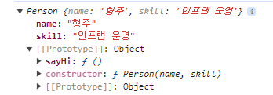
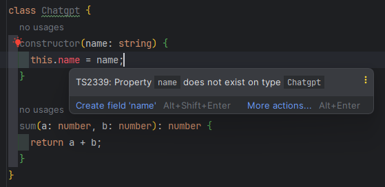
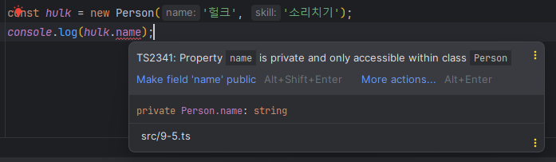
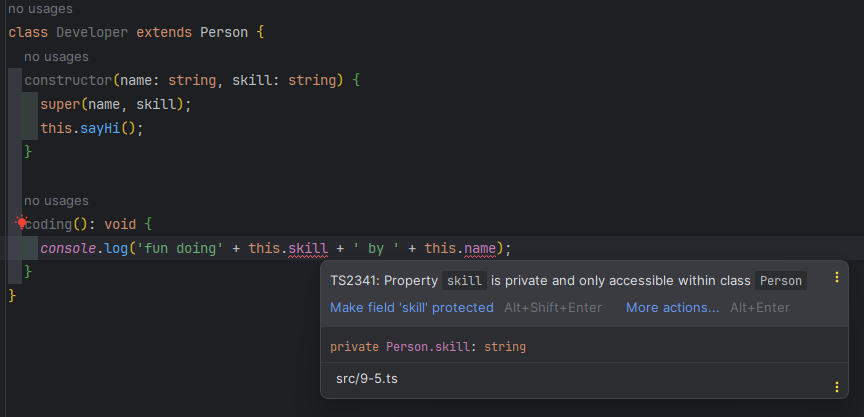
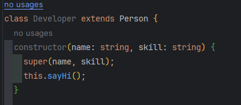
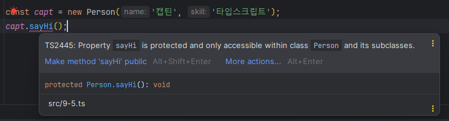
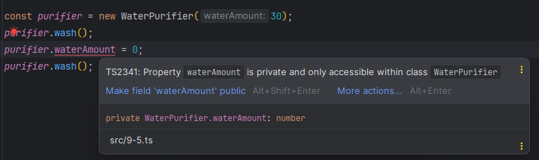
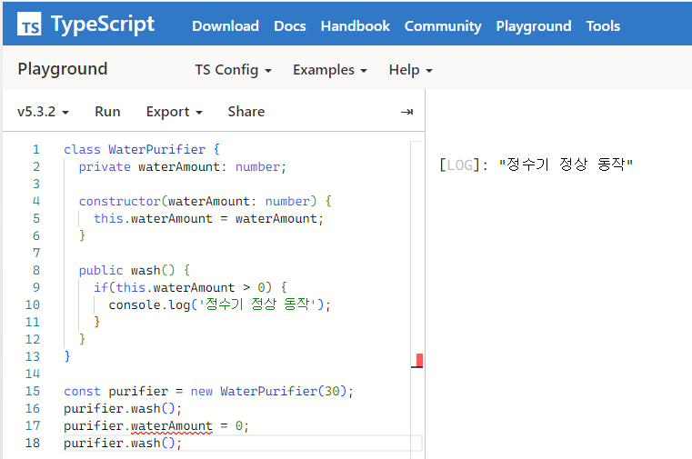
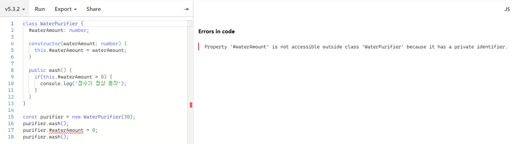
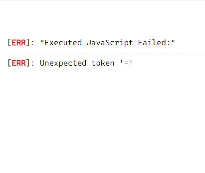

# 9장 클래스

# 9.1 클래스란?

**클래스**

: 여러 가지 유사한 객체를 쉽게 생성하는 자바스크립트 최신 문법

자바스크립트에서 객체를 정의할 때 객체 정의 문법을 사용

```jsx
const capt = {
    name:'캡틴',
    skill: '방패 던지기'
};

const lee = {
    name: '길벗',
    skill: '좋은 책 만들기'   
};
```

위와 같이 모양이 유사한 객체는 일일이 정의하기보다 생성자 함수를 사용하는 것이 좋다.

```jsx
function Person(name, skill) {
    this.name = name;
    this.skill = skill;
}

const capt = new Person("캡틴", "방패 던지기");
const lee = new Person("길벗", "좋은 책 만들기");
```

- 생성자 함수를 사용해 여러 개의 유사한 구조의 객체를 만들 수 있다.

생성자 함수를 최신 자바스크립트 문법으로 표현

```jsx
class Person {
    constructor(name, skill) {
        this.name = name;
        this.skill = skill;
    }
}
```

- Person 클래스는 Person 생성자 함수와 코드는 다르지만 역할은 동일
    
    → 생성자 함수라는 일반적인 관례를 문법 레벨로 끌어올린 것이 클래스
    

# 9.2 클래스 기본 문법

생성자 함수와 클래스를 비교해보자.

```jsx
function Person(name, skill) {
    this.name = name;
    this.skill = skill;
}

Person.prototype.sayHi = function () {
    console.log('hi');
}
```

→ Person 생성자 함수에 sayHi라는 속성 함수를 추가

생성자 함수로 객체를 생성

```jsx
const joo = new Person('형주', '인프랩 운영');
```

joo 변수를 콘솔창에 출력해보자.

---



---

→ 객체 안에 name과 skill이라는 속성이 있고, 객체의 프로토타입에 sayHi라는 속성 함수가 있다는 의미

객체 속성과 속성 함수는 다음과 같이 사용

```jsx
console.log(joo.name);
console.log(joo.skill);
joo.sayHi();
```

위 생성자 함수의 코드를 클래스로 바꿔보자.

```jsx
class Person {
    constructor(name, skill) {
        this.name = name;
        this.skill = skill;
    }

    sayHi() {
        console.log("hi");
    }
}
```

- 생성자 메서드(constructor)를 사용해 name과 skill 값을 받아 객체를 생성
- sayHi()라는 클래스 메서드 선언
- 여기서 name과 skill 속성을 **클래스 속성**이라고 한다.

클래스도 생성자 함수와 동일하게 new 키워드를 붙여 객체를 생성

```jsx
const joo = new Person("형주", "인프랩 운영");
```

- 클래스로 생성된 객체를 **클래스 인스턴스**라고 한다.

# 9.3 클래스 상속

**클래스 상속**

: 부모 클래스의 속성과 메서드 등을 자식 클래스에게 물려준다는 의미

`ex`

```jsx
class Person {
    constructor(name, skill) {
        this.name = name;
        this.skill = skill;
    }

    sayHi() {
        console.log("hi");
    }
}

class Developer extends Person {
    constructor(name, skill) {
        super(name, skill);
    }

    coding() {
        console.log("fun");
    }
}
```

→ Person 클래스를 상속받아 Developer 클래스를 정의

- `super 키워드`
    
    : 자식 클래스에서 객체를 생성할 때, 부모 클래스의 생성자 메서드를 호출
    

Developer 클래스로 새로운 객체 하나 생성

```jsx
const capt = new Developer('캡틴', '방패 던지기');
capt.coding();
```

상속받은 메서드에 접근할 수 있다.

```jsx
capt.sayHi(); // hi
```

상속받은 클래스 속성에도 접근

```jsx
console.log(capt.name); // 캡틴
console.log(capt.skill); // 방패 던지기
```

상속을 받으면 클래스 인스턴스뿐만 아니라 자식 클래스 내부에서도 부모 클래스의 속성이나 메서드에 접근할 수 있다.

```jsx
class Person {
    constructor(name, skill) {
        this.name = name;
        this.skill = skill;
    }

    sayHi() {
        console.log("hi");
    }
}

class Developer extends Person {
    constructor(name, skill) {
        super(name, skill);
        **this.sayHi();**
    }

    coding() {
        **console.log("fun doing" + this.skill + " by " + this.name);**
    }
}
```

이렇게 클래스를 상속받으면 기존 클래스에 정의된 속서오가 메서드를 재활용할 수 있어 객체 지향 프로그래밍에 유용

# 9.4 타입스크립트의 클래스

클래스에 타입을 정의해보는 방법을 알아보자.

`ex`

```tsx
class Chatgpt {
  constructor(name) {
    this.name = name;
  }

  sum(a, b) {
    return a + b;
  }
}
```

위 클래스 코드에 타입을 입히기

```tsx
class Chatgpt {
  constructor(name: string) {
    this.name = name;
  }

  sum(a: number, b: number): number {
    return a + b;
  }
}
```

작성을 하게 되면 다음과 같은 에러가 발생한다.

---



---

발생하는 이유

: 타입스크립트로 클래스를 작성할 때 생성자 메서드에서 사용될 클래스 속성을 미리 정의해줘야 하기 때문이다.

```tsx
class Chatgpt {
  **name: string;**

  constructor(name: string) {
    this.name = name;
  }

  sum(a: number, b: number): number {
    return a + b;
  }
}
```

→ name 속성의 타입을 먼저 정의해주었다.

# 9.5 클래스 접근 제어자

**클래스 접근 제어자**

: 클래스 속성의 노풀 범위를 정의

쓰는 이유

- 여러 객체를 다루다 보면 의도지 않게 객체 값이 바뀌어 에러가 발생
    
    → 클래스 접근 제어자를 사용해 위와 같은 에러를 발생시킬 확률을 낮춘다.
    

## 9.5.1 클래스 접근 제어자의 필요성

`ex`

```jsx
class Person {
  name: string;
  skill: string;

  constructor(name: string, skill: string) {
    this.name = name;
    this.skill = skill;
  }
}

const capt = new Person('캡틴', '방패 던지기');
console.log(capt.name);
```

Person 클래스를 이용해 생성된 객체는 자유롭게 속성을 변경할 수 있다.

```jsx
const capt = new Person('캡틴', '방패 던지기');
console.log(capt.name);
**capt.name = '헐크';
console.log(capt.name);**
```

→ 위 코드는 객체 내용이 변하더라도 크게 문제없다.

- 클래스 속성의 내용이 변경되었을 때 영향을 주는 로직이 따로 없기 때문이다.

다른 경우

정수기 클래스 코트

```jsx
class WaterPurifier {
  waterAmount: number;

  constructor(waterAmount: number) {
    this.waterAmount = waterAmount;
  }

  wash() {
    if(this.waterAmount > 0) {
      console.log('정수기 동작 성공');
    }
  }
}

const purifier = new WaterPurifier(30);
```

- 생성자 메서드: 물의 양을 입력받는다.
- 메서드 wash(): 물이 있어야 동작하게끔 작성

객체 생성할 때 물의 양을 30으로 초기화

→ wash 메서드 함수를 실행할 수 있다.

```jsx
purifier.wash(); // 정수기 동작 성공
```

누군가 실수로 purifier 객체에 접근하여 물의 양을 0으로 바꾸면??

```jsx
purifier.waterAmount = 0;
```

→ waterAmount가 30에서 0으로 바뀌었기 때문에 wash() 메서드를 실행하면 정상적으로 동작하지 않는다.

```jsx
const purifier = new WaterPurifier(30);
purifier.wash();
**purifier.waterAmount = 0;
purifier.wash();**
```

→ 정수기가 고장난 것

- 클래스 속성이 의도치 않게 오염되었을 때 발생하는 에러

위 에러를 방지할 수 있는 속성 접근 제어자를 알아보자.

## 9.5.2 클래스 접근 제어자: public, private, protected

### public 접근 제어자

: 클래스 안에 선언된 속성과 메서드를 어디서든 접근할 수 있게 한다.

- 따로 접근 제어자를 선언하지 않으면 기본값은 public

pubilc 접근 제어자 사용해보기

```tsx
class WaterPurifier {
  **public** waterAmount: number;
  
  constructor(waterAmount: number) {
    this.waterAmount = waterAmount;
  }
  
  **public** wash() {
    if(this.waterAmount > 0) {
      console.log('정수기 동작 성공');
    }
  }
}
```

→ 속성 waterAmount와 wash() 메서드에 public 접근 제어자를 사용

- 이 속성과 메서드는 어디에서나 접근할 수 있다.

```tsx
const purifier = new WaterPurifier(50);
console.log(purifier.waterAmount);
purifier.wash();
```

### private 접근 제어자

: 클래스 코드 외부에서 클래스의 속성과 메서드를 접근할 수 없게 한다.

- 클래스 안 로직을 외부와 단절시켜 보호할 때 사용한다.

`ex`

```tsx
class Person {
  **private** name: string;
  **private** skill: string;

  constructor(name: string, skill: string) {
    this.name = name;
    this.skill = skill;
  }

  **private** sayHi() {
    console.log('hi');
  }
}
```

Person 클래스로 객체를 하나 생성 후 name 속성을 출력

```tsx
const hulk = new Person('헐크', '소리치기');
console.log(hulk.name);
```

타입 에러 발생



---

→ 클래스 name 속성이 private으로 정의되어 있는데, 외부에서 이 속성을 사용하려고 해서 발생한 오류

### protected 접근 제어자

: protected로 선언된 속성이나 메서드는 클래스 외부에서 사용할 수 없다. 하지만 상속받은 클래스에서는 사용할 수 있다.

`ex`

```tsx
class Person {
  private name: string;
  private skill: string;

  constructor(name: string, skill: string) {
    this.name = name;
    this.skill = skill;
  }

  protected sayHi(): void {
    console.log('hi');
  }
}

class Developer extends Person {
  constructor(name: string, skill: string) {
    super(name, skill);
    this.sayHi();
  }

  coding(): void {
    console.log('fun doing' + this.skill + ' by ' + this.name);
  }
}
```

- Person 클래스의 속성 name과 skill은 접근 제어자로 private 선언
    
    클래스 메서드 sayHi()에는 protected 선언
    

coding() 메서드를 보면 부모 클래스 속성인 skill과 name 속성에 접근

→ 에러 발생!!



---

→ Person 클래스에 private으로 정의된 속성을 외부에서 접근하려고 해서 생긴 오류

Person 클래스 메서드는 protected로 설정

→ 자식 클래스에서 사용해도 문제 없다.



---

부모 클래스(Person) 객체를 생성해보자.

```tsx
const capt = new Person('캡틴', '타입스크립트');
capt.sayHi();
```

에러 발생



---

→ sayHi() 메서드는 보호된(protected) 속성이므로 클래스 외부에서 사용할 수 없다.

## 9.5.3 클래스 접근 제어자로 정수기 문제 해결하기

클래스 접근 제어자로 정수기 클래스 문제를 해결해보자.

```tsx
class WaterPurifier {
  private waterAmount: number;

  constructor(waterAmount: number) {
    this.waterAmount = waterAmount;
  }

  public wash() {
    if(this.waterAmount > 0) {
      console.log('정수기 정상 동작');
    }
  }
}

const purifier = new WaterPurifier(30);
purifier.wash();
purifier.waterAmount = 0;
purifier.wash();
```

타입 에러 발생



---

→ wash 메서드가 정상적으로 실행되는 것을 볼 수 있다.

### 9.5.4 클래스 접근 제어자를 사용할 때 주의해야 할 점

→ 접근 범위에 따라 실행까지 막아 주지 않는다.

다음 코드를 타입스크립트 플레이그라운드에 붙여 넣고 실행

```tsx
class WaterPurifier {
  private waterAmount: number;

  constructor(waterAmount: number) {
    this.waterAmount = waterAmount;
  }

  public wash() {
    if(this.waterAmount > 0) {
      console.log('정수기 정상 동작');
    }
  }
}

const purifier = new WaterPurifier(30);
purifier.wash();
purifier.waterAmount = 0;
purifier.wash();
```



---

→ wash 메서드는 한번 실행은 된다.

`why?`

타입스크립트의 접근 제어자가 지정되어 있더라도 실행 시점의 에러까지는 보장해주지 못한다.

→ “타입스크립트는 실행 시점의 에러까지 막을 수 없다”

- 타입스크립트는 실행하는 시점이 아니라 컴파일할 때 미리 에러를 발견하는 데에 목적이 있다.

`but` 타입 에러가 발생한 코드는 타입스크립트가 자바스크립트로 컴파일하지 않는다.

private의 실행 결과까지도 클래스 접근 제어자와 일치시키려면?

→ `**private 문법(#)**` 사용

정수기 클래스에 위 문법 적용

```tsx
class WaterPurifier {
  #waterAmount: number;

  constructor(waterAmount: number) {
    this.#waterAmount = waterAmount;
  }

  public wash() {
    if(this.#waterAmount > 0) {
      console.log('정수기 정상 동작');
    }
  }
}

const purifier = new WaterPurifier(30);
purifier.wash();
purifier.#waterAmount = 0;
purifier.wash();
```

이 코드를 타입스크립트 플레이그라운드에서 실행



---

→ #waterAmount는 private 속성이므로 외부에서 접근할 수 없다는 에러 메시지

에러를 무시하고 코드를 실행하면 Logs는 다음과 같은 메시지 표시

---



---

→ private 접근 제어자와 다르게 실행되지 않는다. 실행되더라도 private 속성 자체에 접근할 수 없다.