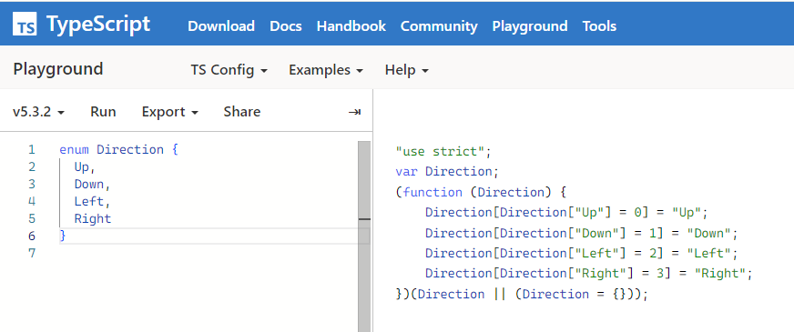
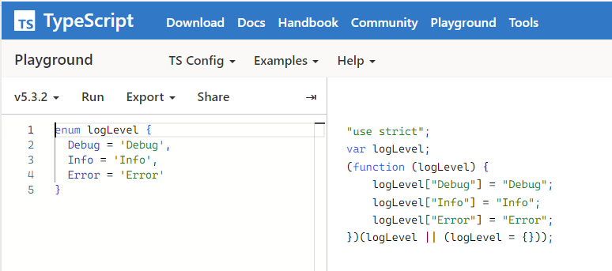
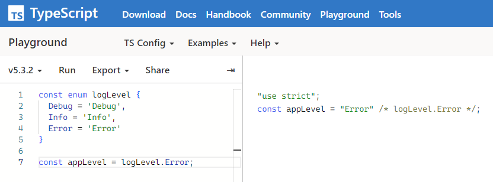

# 8장 이넘

# 8.1 이넘이란?

**이넘(enum)**

: 특정 값의 집합을 의미하는 데이터 타입

- 상수 집합이라고도 표현한다.

**상수의 의미**

`ex`

저녁 식사 값을 계산하는 `getDinnerPrice()` 함수

```tsx
function getDinnerPrice() {
  return 10000 + 20000;
}
```

→ 코드만 봐서는 10000원과 20000원이 각각 무슨 메뉴를 의미하는 지 알 수 없다.

이때 상수를 사용하여 각 숫자 값에 의미를 부여할 수 있다.

```tsx
function getDinnerPrice() {
  const RICE = 10000;
  const COKE = 2000;
  return RICE + COKE;
}
```

- 밥과 콜라를 const 키워드를 사용해 고정 값으로 정의

상수는 단순히 고정 값을 저장하는 것뿐만 아니라 이 값이 어떤 의미를 갖는지 알려줌으로써 가독성을 높이는 장점이 있다.

+) 상수는 보통 모두 대문자로 작성해 일반 변수와 구분한다.

**이넘의 역할**

: 비슷한 성격이나 같은 범주에 있는 상수를 하나로 묶어 더 큰 단위의 상수로 만드는 것이 이넘의 역할

`ex` 신발의 제조하는 브랜드를 묶어 놓은 집합

```tsx
enum ShoesBrand {
  Nike,
  Adidas,
  NewBalance
}
```

이넘 값의 속성은 다음과 같이 사용

```tsx
const myShoes = ShoesBrand.Nike;
const yourShoes = ShoesBrand.NewBalance;
```

# 8.2 숫자형 이넘

이넘에 선언된 속성은 기본적으로 숫자 값을 가진다.

`ex`

```tsx
enum Direction {
  Up,
  Down,
  Left,
  Right
}

console.log(Direction.Up); // 0
```

- Up의 값은 0, Down의 값은 1
    
    → 순서대로 1씩 증가한다.
    

속성 값이 숫자로 지정되는 이유??

→ 타입스크립트의 내부 규칙 때문이다.

위 코드를 자바스크립트로 컴파일

---



---

반환된 결과 중 다음 코드가 이넘 속성 값으로 숫자가 할당되는 부분

```tsx
Direction["Up"] = 0
```

위 그림에서 볼 수 있듯이 Direction은 변수

- 변수의 Up 속성에 0을 할당 → `Direction.Up`을 입력하면 0이라는 값이 나온다.

특이한 문법이 있다.

```tsx
Direction[Direction["Up"] = 0] = "Up";
```

위 코드는 다음과 같이 동작

```tsx
Direction[0] = "Up";
```

- [ ] 안에서 객체의 속성에 0을 할당하는 코드가 존재
    
    → 할당 연산자 =의 할당 값인 0만 남기 때문이다.
    

결과적으로 Direction 변수는 다음과 같이 정의된 꼴

```tsx
Direction.Up = 0;
Direction[0] = "Up";
```

위 코드를 컴파일 해보면 숫자 0과 문자열 Up이 나오는 것을 확인

```tsx
console.log(Direction.Up); // 0
console.log(Direction[0]); // 'Up'
```

→ 이넘의 속성과 값이 거꾸로 연결되어 할당된다. 이것을 **리버스 매핑**이라고 한다.

이넘 속성의 초기값을 변경하려면 다음과 같이 선언

```tsx
enum Direction {
  Up = 10,
  Down,
  Left,
  Right
}
```

- 이제 기본값이 0이 아니라 10으로 설정
    
    → Down 속성은 11, Left 속성은 12, Right 속성은 13
    
    → 시작 값이 변경되더라도 이넘 속성 값은 1씩 증가하는 규칙이 있다.
    

실제 코드를 작성할 때, 명시적으로 값을 설정하는 것이 코드를 파악하는데에 좋다.

```tsx
enum Direction {
  Up = 10,
  Down = 11,
  Left = 12,
  Right = 13
}
```

# 8.3 문자형 이넘

**문자형 이넘**

: 이넘의 속성 값에 문자열을 연결한 이넘을 의미

- 숫자형 이넘과 다르게 모든 속성 값을 다 문자열로 지정해줘야 한다.
- 선언된 속성 순서대로 값이 증가하는 규칙도 없다.

`ex`

```tsx
enum Direction {
  Up = 'Up',
  Down = 'Down',
  Left = 'Left',
  Right = 'Right'
}

console.log(Direction.Up); // 'Up'
```

Direction 이넘은 네 방향에 대한 속성 값을 갖는다.

→ 숫자보단 문자열로 관리되는 것이 더 명시적

- 실무에서는 이넘 값을 주로 문자열로 관리한다.
- 속성 이름과 값을 동일한 문자열로 관리하는 것도 일반적인 코딩 규칙
- 네이밍 규칙
    - 파스칼 케이스 or 스네이크 케이스
        
        ```tsx
        enum Direction {
          UP = 'UP',
          DOWN = 'DOWN',
          LEFT = 'LEFT',
          RIGHT = 'RIGHT'
        }
        
        enum ArrowKey {
          KEY_UP = 'KEY_UP',
          KEY_DOWN = 'KEY_DOWN'
        }
        ```
        

# 8.4 알아 두면 좋은 이넘의 특징

- 숫자형 이넘과 문자형 이넘 말고도 다양한 형태의 이넘의 문법
- const 이넘

## 8.4.1 혼합 이넘

숫자와 문자열을 섞어서 선언할 수 있다.

```tsx
enum Answer {
  Yes = 'Yes',
  No = 1
}
```

→ 코드 상 문제는 없지만 일괄된 데이터 타입으로 관리하는 것이 좋다.

## 8.4.2 다양한 이넘 속성 값 정의 방식

이넘의 속성 값은 고정 값뿐만 아니라 다양한 형태의 값을 할당할 수 있다.

```tsx
enum Authorization {
  User,
  Admin,
  SuperAdmin = User + Admin,
  God = "abc".length
}
```

User와 Admin 속성 값은 0과 1

SuperAdmin 속성은 User와 Admin의 값을 더한 결과인 1

- 먼저 선언되어 있는 이넘의 속성을 활용할 수 있다.
- 덧셈 연산자를 사용하여 계산한 값을 속성 값으로 할당할 수 있다.
- God 속성은 “abc”.length를 사용해 속성 값을 정의
    
    → God의 속성 값은 3
    

→ 이처럼 이넘 속성 값을 할당할 때 연산자 등을 활용할 수 있다. 하지만 활용도는 높지 않다.

## 8.4.3 const 이넘

**const 이넘**

: 이넘을 선언할 때 const를 붙인 이넘

```tsx
const enum logLevel {
  Debug = 'Debug',
  Info = 'Info',
  Error = 'Error'
}
```

**const를 이넘 앞에 붙이는 이유**

: 컴파일 결과물의 코드양을 줄이기 위해서

`ex`

다음 코드를 컴파일

```tsx
enum logLevel {
  Debug = 'Debug',
  Info = 'Info',
  Error = 'Error'
}
```

---



---

→ logLevel 이넘을 코드에서 활용하려면 logLevel이라는 객체를 내부적으로 선언해 이넘 속성 값들을 연결해줘야 한다.

반면 const 이넘은 객체를 생성하지 않고 이넘이 사용되는 곳에서 속성 값을 바로 연결해준다.

다음 코드가 어떻게 변환되는지 확인해보자.

```tsx
const enum logLevel {
  Debug = 'Debug',
  Info = 'Info',
  Error = 'Error'
}

const appLevel = logLevel.Error;
```

---



---

→ 컴파일 결과를 확인해보면, 일반 이넘을 변환했을 때 객체 코드가 생성되지 않고 appLevel 변수에 바로 “Error” 문자열 값이 할당되는 것을 볼 수 있다.

const 이넘은 컴파일했을 때 코드양을 줄여 준다.

- const 이넘은 8.4.2 절에서 배운 다양한 속성 값 정의 방식을 사용할 수 없고 항상 속성에 고정 값만 넣어 주어야 한다.