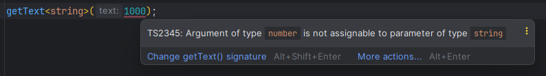
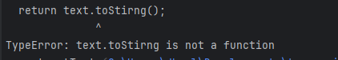
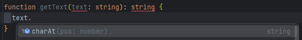
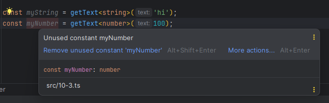
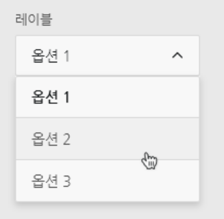
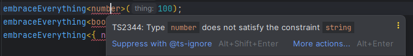
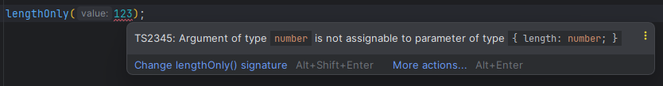
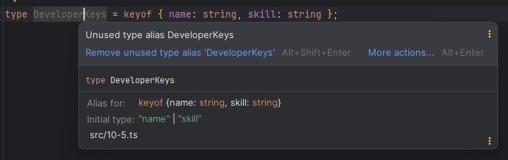
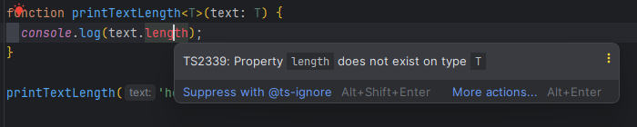
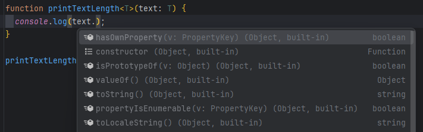

# 10장 제네릭

제네릭은 타입스크립트에서 중복되는 코드를 효과적으로 줄이고 고급 문법을 작성하게 도와준다.

# 10.1 제네릭이란?

**제네릭**

: 타입을 미리 정의하지 않고 사용하는 시점에 원하는 타입을 정의해서 쓸 수 있는 문법

→ 함수의 파라미터와 같은 역할

여기서의 **역할**이란?

→ 인자로 넘긴 값을 함수의 파라미터로 받아 함수 내부에서 그대로 사용하는 방식을 의미

`ex`

```jsx
function getText(text) {
	return text;
}
```

getText() 함수의 text는 함수를 호출할 때 어떤 값이든 인자로 받을 수 있다. 그리고 받은 값을 그대로 반환 → 이 원리를 타입스크립트에 반환한 것이 **제네릭**

# 10.2 제네릭 기본 문법

제네릭의 기본 문법

```tsx
function getText<T>(text: T): T {
  return text;
}
```

이렇게 하면 getText() 함수를 실행할 때 아무 타입이나 넘길 수 있다.

```tsx
getText<string>('hi');
```

→ 함수를 호출할 때 제네릭에 문자열 데이터 타입인 string 타입을 할당한다.

그럼 제네릭 기본 문법 코드가 마치 다음과 같이 정의되는 효과가 생긴다.

```tsx
function getText<string>(text: string): string {
	return text;
}
```

위 코드는 궁극적으로 다음과 같이 선언된 것과 동일

```tsx
function getText(text: string): string {
	return text;
}
```

제네릭이 string이 아닌 number 타입을 넘기면 다음과 같은 효과가 생긴다.

```tsx
function getText(text: number): number {
	return text;
}
```

어느 타입이든 함수를 호출할 때 타입을 지정해 사용할 수 있다.

제네릭으로 넘긴 타입과 맞지 않은 데이터를 인자로 넘기면 에러 발생



# 10.3 왜 제네릭을 사용할까?

## 10.3.1 중복되는 타입 코드의 문제점

`ex` 문자열 텍스트를 받아 그대로 반환해주는 함수, 숫자 텍스트를 받아 그대로 반환하는 함수를 작성

```tsx
function getText(text: string): string {
  return text;
}

function getNumber(num: number): number {
  return num;
}
```

→ 두 함수는 텍스트를 넘겨 받아 그대로 반환해 주는 코드에 단지 타입만 다르게 선언한 것

함수의 역할과 동작은 같은데 타입이 다르기 때문에 함수를 분리했다.

→ 코드의 중복이 발생!!

다른 데이터 타입들이 추가될 때마다 타입에 맞는 함수를 생성해야 한다.

```tsx
function getBoolean(bool: boolean): boolean {
  return bool;
}

function getArray(arr: []): [] {
  return arr;
}

function getObject(obj: {}): object {
  return obj;
}
```

## 10.3.2 any를 쓰면 되지 않을까?

`ex`

```tsx
function getText(text: any): any {
  return text;
}
```

→ 어떤 타입의 텍스트도 모두 받을 수 있다.

동일한 동작을 하는 함수가 반복해서 생성되는 문제는 해결

`but` any를 사용하기 때문에 타입스크립트의 장점이 사라진다. → 코드 자동 완성, 에러의 사전 방지

```tsx
function getText(text: any): any {
  return **text.toStirng();**
}
```

→ toString() 메서드의 오탈자가 발생해도 에러를 잡아주지 못한다.

에러

---



---

→ 에러의 사전 방지가 안된다.

## 10.3.3 제네릭으로 해결되는 문제점

지금까지 살펴본 문제

1. 코드의 타입 때문에 함수를 중복으로 선언
2. any 타입을 선언해 생기는 문제

→ 제네릭으로 모두 해결이 가능하다.

`ex`

```tsx
function getText<T>(text: T): T {
  return text;
}
```

→ 함수에 제네릭을 선언하고 파라미터와 반환 타입에 제네릭 타입을 선언

함수를 호출할 때 제네릭 타입을 지정

```tsx
getText<string>('hi');
```

함수는 제네릭으로 string 타입을 받았기 때문에 함수 안에서 text 파라미터가 문자열로 추론



---

→ 마치 함수의 타입을 string으로 선언해 사용한 듯한 효과가 나타난다.

제네릭으로 받은 타입이 파라미터와 반환값에 모두 연결되기 때문에 함수의 호출 결과 타입도 제네릭 타입을 따른다.

```tsx
const myString = getText<string>('hi');
const myNumber = getText<number>(100);
```

두 변수는 각각 제네릭 반환 타입과 같은 타입으로 정의




---

결국 제네릭을 쓰면 중복되는 코드와 타입이 정확하게 지정되면서 타입스크립트의 이점을 모두 가져갈 수 있다.

# 10.4 인터페이스에 제네릭 사용하기

제네릭은 함수뿐만 아니라 인터페이스에도 사용할 수 있다.

`ex`

```tsx
interface ProductDropdown {
  value: string,
  selected: string
}

interface StockDropdwon {
  value: number,
  selected: boolean
}
```

상품 목록과 상품의 재고를 보여주는 드롭다운 UI를 인터페이스로 정의

드롭다운이란?



---

: 마우스 클릭으로 하위 메뉴가 펼쳐지는 UI

마우스를 클릭하면 하위 메뉴가 열리고 특정 아이템을 선택했을 때 선택되었는지 표시해야 한다.

→ `value`와 `selected` 속성을 갖는 기본 구조로 정의

만약 value에 다른 데이터 타입을 갖는 드롭다운  UI가 필요하다면?

→ 추가적으로 새로운 인터페이스를 정의해야한다.

```tsx
interface AddressDropdown {
  value: {
    city: string, zipCode: string
  },
  selected: boolean
}
```

이런 식으로 모든 데이터 타입을 일일이 정의하면 타입 코드가 많아진다. → 제네릭 사용

```tsx
interface Dropdown<T> {
  value: T,
  selected: boolean
}
```

→ 타입을 유연하게 확장할 수 있게 된다.

이제 `ProductDropdown, StockDropdown, AddressDropdown` 인터페이스 대신 `Dropdown` 인터페이스를 하나의 타입으로 정의할 수 있다.

```tsx
// 드롭다운 유형별로 각각의 인터페이스를 연결
let product: ProductDropdown;
let stock: StockDropdown;
let address: AddressDropdown;

// 드롭다운 유형별로 하나의 제네릭 인터페이스 연결
let product: Dropdown<string>;
let stock: Dropdown<number>;
let Address: Dropdown<{ city: number, zipCode: string }>;

```

# 10.5 제네릭의 타입 제약

**제네릭의 타입 제약**

: 제네릭으로 타입을 정의할 때, 좀 더 정확한 타입을 정의할 수 있게 도와주는 문법

## 10.5.1 extends를 사용한 타입 제약

제네릭을 사용하면 타입을 별도로 제약하지 않고 아무 타입이나 받아서 쓸 수 있다.

`ex`

```tsx
function embraceEverything<T>(thing: T): T {
  return thing;
}

embraceEverything<string>('hi');
embraceEverything<number>(100);
embraceEverything<boolean>(false);
embraceEverything<{ name: string }>({name: 'capt'});
```

모든 타입이 아니라 몇 개의 타입만 제네릭으로 받고 싶다면?

제네릭으로 문자열 타입만 받을 수 있도록 제네릭에 제약을 걸기

```tsx
function embraceEverything<T extends string>(thing: T): T {
  return thing;
}
```

제네릭을 선언하는 부분에 <T extends 타입>과 같은 형태로 코드를 작성

이제 string이 아닌 타입을 제네릭으로 넘기려고 하면 에러가 발생한다.



---

이렇게 extends 키워드를 사용해 제네릭의 타입을 제약할 수 있다.

## 10.5.2 타입 제약의 특징

일반적으로 타입을 제약할 때 여러 개의 타입 중 몇 개만 쓸 수 있게 제약한다.

`ex` length 속성을 갖는 타입만 취급하기

```tsx
function lengthOnly<T extends { length: number }>(value: T): number {
  return value.length;
}
```

→ 이제 받을 수 있는 타입은 `string, array, object`가 된다.

lengthOnly() 함수에서 제네릭의 타입을 length 속성을 갖는 타입으로 제약

이전과는 다르게 제네릭으로 받은 타입을 파라미터에만 연결해 주고 반환 타입에는 연결하지 않았다.

이 함수의 인자로 넘길 수 있는 데이터 타입은 문자열, 배열, length 속성을 갖는 객체

```tsx
lengthOnly('hi');
lengthOnly([1, 2, 3]);
lengthOnly({title: 'abc', length: 123});
```

+) 문자열과 배열에는 length 속성을 내장하고 있다.

위 제약 조건에 해당하지 않은 number나 boolean 등 다른 데이터 타입이 온다면 에러가 발생



---

위 코드는 `lengthOnly<number>(100)`으로 선언하지 않았다. 하지만 `lengthOnly(100)`으로만 선언해도 제네릭에 number 타입을 넘긴 것과 같은 효과가 나타난다.

`why?`

인자로 넘긴 데이터가 숫자 100이기 때문에 lengthOnly() 함수 내부적으로 파라미터 타입인 number를 제네릭에 연결해주었기 때문이다. → “제네릭 타입 추론”

## 10.5.3 keyof를 사용한 타입 제약

**keyof**

: 특정 타입의 키 값을 추출해 문자열 유니언 타입으로 변환해준다.

`ex`

```tsx
type DeveloperKeys = keyof { name: string, skill: string };
```

→ keyof를 사용해 객체의 키를 DeveloperKeys라는 타입 별칭에 담아준다.

DeveloperKeys 타입을 보면 객체의 키가 유니언 타입으로 변환되어 있는 것을 볼 수 있다.



---

만약 속성이 3개면 `속성1 | 속성2 | 속성3` 형태의 유니언 타입이 반환되었을 것이다.

이처럼 keyof는 대상 타입의 키를 추출해 유니언 타입으로 변환해준다.

제네릭 타입 제약으로 돌아가 keyof를 적용

`ex`

객체의 키 값만 인자로 받아 출력할 수 있도록 제네릭의 타입 제약을 걸어 놓은 함수

```tsx
function printKeys<T extends keyof { name: string, skill: string }>(value: T) {
  console.log(value);
}
```

extends와 keyof를 조합해 name과 skill 속성을 갖는 객체의 키만 타입으로 받는다.

이처럼 extends를 이용해 제네릭의 타입을 제약할 때 keyof를 함께 사용하여 타입의 제약 조건을 까다롭게 만들 수 있다.

# 10.6 제네릭을 처음 사용할 때 주의해야 할 사고방식

제네릭에서 헷갈리는 부분

→ 함수 안에서 제네릭으로 받은 타입을 다룰 때

`ex`

인자로 넘긴 텍스트 길이를 출력하는 함수

```tsx
function printTextLength<T>(text: T) {
  console.log(text.length);
}

printTextLength('hello');
```

제네릭으로 선언되어 있고 별도의 타입 제약을 하지 않았다.

- 에러가 발생하지 않을 거라 생각했지만 에러 발생



---

여러 타입 중 문자열인 hello를 넘겨서 함수 안에서 문자열과 관련된 속성과 API(length 속성)를 제공받을 수 있을 거 같지만 에러가 발생한다.

`why?`

타입스크립트 관점에서는 `printTextLength()` 함수 안에 어떤 타입이 들어올지 모르기 때문에 함부로 타입을 가정하지 않는다.

→ 따라서 함수 안에서 text 파라미터를 다룰 때, 코드 자동 완성이나 타입이 미리 정의된 효과를 얻을 수 없다.



---

→ 자동 완성이나 타입 추론이 안되는 것을 확인할 수 있다.

`solution`

타입 제약 문법을 사용하면 된다.

위 예제의 함수는 텍스트 길이를 출력

→ 취급할 데이터에 length 속성이 있으면 된다.

제네릭으로 사용할 타입에 힌트를 준다.

```tsx
function printTextLength<T extends { length: number }>(text: T) {
  console.log(text.length);
}
```

extends 키워드를 사용하여 타입을 제한한다. 

→ length 속성이 있는 데이터 타입만 제네릭 타입으로 넘길 수 있다.

제네릭으로 받을 타입을 배열 형태로 정의하는 방법도 있다.

```tsx
function printTextLength<T>(text: T[]) {
  console.log(text.length)
}
```

제네릭으로 받은 타입을 파라미터에 연결새 배열 형태로 선언

`T[]` → 타입을 배열의 데이터 타입으로 쓰겠다는 의미

위와 같이 함수를 정의하면 함수를 호출할 때 문자열이 아니라 배열 형태로 데이터를 넘겨야 한다.

```tsx
printTextLength<string>(['a', 'b', 'c']);
printTextLength<number>([1, 2, 3]);
printTextLength([true, false]);
```