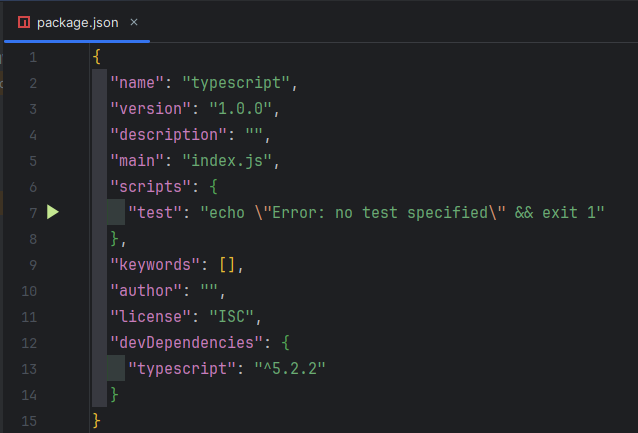
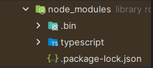
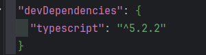
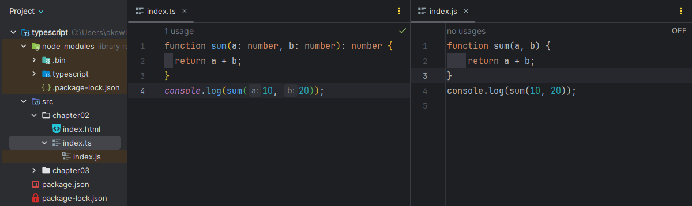
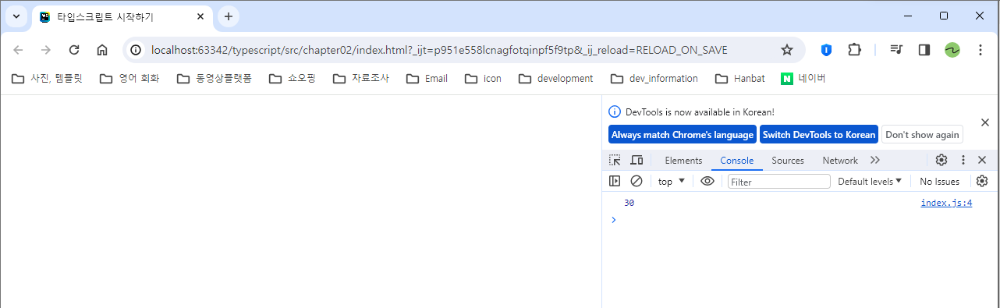

# 2장 타입스크립트 시작하기

# 2.2 타입스크립트 프로젝트 시작

프로젝트의 작업 순서는 다음과 같다.

```tsx
1. 프로젝트 폴더 및 타입스크립트 파일 생성
2. NPM 설정 파일 및 타입스크립트 설치
3. 타입스크립트 컴파일 명렁어 실행
4. 컴파일된 파일의 실행 결과 확인
```

## 2.2.1 프로젝트 폴더 및 타입스크립트 파일 생성하기

작업 폴더를 만들고 타입스크립트 파일을 하나 생성

파일 이름은 `index.ts`

생성한 파일 `index.ts` 에 다음과 같은 코드 작성

```tsx
function sum(a: number, b: number): number {
  return a + b;
}
console.log(sum(10, 20));
```

## 2.2.2 NPM 설정 파일 및 타입스크립트 설치하기

타입스크립트 파일을 실행하려면 자바스크립트 파일로 변환해야 한다.

- 타입스크립트를 자바스크립트로 변환하는 작업을 **컴파일**이라고 한다.

컴파일 하기 위해 **타입스크립트 npm 패키지** 설치해야 한다.

1. 현재 프로젝트가 npm으로 관리되도록 설정 파일을 생성
    
    ```tsx
    npm init -y
    ```
    
    이 명령어는 npm 설정 파일을 기본값으로 생성하는 명령어
    
    명령어를 입력하면 `package.json` 파일이 생성 
    
    ---
    
    
    
    ---
    

1. 이제 npm install 명령어로 원하는 패키지 설치 가능
    
    다음 명령어를 입력해 타입스크립트 패키지를 설치
    
    ```tsx
    npm install typescript -D
    ```
    
    node_modules 폴더가 생성되면서 하위에 typescript 폴더가 생성
    
    ---
    
    
    
    ---
    
    package.json 파일에 devDependencies 속성이 추가되면서 설치된 패키지 이름과 버전이 명시
    
    ---
    
    
    
    ---
    

## 2.2.3 타입스크립트 컴파일 명령어 실행하기

1. 변환 작업(컴파일)을 위해 다음 명령어 입력
    
    ```tsx
    tsc index.ts
    ```
    
    **tsc** → **타입스크립트 컴파일러를 의미**
    
2. 명령 실행 결과 index.ts 파일의 타입스크립트 코드가 자바스크립트 코드로 변환되어 index.js 파일이 생성된다.
    
    ---
    
    
    
    ---
    

## 2.2.4 컴파일된 파일의 실행 결과 확인하기

1. 프로젝트 폴더에 index.html 파일 생성후 다음 코드 작성
    
    `index.html`
    
    ```tsx
    <!doctype html>
    <html lang="ko">
    <head>
    	<meta charset="UTF-8">
    	<meta name="viewport"
    	      content="width=device-width, user-scalable=no, initial-scale=1.0, maximum-scale=1.0, minimum-scale=1.0">
    	<meta http-equiv="X-UA-Compatible" content="ie=edge">
    	<title>타입스크립트 시작하기</title>
    </head>
    <body>
    <script src="./index.js"></script>
    </body>
    </html>
    ```
    

1. 변환된 파일(index.js)의 실행 결과를 확인
    
    ---
    
    
    
    ---