# 5장 인터페이스

# 5.1 인터페이스

타입스크립트에서 인터페이스

: 객체 타입을 정의할 때 사용하는 문법

인터페이스로 타입을 정의할 수 있는 부분

- 객체의 속성과 속성 타입
- 함수의 파라미터와 반환 타입
- 함수의 스펙(파라미터 개수와 반환값 여부 등)
- 배열과 객체를 접근하는 방식
- 클래스

# 5.2 인터페이스를 이용한 객체 타입 정의

다음과 같은 객체가 있다.

```tsx
const seho = {name: '세호', age: 36};
```

- 문자열을 갖는 name 속성, 숫자 36을 갖는 age 속성으로 구성된 객체

위 객체의 타입을 인터페이스로 정의

```tsx
interface User {
  name: string;
  age: number;
}
```

- 인터페이스 속성으로 name과 age를 각각 문자열과 숫자 타입으로 정의

`seho` 객체에 위 인터페이스를 적용

```tsx
interface User {
  name: string;
  age: number;
}

const seho: User = {name: '세호', age: 36};
```

만약 인터페이스 타입과 맞지 않는 객체에 인터페이스를 지정하면 에러 발생

1. age 속성에 문자열 데이터 `‘36’` 할당

```tsx
const seho: User = {name: '세호', age: '36'};
```

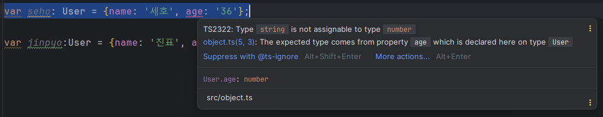

1. 인터페이스에 정의되지 않은 hobby 속성 추가

```tsx
const jinpyo: User = {name: '진표', age: 20, hobby: '수영'};
```

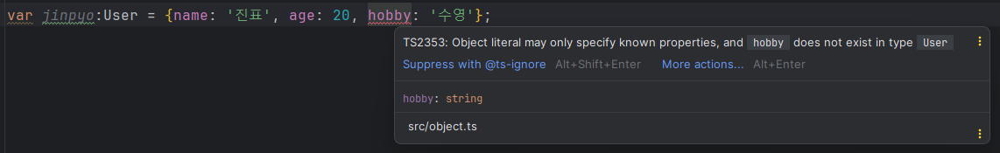

# 5.3 인터페이스를 이용한 함수 타입 정의

**인터페이스**는 **객체의 타입을 정의**하기 위해 사용

→ 객체가 사용되는 모든 곳에 인터페이스를 쓸 수 있다.

→ 객체는 함수의 파라미터, 반환값으로 사용될 수 있다.

## 5.3.1 함수 파라미터 타입 정의

함수 `**logAge**`

```tsx
function logAge(someone) {
  console.log(someone.age);
}
```

- someone은 객체라는 것을 확인할 수 있다.

함수의 파라미터를 명시적으로 선언하기 위해 인터페이스를 이용해 타입을 선언

```tsx
**interface Person {
  name: string,
  age: number
}**

function logAge(**someone: Person**) {
  console.log(someone.age);
}
```

- someone 파라미터는 name과 age 속성을 갖는 객체라는 것을 알 수 있다.

이 함수를 실행하는 코드

```tsx
interface Person {
  name: string,
  age: number
}

function logAge(someone: Person) {
  console.log(someone.age);
}

const jinpyo = {name: 'jinpyo', age: 20};
logAge(jinpyo); // 20
```

- `logAge()`에 넘긴 인자가 함수의 파라미터 타입을 만족하기에 에러가 발생하지 않는다.

만약 누락된 속성이 있으면 에러 발생

---

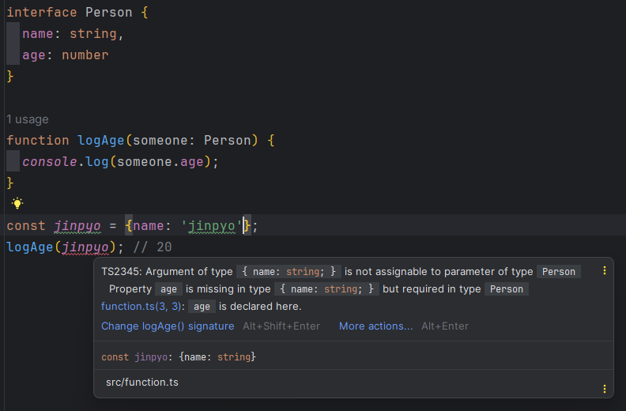

---

- age 속성이 누락 → logAge()의 파라미터 타입(Person)과 일치하지 않아 에러 발생

## 5.3.2 함수 반환 타입 정의

`**getPerson()**` 함수

```tsx
interface Person {
  name: string,
  age: number
}

function getPerson(someone: Person) {
  return someone;
}
```

- Person 인터페이스 타입의 데이터를 받아 그대로 반환
    
    → 함수의 반환 타입이 추론되는 것을 확인할 수 있다.
    
    ---
    
    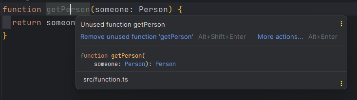
    
    ---
    

함수의 반환 타입을 명시적으로 표시해보자.

→ 인터페이스를 이용해 타입 정의

```tsx
function getPerson(someone: Person): Person {
  return someone;
}
```

이제 getPerson() 함수의 호출 결과를 변수에 할당하면 해당 변수가 Person 인터페이스 타입으로 추론되는 것을 확인

---

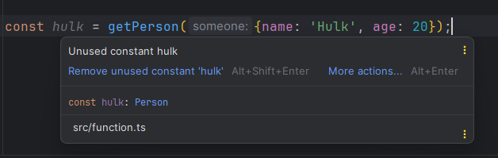

---

# 5.4 인터페이스의 옵션 속성

인터페이스로 정의된 객체의 속성을 선택적으로 사용할 때

→ **옵션 속성**을 사용

`ex` 속성을 2개 가진 객체에서 속성 1개만 필요할 때

```tsx
interface Person {
  name: string,
  age: number
}

function logAge(someone: Person) {
  console.log(someone.age)
}

const captain = {age: 100};
logAge(captain);
```

다음과 같은 에러 발생

---

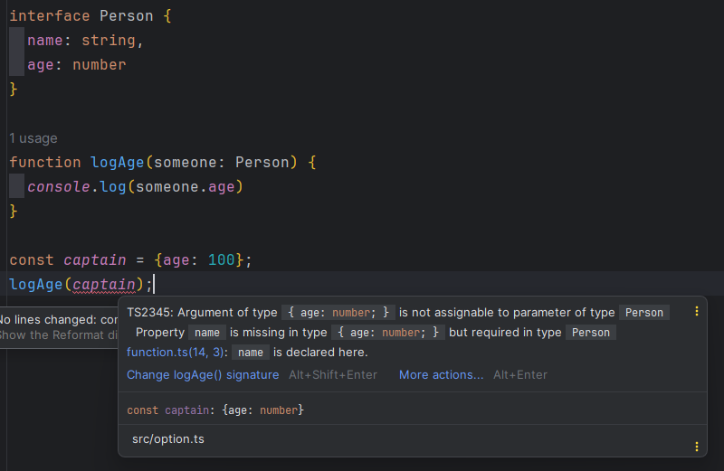

---

`Person` 인터페이스의 name 속성에 `?` 붙여보기

```tsx
interface Person {
  name?: string,
  age: number
}
```

→ `logAge()` 함수 인자에 Person 인터페이스를 만족하는 객체를 넘겨야하지만 name 속성은 있어도되고 없어도 된다.

에러가 사라지는 것을 확인

---

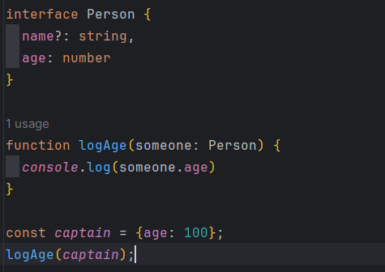

---

→ 상황에 따라서 유연하게 인터페이스 속성의 사용 여부를 결정

# 5.5 인터페이스 상속

**상속이란?**

- 객체 간 관계를 형성하는 방법
- 부모 클래스의 내용을 자식 클래스가 물려받아 사용하거나 확장하는 기법

자바스크립트에서의 상속 구현

```jsx
class Person {
  constructor(name, age) {
    this.name = name;
    this.age = age;
  }
  
  logAge() {
    console.log(this.age);
  }
}

class Developer extends Person{
  constructor(name, age, skill) {
    super(name, age);
    this.skill = skill;
  }
  
  logDeveloperInfo() {
    this.logAge();
    console.log(this.name);
    console.log(this.skill);
  }
}
```

Person 클래스를 Developer 클래스에서 상속받아 클래스를 구현

- Person 클래스에 name 속성과  age 속성 정의, logAge() 메서드 구현
    
    → Developer에서 이 속성들과 메서드를 모두 사용할 수 있다.
    

## 5.5.1 인터페이스의 상속이란?

인터페이스 상속은 클래스 상속과 동일하게 `extends` 키워드 사용

```tsx
interface Person {
  name: string,
  age: number
}

interface Developer extends Person {
  skill: string
}

const ironman: Developer = {
  name: '아이언맨',
  age: 21,
  skill: '만들기',
}
```

Person 인터페이스를 선언하고 Developer 인터페이스에 상속

Developer 인터페이스는 다음과 같은 효과가 나타난다.

```tsx
interface Developer {
	name: string, 
	age: number,
	skill: string,
}
```

## 5.5.2 인터페이스를 상속할 때 참고 사항

상위 인터페이스의 타입을 하위 인터페이스에서 상속받아 타입을 정의할 때, 상위 인터페이스의 타입과 호환이 되어야 한다.

→ 상위 클래스에서 정의된 타입을 사용해야 한다는 의미

`ex`

```tsx
interface Person {
  name: string,
  age: number
}

interface Developer extends Person {
  **name: number,**
}
```

---

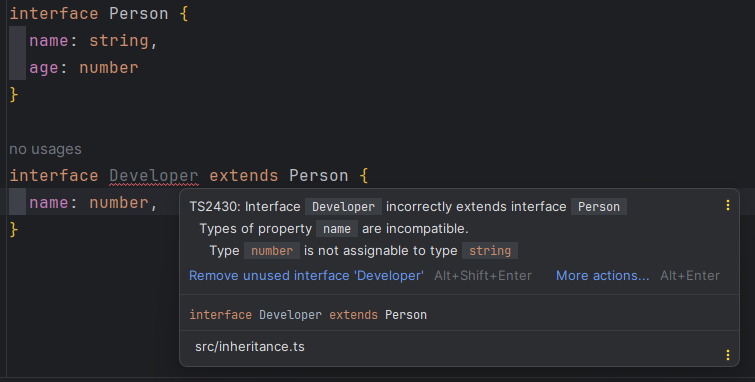

---

`Person` 인터페이스에서 선언한 name 속성 타입을 자식 인터페이스 `Developer` 인터페이스에서 다른 타입으로 정의해서 생긴 에러

→ 부모 인터페이스에 정의된 타입을 자식 인터페이스에서 모두 보장해줘야 한다.

상속을 여러 번 할 수 있다.

```tsx
interface Hero {
  power: boolean;
}

interface Person extends Hero {
  name: string,
  age: number
}

interface Developer extends Person {
  skill: string
}

const ironman: Developer = {
  name: '아이언맨',
  age: 21,
  skill: '만들기',
  power: true,
}
```

Hero 인터페이스를 Person 인터페이스가 상속, Person 인터페이스를  Developer 인터페이스가 상속받는다.

- ironman 변수에 Developer 인터페이스 정의
    
    → 인터페이스 3개에서 제공하는 속성을 모두 타입에 맞게 선언해줘야 한다.
    

# 5.6 인터페이스를 이용한 인덱싱 타입 정의

**인덱싱이란?**

→ 객체의 특정 속성을 접근하거나 배열의 인덱스로 특정 요소에 접근하는 동작

```jsx
const user = {
  name: '캡틴',
  admin: true
};
console.log(user['name']);

const companies = ['삼성', '네이버', '구글'];
console.log(companies[0])
```

- `user['name']` 형태로 객체의 특정 속성에 접근
- `companies[0]` 형태로 배열의 특정 요소에 접근

→ 이것들이 인덱싱

## 5.6.1 배열 인덱싱 타입 정의

배열을 인덱싱할 때, 인터페이스로 인덱스와 요소의 타입을 정의

```tsx
interface StringArray {
  [index: number]: string
}

const companies: StringArray = ['삼성', '구글', '네이버'];
```

인터페이스 속성에 `[index: number]: string`의 의미

→ 속성의 인덱스 이름은 숫자이고 그 속성 값으로 문자열 타입이 와야 한다는 의미

`StringArray` 인터페이스의 인덱스 타입을 문자열로 변경

```tsx
interface StringArray {
  [index: string]: string
}

const companies: StringArray = ['삼성', '구글', '네이버'];
```

다음과 같은 에러 발생

---

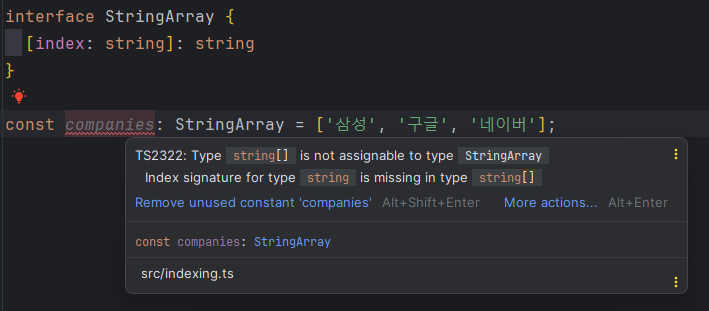

---

→ 배열의 인덱스는 숫자여야 하는데 문자열로 인덱스 타입을 강제하여 배열 정의에 위배되어 에러가 나는 것이다.

배열 변수는 인터페이스로 타입을 정의하기보다 `string[]`으로 선언하는 것이 더 간편하고 타입을 파악하기 편하다.

## 5.6.2 객체 인덱싱 타입 정의

객체 인덱싱의 타입도 인터페이스로 정의할 수 있다.

`SalaryMap` 인터페이스

```tsx
interface SalaryMap {
  [level: string]: number
}

const salary: SalaryMap = {
  junior: 100,
};
```

속성 이름이 문자열 타입, 속성 값이 숫자 타입인 모든 속성 이름 / 속성 값 쌍을 허용한다는 의미

이제 객체의 속성에 접근하면 속성 값 타입이 number인 것을 확인할 수 있다.

---


---

`SalaryMap` 인터페이스 속성 값 타입을 string으로 변경하면?

```tsx
interface SalaryMap {
  [level: string]: string
}

const salary: SalaryMap = {
  junior: '100',
};

const money = salary['junior'];

console.log(money);
```

`salary[’junior’]` 인덱싱 코드의 결과 타입은 `string`이 된다.

## 5.6.3 인덱스 시그니처란?

```tsx
interface SalaryMap {
  [level: string]: string
}
```

→ 이처럼 속성 이름을 명시하지 않고 속성의 이름 타입과 속성 값 타입을 정의한 문법을 **인덱스 시그니처**라고 한다.

**인덱스 시그니처는 객체의 속성 타입을 유연하게 정의할 때도 사용**

`ex`

```tsx
const salary = {
  junior: '100원',
};
```

이 객체의 타입을 인터페이스로 정의

```tsx
interface SalaryInfo {
  junior: string
}
```

주니어뿐만 아니라 미드, 시니어 등 여러 레벨의 급여까지 추가

```tsx
const salary: SalaryInfo = {
  junior: '100원',
  mid: '400원',
  senior: '700원',
};
```

SalaryInfo의 인터페이스 타입과 객체 타입이 맞지 않기 때문에 에러 발생

---

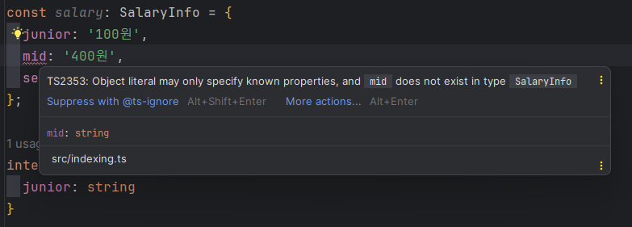

---

다음과 같이 인터페이스의 타입 정의를 수정해줘야지 타입 에러가 발생하지 않는다.

```tsx
const salary: SalaryInfo = {
  junior: '100원',
  mid: '400원',
  senior: '700원',
};

interface SalaryInfo {
  junior: string,
  mid: string,
  senior: string
}
```

→ 여러 급여 정보가 추가될 때마다 인터페이스를 수정해야하는 번거로움이 생긴다.

이때 **인덱스 시그니처 방식**을 사용 

- junior, mid, senior 등은 문자열
- 속성 값 타입은 100원, 400원, 700원 등 문자열

```tsx
interface SalaryInfo {
  [index: string]: string
}
```

이제 SalaryInfo 인터페이스로 정의한 객체에 무수히 많은 속성을 추가할 수 있다.

```tsx
const salary: SalaryInfo = {
  junior: '100원',
  mid: '400원',
  senior: '700원',
  ceo: '0원',
  newbie: '50원'
};
```

## 5.6.4 인덱스 시그니처는 언제 쓸까?

객체의 속성 이름과 개수가 구체적으로 정의되어 있으면?

→ 인터페이스에서 속성 이름과 속성 값 타입을 명시하는 것이 효과적

```tsx
interface User {
  id: string,
  name: string
}

const seho: User = {
  id: '1',
  name: '세호',
}
```

인덱스 시그니처가 적용되어 있는 경우 코드를 작성할 때 구체적으로 어떤 속성이 제공될지 알 수 없어 코드 자동완성이 되지 않는다.

```tsx
interface User {
  [property: string]: string
}

const seho: User = {

};
```

---

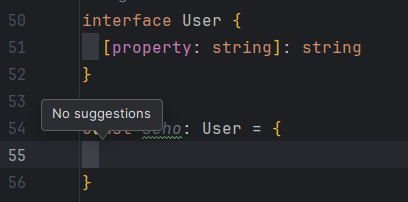

---

User라는 인터페이스에 id와 name 속성이 무조건 들어간다고 하면 같이 섞어서 정의 가능

```tsx
interface User {
  [property: string]: string,
  id: string,
  name: string
}

const seho: User = {
  id: '1',
  name: '세호',
}
```

이제 명시된 속성 정보를 확인할 수 있다.

---

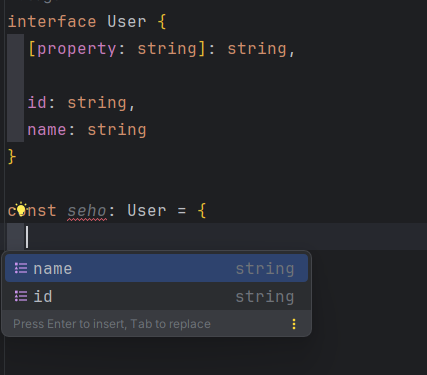

---

seho 객체에는 id과 name 속성의 정의할 수 있을뿐만 아니라 타입의 조건이 맞은 속성도 계속 추가할 수 있다.

```tsx
const seho: User = {
  id: '1',
  name: '세호',
  address: '판교',
}
```

**객체의 속성 이름과 속성 값이 정해져 있는 경우 → 속성 이름과 속성 값 타입을 명시해 정의**

**속성 이름은 모르지만 속성 이름의 타입 값과 값의 타입을 아는 경우 → 인덱스 시그니처**