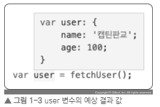
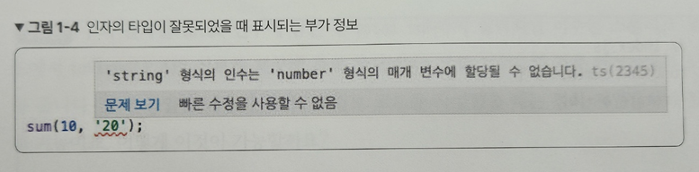

# 1장 타입스크립트 소개와 배경

# 1.1 타입스크립트란?

---

타입스크립트는 자바스크립트에 타입을 부여한 언어

즉, 자바스크립트를 확장한 언어

타입스크립트를 찾는 이유

→ 코드를 더 읽기 쉽게 만들어 주는 타입스크립트

함수를 호출한 후 함수의 호출 결과를 user 변수에 담는 코드

```jsx
var user = fetchUser();
```

user의 값을 확인하기 위해 다음 코드를 작성

```jsx
console.log(user);
```

- user 값은 fetchUser() 함수의 반환값에 따라 달라진다.

`fetchUser()` 함수

```jsx
function fetchUser() {
	return { name: '안진표', age: 20 }
}
```

- 위 함수는 name과 age를 가진 객체를 반환
    
    → user 변수에는 위에서 반환한 객체가 들어있다.
    

또 다른 `fetchUser()` 함수

```jsx
function fetchUser() {
	const person = {
		// ...
	}

	//...
	//...

	const result = {...person, ...developer}
	result.nickname = "진표"

	//..

	return result;
}
```

- 이 함수는 person과 result 변수를 선언할 때, const 키워드 사용
    
    `…` 으로 표기되는 스프레드 오퍼레이터 문법도 포함
    
    → 여러 문법들을 사용한 코드가 등장해 함수 안에 로직을 단번에 파악하기 어려워 함수 결과를 예측하기 어렵다.
    

만약 다음과 같이 `fetchUser( )` 함수의 내부 로직을 몰라도 user 변수의 값을 알 수 있다면 어떨까?

---



---

# 1.2 왜 타입스크립트를 배워야 할까?

---

타입스크립트는 코드 의미 파악을 더 쉽게해줄뿐만 아니라 다음 2가지 장점을 가지고 있다.

1. 에러 사전 방지
2. 코드 가이드 및 자동 완성

## 1.2.1 에러의 사전 방지

코드를 실행하기 전 미리 에러를 어느 정도 검출할 수 있다.

인자 2개를 넘겨 받아 함을 구하는 sum() 함수

```jsx
function sum(a,b) {
 return a + b;
}
```

다음과 같이 숫자 10과 20을 넘겨 호출

```jsx
sum(10, 20);
```

→ 숫자 30을 반환

이때 함수에 숫자 10과 문자열 20을 넘기면 어떻게 될까?

```jsx
sum(10, '20');
```

자바스크립트 결과: 문자열 1020

`why?` 자바스크립트의 언어는 타입이 없기 때문이다.

함수에 넘길 수 있는 인자의 타입을 정하면?

```tsx
function sum(a: number, b: number) {
 return a + b;
}
```

→ sum( ) 함수를 타입스크립트로 작성한 것

- 인자의 타입이 숫자로 정의되어 있기에 이 함수의 인자로 숫자를 넘겨야 한다는 사실을 알 수 있다.

sum( ) 함수를 호출할 때 인자의 타입이 맞지 않으면 개발 툴에서 미리 경고

→ 실수를 미연에 방지

---



---