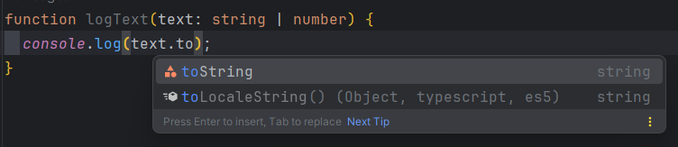
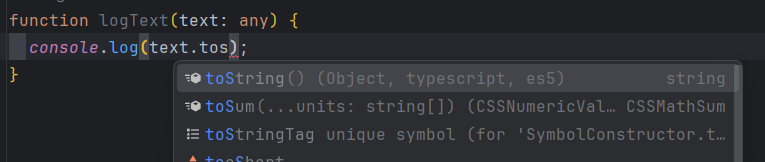
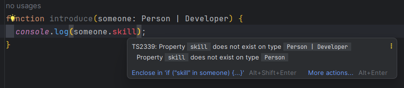
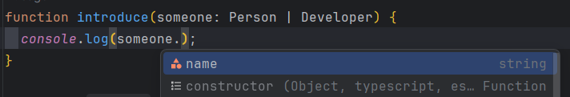
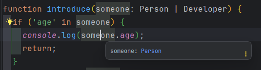
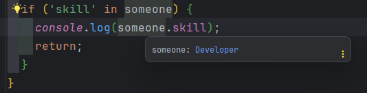
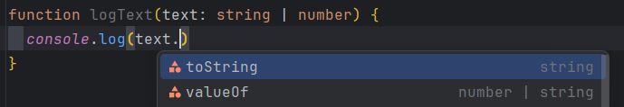
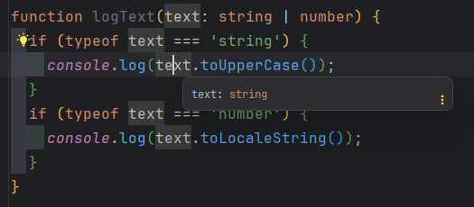
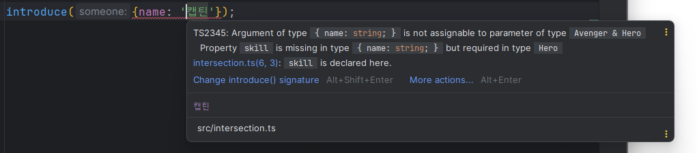
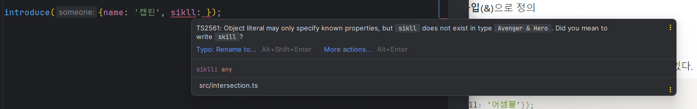

# 6장 연산자를 사용한 타입 정의

# 6.1 유니언 타입

**유니언 타입**

: 여러 개 타입 중 한 개만 쓰고 싶을 때 사용하는 문법

```tsx
function logText(text: string | number) {
  console.log(text);
}
```

→ text 파라미터는 문자열과 숫자를 모두 받을 수 있는 유니언 타입으로 선언

logText 함수는 문자열과 숫자 모두 입력받아 콘솔에 출력할 수 있다.

```tsx
logText('hi');
logText(100);
```

# 6.2 유니언 타입의 장점

유니언 타입을 사용하지 않고 logText 함수를 만들기 위해선 함수 2개를 작성해야 한다.

```tsx
function logText(text: string) {
  console.log(text);
}

function logNumber(text: number) {
  console.log(text);
}
```

→ 동일한 동작을 타입이 다르다는 이유로 함수를 하나 더 작성해야 하는 불편함 존재

유니언 타입을 사용해 같은 동작을 하는 함수의 코드 중복을 줄인다.

```tsx
function logText(text: string | number) {
  console.log(text);
}
```

여러개 타입을 받기위해 any 타입을 사용했을 때와 비교해도 타입을 정확히 사용할 수 있다.

```tsx
function logText(text: any) {
  console.log(text);
}
```

→ any 타입은 타입이 없는 것과 마찬가지로 타입스크립트의 장점을 살리지 못한다.

**어떤 장점?**

: 타입이 정해져 있을 때 자동으로 속성과 API를 자동 완성하는 특성

`ex` `logText()` 함수에 넘겨진 텍스트에 `toString()`을 호출

---



---

→ toString()을 자동완성할 수 있다.

---



---

→ toString() 자동완성 동작이 실행되지 않는다.

따라서 toStirng라는 오탈자가 발생해도 에러를 발견하기 어렵다.

반면 유니언 타입 코드에서는 다음과 같은 에러 표시

---


---

# 6.3 유니언 타입을 사용할 때 주의할 점

객체의 타입을 정의하는 인터페이스 2개가 있다.

```tsx
interface Person {
  name: string,
  age: number
}

interface Developer {
  name: string,
  skill: string
}
```

두 인터페이스 중 1개를 받아 콘솔에 출력하는 `introduce()` 함수

```tsx
function introduce(someone: Person | Developer) {
  console.log(someone);
}
```

Person의 age 속성과 Developer의 skill 속성을 출력하려고 한다.

→ 다음과 같은 에러 발생

---


---



---

**??**

: Person과 Developer 중 하나의 타입인 someone에서 skill과 age 속성을 제공해주지 않을까…??

다음과 같은 코드를 작성해 에러가 난 이유를 추측

```tsx
function introduce(someone: Person | Developer) {
  console.log(someone.age);
}

introduce({name: '캡틴', skill: '인프런 강의'});
```

넘겨진 인자에는 age 속성이 없고 name과 skill 속성만 있다.

함수의 파라미터에 유니언 타입을 사용하면 함수에 어떤 값이 들어올지 알 수 없다.

→ 안전한 방식으로 타입의 속성과 API를 자동 완성해준다.

---



---

Person 타입이 올지 Developer 타입이 올지 알 수 없기 때문에 문제없는 공통 속성인 name 속성만 자동완성 해준다.

함수 내부에서 파라미터 타입의 종류에 따라 특정 로직을 실행하고 싶으면?

→ `in` 연산자를 사용해 로직을 완성

```tsx
function introduce(someone: Person | Developer) {
  if ('age' in someone) {
    console.log(someone.age);
    return;
  }
  if ('skill' in someone) {
    console.log(someone.skill);
    return;
  }
}
```

**in 연산자**

: 객체의 특정 속성이 있는지 확인하는 자바스크립트 연산자

`someone.age`와 `someone.skill` 각각의 타입이 올바르게 추론되고 있는 것을 확인

---





---

문자열과 숫자를 유니언 타입으로 지정한 코드를 보자.

---



---

→ string타입과 number 타입에 공통으로 사용되는 메서드만 제시되는 것을 확인

파라미터 값이 문자라면 대문자로 변경해 출력하고, 숫자라면 국가 언어에 맞추어 숫자 형식을 변경해 주는 코드 작성

```tsx
function logText(text: string | number) {
  if (typeof text === 'string') {
    console.log(text.toUpperCase());
  }
  if (typeof text === 'number') {
    console.log(text.toLocaleString());
  }
}
```

첫번째 if 문 안 text의 타입이 string으로 표시되는 것을 확인할 수 있다.

---



---

`result`

함수의 파라미터에 유니언 타입을 선언하면

- 두 타입의 공통 속성과 메서드만 자동 완성
- 특정 타입의 속성과 메서드를 사용하려면 typeof 이나 in 연산자를 사용해 타입을 구분한 후 코드를 작성
    
    → 타입가드
    

# 6.4 인터섹션 타입

**인터섹션 타입**

: 타입 2개를 하나로 합쳐서 사용할 수 있는 타입

- 보통 인터페이스 2개를 합치거나 타입 정의 여러 개를 합치고 싶을 때 사용

`ex`

```tsx
interface Avenger {
  name: string
}

interface Hero {
  skill: string
}

function introduce(someone: Avenger & Hero) {
  console.log(someone.name);
  console.log(someone.skill);
}
```

→ 함수의 파라미터에 **인터섹션 타입(&)**으로 정의

- someone 파라미터는 두 타입의 name과 skill 속성을 모두 사용할 수 있다.

`introduce()` 함수를 호출할 때, name과 skill 속성을 가진 객체를 인자로 넘길 수 있다.

```tsx
introduce({name: '캡틴', skill: '어셈블'});
```

name이나 skill 속성 중 하나라도 누락하여 넘기면 에러 발생

---



---

→ 인터섹션 타입으로 정의되어 있기 때문에 두 타입의 모든 속성을 만족하는 객체를 인자로 넘겨야 한다.

---



---