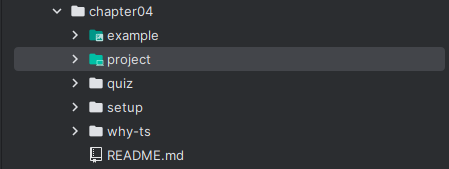
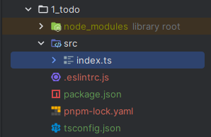
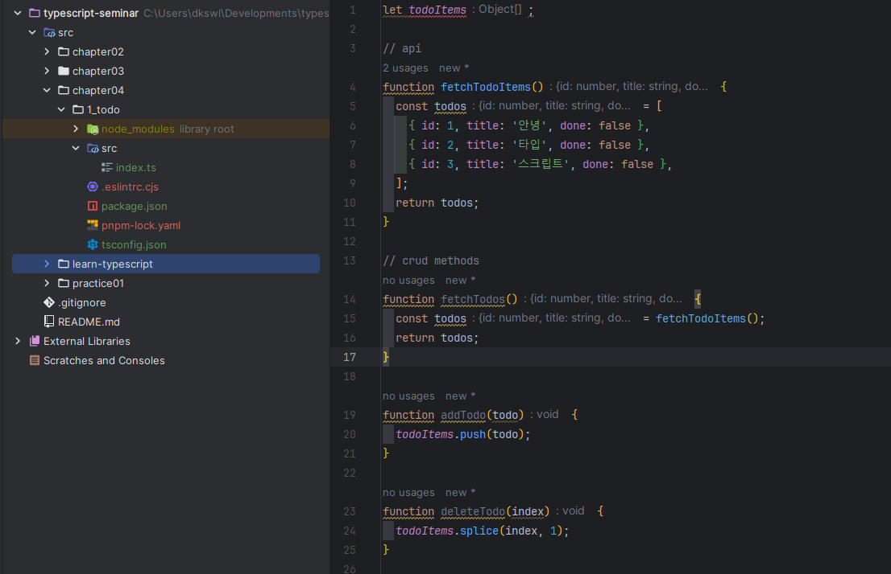
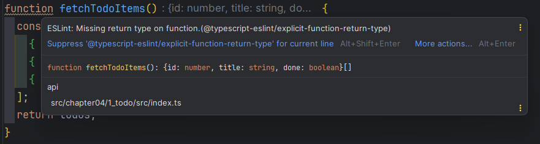
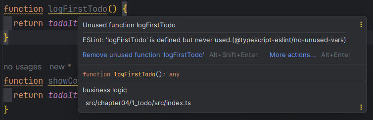
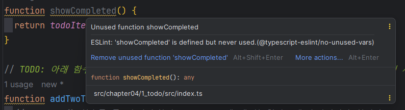
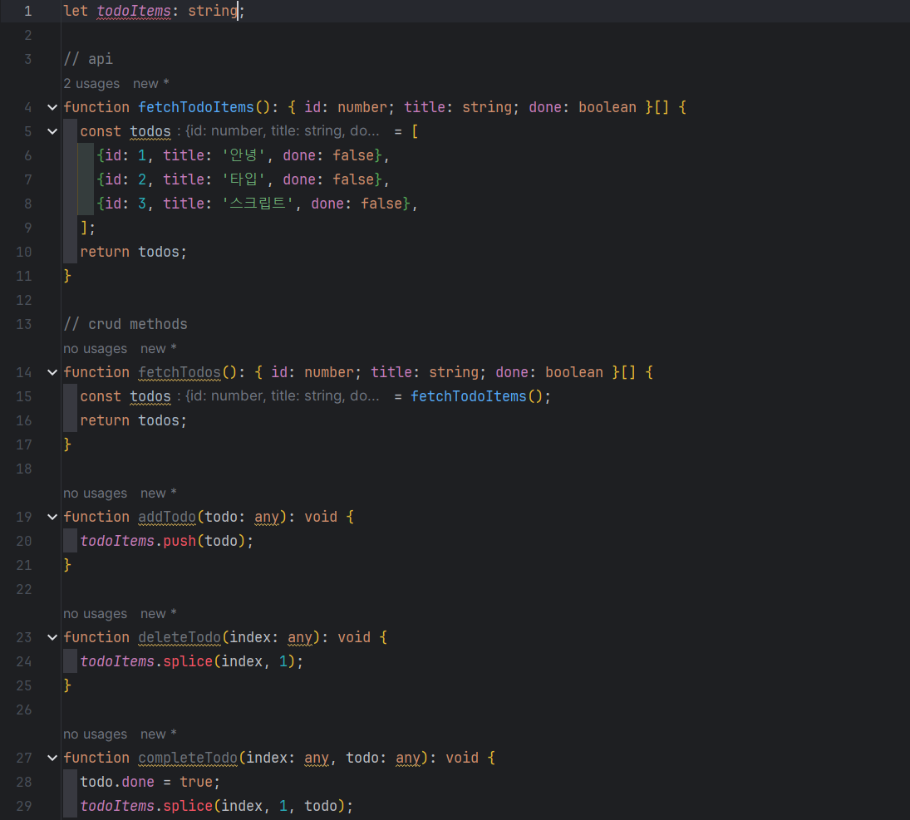
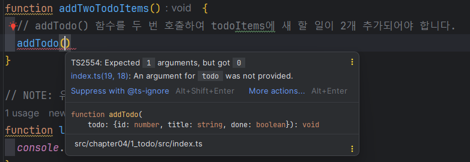

# 4장 첫 번째 프로젝트: 할 일 관리 앱

# 4.1 프로젝트 내려받기 및 라이브러리 설치

1. 예제 소스 코드를 내려 받는다.
    
    ```tsx
    git clone git@github.com:joshua1988/learn-typescript.git chapter04
    ```
    
    ---
    
    
    
    ---
    
2. quiz 폴더의 1_todo 폴더로 이동 후 터미널에 다음 명령어 입력
    
    ```tsx
    pnpm install
    ```
    
    → 프로젝트에 필요한 라이브러리 설치가 된다.
    

# 4.2 프로젝트 폴더 구조

1. 1_todo 폴더 아래는 다음과 같이 폴더 2개와 파일 4개가 있다.
    
    ---
    
    
    
    ---
    

각 폴더와 파일이 어떤 역할을 하는지 알아보자.

## 4.2.1 node_modules 폴더

- node_modules 폴더에는 실습에 필요한 라이브러리 설치되어 있다.
- 앞서 `pnpm install` 명령을 통해 필요한 라이브러리 설치했다.
    
    → 설치가 끝나면 `node_modules` 폴더가 생성
    

## 4.2.3 .eslintrc.js 파일

- ESLint 설정 파일
- ESLint란?
    
    : 자바스크립트 문법 검사 도구
    
    - 코드 작성의 일관성 유지하고, 잠재적인 에러가 발생할 수 있는 코드를 경고
- 프로젝트 실습을 위해 타입스크립트 검사 규칙을 추가

## 4.2.4 package.json 파일

- NPM 설정 파일
    - 프로젝트 이름, 버전, 라이선스 등 프로젝트와 관련된 기본 정보가 들어감
- 로컬에서 개발할 때 필요한 라이브러리 목록을 저장

`**package.json**`

```json
{
  "name": "1_todo",
  "version": "1.0.0",
  "description": "",
  "main": "index.js",
  "scripts": {
    "test": "echo \"Error: no test specified\" && exit 1"
  },
  "keywords": [],
  "author": "",
  "license": "ISC",
  "devDependencies": {
    "@babel/core": "^7.9.0",
    "@babel/preset-env": "^7.9.5",
    "@babel/preset-typescript": "^7.9.0",
    "@typescript-eslint/eslint-plugin": "^2.27.0",
    "@typescript-eslint/parser": "^2.27.0",
    "eslint": "^6.8.0",
    "eslint-plugin-prettier": "^3.1.2",
    "prettier": "^2.0.4",
    "typescript": "^3.8.3"
  }
}
```

**package.json** 파일 속성

- **name**: 프로젝트 이름
- **version**: 프로젝트 버전
- **description**: 프로젝트 설명
- **main**: 프로젝트 메인 파일
- **scripts**: 프로젝트 명령어
    
    `“pnpm run 명령어이름”` 형태로 해당 명령어 실행
    
- **keywords**: NPM 사이트에서 검색할 때 연관될 검색어
- **author**: 프로젝트 작성자
- **license**: 프로젝트 라이선스 표기
- **devDependencies:** 로컬에서 개발할 때 필요한 라이브러리 목록

## 4.2.5 package-lock.json / pnpm-lock.yaml 파일

- **dependencies**나 **devDependencies**에 명시된 라이브러리를 설치할 때 필요한 부수 라이브러리의 버전을 관리
- 이 파일은 개발자가 직접 수정하지 않는다.

## 4.2.6 tsconfig.json 파일

- 타입스크립트 설정 파일
- 타입스크립트 컴파일을 할 때 다양한 옵션을 지정할 수 있다.

현재 실습 프로젝트의 `**tsconfig.json**` 옵션 설정

```json
{
  "compilerOptions": {
    "allowJs": true,
    "checkJs": true,
    "noImplicitAny": false
  },
  "include": ["./src/**/*"]
}
```

- **compilerOptions**: 타입스크립트 컴파일 시 세부적인 동작을 지정하는 옵션
    - **allowJs**: 자바스크립트 파일도 컴파일 대상에 포함하는지?
    - **checkJs**: 프로젝트 내 자바스크립트 파일에서 타입스크립트 컴파일 규칙을 적용할 지?
        
        → `// @ts-check` 를 넣는 것과 효과가 같다.
        
        true로 설정하면 자바스크립트 내 에러도 타입스크립트 컴파일 규칙에 따라 검증한 후 에러를 표시
        
    - **nolmplicitAny**: 타입스크립트는 타입을 따로 지정하지 않으면 암묵적으로 모든 타입을 any로 추론 → 이 성질에 대한 옵션
        
        true를 넣으면 암묵적인 타입 추론이 되지 않아 any라도 꼭 정의해줘야 한다.
        
- **include**: 타입스크립트 컴파일 대상 경로 지정
    - `./src/**/*` → 소스 폴더 아래의 모든 파일에서 타입스크립트 컴파일을 돌리겠다는 의미

# 4.3 프로젝트 로직

소스 코드를 살펴보자.

src 폴더 아래에 있는 `index.ts` 파일

```tsx
let todoItems;

// api
function fetchTodoItems() {
  const todos = [
    { id: 1, title: '안녕', done: false },
    { id: 2, title: '타입', done: false },
    { id: 3, title: '스크립트', done: false },
  ];
  return todos;
}

// crud methods
function fetchTodos() {
  const todos = fetchTodoItems();
  return todos;
}

function addTodo(todo) {
  todoItems.push(todo);
}

function deleteTodo(index) {
  todoItems.splice(index, 1);
}

function completeTodo(index, todo) {
  todo.done = true;
  todoItems.splice(index, 1, todo);
}

// business logic
function logFirstTodo() {
  return todoItems[0];
}

function showCompleted() {
  return todoItems.filter(item => item.done);
}

// TODO: 아래 함수의 내용을 채워보세요. 아래 함수는 `addTodo()` 함수를 이용하여 2개의 새 할 일을 추가하는 함수입니다.
function addTwoTodoItems() {
  // addTodo() 함수를 두 번 호출하여 todoItems에 새 할 일이 2개 추가되어야 합니다.
}

// NOTE: 유틸 함수
function log() {
  console.log(todoItems);
}

todoItems = fetchTodoItems();
addTwoTodoItems();
log();
```

- 할 일 관리 앱을 가정해 코드를 제작
- 할일 목록이라는 데이터 관점에서 조작하는 부분만 간단하게 작성되어 있다.

`fetchTodoItems()` 함수

- 이 함수를 호출해 할 일 목록 데이터를 반환할 수 있게 구현

```tsx
function fetchTodoItems() {
  const todos = [
    { id: 1, title: '안녕', done: false },
    { id: 2, title: '타입', done: false },
    { id: 3, title: '스크립트', done: false },
  ];
  return todos;
}
```

`fetchTodos()` 함수

- fetchTodoItems() 함수의 호출결과를 `todoItems` 변수에 담아 주는 역할
    
    let으로 선언된 변수 `todoItems`: 할일 목록의 데이터가 담길 변수
    
    ```tsx
    function fetchTodos() {
      const todos = fetchTodoItems();
      return todos;
    }
    ```
    

`addTodo()` 함수

- 배열로 정의된 할일 목록에 배열 메서드 push로 할 일을 추가
    
    ```tsx
    function addTodo(todo) {
      todoItems.push(todo);
    }
    ```
    

`deleteTodo()` 함수

- 할 일을 삭제
- **splice** 메서드를 사용해 배열의 특정 인덱스에 있는 할 일 데이터를 삭제
    
    ```tsx
    function deleteTodo(index) {
      todoItems.splice(index, 1);
    }
    ```
    

`completeTodo()` 함수

- 특정 할 일을 완료/미완료 처리
- splice 메서드를 사용해 특정 인덱스에 있는 할 일 완료 처리 여부를 완료로 표시 후 데이터 갱신
    
    ```tsx
    function completeTodo(index, todo) {
      todo.done = true;
      todoItems.splice(index, 1, todo);
    }
    ```
    

`logFirstTodo()` 함수는 첫 번째 할 일을 출력

`showCompleted()` 함수는 완료된 할 일의 목록을 표시

```tsx
function logFirstTodo() {
  return todoItems[0];
}

function showCompleted() {
  return todoItems.filter(item => item.done);
}
```

`addTodoItems()` 함수는 실습을 통해 직접 구현

# 4.4 프로젝트 실습

실습할 때 알아야 하는 개념

1. 타입 표기 방식을 이용한 타입 정의 방법
2. 변수의 타입 정의 방법
3. 함수의 파라미터 타입과 반환값 타입 정의 방법

실습 순서

1. ESLint의 에러가 표시되는 부분의 타입 정의
2. todoItems 변수 타입 선언
3. todoItems 변수의 타입 선언에 따라 발생하는 에러 코드 정리 및 타입 정의
4. 함수 파라미터나 내부 로직의 타입 정의
5. addTwoTodoItems() 함수 구현
6. 정의한 타입 중에서 좀 더 적절한 타입을 정의할 수 있는 곳이 있는지 확인 및 정의

# 4.5 프로젝트 실습 풀이

## 4.5.1 함수의 반환 타입 정의

실습 코드의 **노란색 줄**이 표시되어 있는 부분들이 주로 **함수 이름**인 것을 확인

---



---

다음과 같이 fetchTodoItems() 함수의 에러 메시지를 확인할 수 있다.

---



---

이것은 **ESLint 에러 메시지**

- 타입스크립트 문법 검사 규칙에 어긋났을 때 표시된다.
- ‘Missing return type on function’ → 함수의 반환 타입이 설정되어 있지 않다는 의미

위 에러를 해결하기 위해 반환 타입을 설정

```tsx
function fetchTodoItems(): **{ id: number; title: string; done: boolean }[]** {
  const todos = [
    {id: 1, title: '안녕', done: false},
    {id: 2, title: '타입', done: false},
    {id: 3, title: '스크립트', done: false},
  ];
  return todos;
}
```

- fetchTodoItems() 함수는 todos라는 배열이 담긴 변수를 반환
    
    → 반환 타입은 todos 변수의 데이터 타입이어야 한다.
    

fetchTodos() 함수의 반환 타입 설정

- fetchTodoItems() 함수의 반환값을 변수에 담아 다시 반환
    
    → 동일한 반환 타입을 갖게 된다.
    

```tsx
function fetchTodos(): { id: number; title: string; done: boolean }[] {
  const todos = fetchTodoItems();
  return todos;
}
```

`addTodo()`, `deleteTodo()`, `completeTodo()` 함수

```tsx
function addTodo(todo) {
  todoItems.push(todo);
}

function deleteTodo(index) {
  todoItems.splice(index, 1);
}

function completeTodo(index, todo) {
  todo.done = true;
  todoItems.splice(index, 1, todo);
}
```

세 함수 모두 함수의 반환값이 없다.

→ 반환 타입을 void로 지정

- void는 함수의 반환값이 없을 때 지정하는 타입

세 함수의 타입을 다음과 같이 지정

```tsx
function addTodo(todo: any): void {
  todoItems.push(todo);
}

function deleteTodo(index: any): void {
  todoItems.splice(index, 1);
}

function completeTodo(index: any, todo: any): void {
  todo.done = true;
  todoItems.splice(index, 1, todo);
}
```

`logFirstTodo()` 함수

- todoItems[0]이라는 값을 반환
    
    → todoItems의 변수 타입에 따라 함수의 반환 타입이 결정
    

---



---

→ 일단 any로 표시 되어 있어 any 지정

```tsx
function logFirstTodo(): any {
  return todoItems[0];
}
```

다음으로는 `showCompleted()` 함수

- filter 배열 메서드를 사용해 완료 처리된 할 일 목록들을 새로운 배열로 반환

---



---

→ 일단 any로 표시 되어 있어 any로 지정

```tsx
function showCompleted(): any {
  return todoItems.filter(item => item.done);
}
```

## 4.5.2 할 일 목록 변수인 todoItems 타입 정의

```tsx
let todoItems;
```

- 할 일 목록 데이터를 담고 있다.

51번째 줄을 보면 todoItems 변수는 fetchTodoItems() 함수의 호출 결과 값을 할당

```tsx
todoItems = fetchTodoItems();
```

- fetchTodoItems() 함수의 반환 타입
    
    → `{ id: number; title: string; done: boolean }[]` 
    
    → 객체를 담은 배열인 것을 확인
    

따라서 todoItems 변수의 데이터 타입은 객체를 담은 배열인 것을 추론

```tsx
let todoItems: {id: number; title: string; done: boolean}[];
```

→ id, title, done 속성을 갖는 객체의 배열 타입

다음과 같이 어울리지 않는 타입을 지정하면 코드에 빨간 줄이 생긴다.

---



---

→ 잘못된 타입을 지정하면 코드를 실행하지 않고도 코드 편집기 단계에서 에러를 미리 확인할 수 있다.

## 4.5.3 함수 파라미터 타입 구체화

변수 타입을 정의했기 떄문에 이제는 함수의 파라미터 타입을 구체적으로 정의해볼 수 있다.

any로 지정된 타입 중 역할에 맞게 좀 더 구체적으로 타입을 정의

1. `addTodo()` 함수
    
    ```tsx
    function addTodo(todo: any): void {
      todoItems.push(todo);
    }
    ```
    
    - todo는 다른 할 일 데이터와 동일한 구조로 저장되어야 한다.
    
    따라서 todo 파라미터를 **id, title, done 속성을 갖는 객체 타입**으로 정의
    
    ```tsx
    function addTodo(todo: { id: number; title: string; done: boolean }): void {
      todoItems.push(todo);
    }
    ```
    

1. `deleteTodo()` 함수
    
    ```tsx
    function deleteTodo(index: any): void {
      todoItems.splice(index, 1);
    }
    ```
    
    - 파라피터 index는 배열의 인덱스를 의미
        
        → 숫자 타입인 number  타입이 더 적합
        
    
    파라미터 타입 변경
    
    ```tsx
    function deleteTodo(**index: number**): void {
      todoItems.splice(index, 1);
    }
    ```
    
2. `compeleteTodo()` 함수
    
    ```tsx
    function completeTodo(index: any, todo: any): void {
      todo.done = true;
      todoItems.splice(index, 1, todo);
    }
    ```
    
    - index는 배열 순서 → number
    - todo는 할 일 데이터 → object
    
    변경
    
    ```tsx
    function completeTodo(
      **index: number,
      todo: { id: number; title: string; done: boolean }**
    ): void {
      todo.done = true;
      todoItems.splice(index, 1, todo);
    }
    ```
    

1. `logFirstTodo()` 함수
    
    ```tsx
    function logFirstTodo(): any {
      return todoItems[0];
    }
    ```
    
    - 첫 번째 할 일 데이터를 반환
    
    변경
    
    ```tsx
    function logFirstTodo(): **{ id: number; title: string; done: boolean }** {
      return todoItems[0];
    }
    ```
    

1. `showCompleted()` 함수
    
    ```tsx
    function showCompleted(): any {
      return todoItems.filter(item => item.done);
    }
    ```
    
    - filter 배열 메서드는 특정 배열에서 조건을 만족하는 요소만 추려서 새로운 배열을 만든다.
    
    변경
    
    ```tsx
    function showCompleted(): **{ id: number; title: string; done: boolean }[]** {
      return todoItems.filter(item => item.done);
    }
    ```
    

## 4.5.4 addTwoTodoItems() 함수 구현

현재 `addTwoTodoItems()` 함수 

```tsx
// TODO: 아래 함수의 내용을 채워보세요. 
// 아래 함수는 `addTodo()` 함수를 이용하여 2개의 새 할 일을 추가하는 함수입니다.
function addTwoTodoItems() {
  // addTodo() 함수를 두 번 호출하여 todoItems에 새 할 일이 2개 추가되어야 합니다.
}
```

이 함수는 `addTodo()` 함수를 사용하여 새 할 일 2개를 추가

addTodo() 함수의 파라미터 타입을 정의했기 때문에 이 함수를 호출할 때 인자의 데이터 타입을 확인할 수 있다.

---



---

addTodo() 함수로 임의의 할 일 데이터를 지정

반환값은 없기 때문에 반환 타입을 void로 지정

```tsx
function addTwoTodoItems(): **void** {
  // addTodo() 함수를 두 번 호출하여 todoItems에 새 할 일이 2개 추가되어야 합니다.
  **addTodo({ id: 4, title: '안진표는', done: false });
  addTodo({ id: 5, title: '귀엽다', done: false });**
}
```

## 4.5.5 반복되는 타입 코드 줄이기

any로 타입을 정의하기보다 데이터 유형에 맞게 구체적으로 타입을 정의했다.

→ 코드가 반복되는 부분이 생긴다.

작성한 타입 코드 중 반복되는 부분

→ `{ id: number; title: string; done: boolean }`

```tsx
let todoItems: { id: number; title: string; done: boolean }[];

// api
function fetchTodoItems(): { id: number; title: string; done: boolean }[] {
  const todos = [
    { id: 1, title: '안녕', done: false },
    { id: 2, title: '타입', done: false },
    { id: 3, title: '스크립트', done: false },
  ];
  return todos;
}

// crud methods
function fetchTodos(): { id: number; title: string; done: boolean }[] {
  const todos = fetchTodoItems();
  return todos;
}

function addTodo(todo: { id: number; title: string; done: boolean }): void {
  todoItems.push(todo);
}

function deleteTodo(index: number): void {
  todoItems.splice(index, 1);
}

function completeTodo(
  index: number,
  todo: { id: number; title: string; done: boolean }
): void {
  todo.done = true;
  todoItems.splice(index, 1, todo);
}
// ....
```

- 할 일 데이터의 타입을 정의한 코드들이 계속 반복해서 들어간다.
    
    → 전체적인 코드의 가독성이 떨어진다.
    

반복되는 타입을 줄일 수 있는 방법

→ **인터페이스**

`interface` 키워드를 사용해 할 일 데이터의 타입을 별도의 이름으로 선언할 수 있다.

```tsx
interface Todo {
	**id: number;
	title: string;
	done: boolean:**
}
```

- id, title, done 속성을 갖는 객체 타입을 의미

앞서 반복되는 코드를 Todo라는 인터페이스로 줄일 수 있다.

```tsx
**interface Todo {
  id: number;
  title: string;
  done: boolean;
}**

let todoItems: Todo[];

// api
function fetchTodoItems(): Todo[] {
  const todos = [
    { id: 1, title: '안녕', done: false },
    { id: 2, title: '타입', done: false },
    { id: 3, title: '스크립트', done: false },
  ];
  return todos;
}

// crud methods
function fetchTodos(): Todo[] {
  const todos = fetchTodoItems();
  return todos;
}

function addTodo(todo: Todo): void {
  todoItems.push(todo);
}

function deleteTodo(index: number): void {
  todoItems.splice(index, 1);
}

function completeTodo(index: number, todo: Todo): void {
  todo.done = true;
  todoItems.splice(index, 1, todo);
}

// business logic
function logFirstTodo(): Todo {
  return todoItems[0];
}

function showCompleted(): Todo[] {
  return todoItems.filter(item => item.done);
}
```