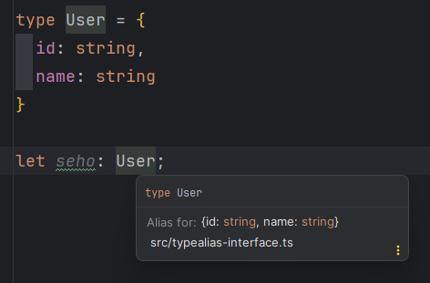
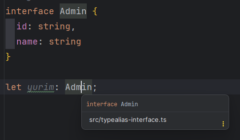

# 7장 타입 별칭

# 7.1 타입 별칭이란?

**타입 별칭**

: 특정 타입이나 인터페이스 등을 참조할 수 있는 타입 변수를 의미

→ 타입에 의미를 부여해 별도의 이름으로 부르는 것

- 변수처럼 해당 타입이 어떤 역할을 하는지 이름을 짓고 싶을 때
- 여러 번 반복되는 타입을 변수화해 쉽게 표기

`ex`

```tsx
type MyName = string;
```

→ MyName이라는 타입 별칭을 선언하고 string 타입을 할당

위 타입 별칭을 코드에 적용

```tsx
type MyName = string;

**const capt: MyName = '캡틴';**
```

→ capt 변수에 MyName이라는 타입 별칭을 지정

- `const capt: string = ‘캡틴’;`과 역할은 같지만 사용할 타입이 구체적으로 어떤 의미를 지니는지 알 수 있다.

타입 별칭을 썼을 때 가장 큰 장점

: 반복되는 타입 코드를 줄일 수 있다.

```tsx
function logText(text: string | number) {
  // ....
}

const message: string | number = '안녕하세요.';
logText(message);
```

→ `logText()` 함수의 파라미터와 `message` 변수에 같은 타입이 반복되는 것을 확인

반복되는 코드를 타입 별칭을 줄일 수 있다.

```tsx
**type MyMessage = string | number;**

function logText(**text: MyMessage**) {
  //....
}

const **message: MyMessage** = '안녕하세요.';
```

→ `string | number` 타입을 `MyMessage` 타입 별칭으로 정의

- `string | number` 이 내 메시지에 사용되는 타입이라는 의미도 부여

**Note**

타입 변수라고 표현해서 타입을 선언하고 다시 다른 타입을 할당할 수 없다.

```tsx
type MyName = string;
type MyName = number; // 에러 발생
```

# 7.2 타입 별칭과 인터페이스의 차이점

타입 별칭과 인터페이스 둘 다 객체 타입을 정의할 수 있다.

```tsx
type User1 = {
  id: string,
  name: string
}

interface User2 {
  id: string,
  name: string
}
```

## 7.2.1 코드 에디터에서 표기 방식 차이

동일한 속성과 타입을 갖는 객체를 각각 타입 별칭과 인터페이스로 정의

타입 별칭

```tsx
type User = {
  id: string,
  name: string
}

let seho: User;
```

→ 타입 별칭 User로 정의하고 seho라는 변수에 연결

타입 별칭에 마우스 커서를 올려보면 타입 정보가 미리보기 화면으로 표시

---



---

인터페이스 코드로 작성하고 미리보기 화면을 확인

```tsx
interface User {
  id: string,
  name: string
}

let seho: User;
```

미리보기 화면

---



---

→ 변수에 연결된 타입이 어떤 모양인지 파악할 때는 타입 별칭이 더 좋아보인다.

## 7.2.2 사용할 수 있는 타입의 차이

**타입 별칭과 인터페이스의 또 다른 차이점**

: 정의할 수 있는 타입 종류

- 인터페이스는 주로 객체의 타입을 정의
- 타입 별칭은 일반 타입에 이름을 짓는 데 사용, 유니언 타입, 인터섹션 타입 등에도 사용
    
    ```tsx
    type ID = string;
    type Product = TShirt | Shoes;
    type Teacher = Person & Adult;
    ```
    
    → 이런 타입들은 인터페이스로 정의X
    
    제네릭이나 유틸리티 타입 등 다양한 타입에 사용
    
    ```tsx
    type Gilbut<T> = {
      book: T;
    }
    
    type MyBeer = Pick<Beer, 'brand'>;
    ```
    

- 인터페이스와 타입 별칭의 정의를 함께 사용할  수 있다.
    
    ```tsx
    interface Person {
      name: string,
      age: number
    }
    
    type Adult = {
      old: boolean;
    }
    
    type Teacher = Person & Adult;
    ```
    

+) 타입 별칭이 인터페이스보다 장점이 더 많은 것 같지만 실제 웹 서비스를 제작할 때 인터페이스를 더 많이 사용한다고 한다.

## 7.2.3 타입 확장 관점에서 차이

**타입 확장이란?**

: 이미 정의되어 있는 타입들을 조합해 더 큰 의미의 타입을 생성하는 것

- 타입 별칭과 인터페이스는 타입을 확장하는 방식이 다르다.

**인터페이스의 타입 확장** 방법

```tsx
interface Person {
  name: string,
  age: number
}

interface Developer extends Person {
  skill: string
}

const joo: Developer = {
  name: '형주',
  age: 21,
  skill: '웹개발'
}
```

→ 인터페이스 타입 확장은 상속이라는 개념을 이용

**타입 별칭의 타입 확장**은 인터섹션 타입으로 객체 타입을 2개 합쳐 사용

```tsx
type Person = {
  name: string,
  age: number
}

type Developer = {
  skill: string
}

const joo: Person & Developer = {
  name: '형주',
  age: 21,
  skill: '웹개발',
};
```

위의 인터섹션 타입을 별도의 타입 별칭으로 정의하여 사용

```tsx
type Person = {
  name: string,
  age: number
}

type Developer = {
  skill: string
}

**type Joo = Person & Developer;**

const joo: **Joo** = {
  name: '형주',
  age: 21,
  skill: '웹개발',
};
```

→ 작성된 타입을 어떻게 조합하느냐에 따라 인터페이스를 쓰기도 하고 타입 별칭을 사용할 수 있다.

**인터페이스의 선언 병합**

→ 동일한 이름으로 인터페이스를 여러 번 선언하면 인터페이스 내용들을 합치는 특성

```tsx
interface Person {
  name: string,
  age: number
}

interface Person {
  address: string
}

const seho: Person = {
  name: '세호',
  age: 20,
  address: '광교',
};
```

# 7.3 타입 별칭은 언제 쓰는 것이 좋을까?

> **타입 별칭으로만 타입 정의가 가능한 곳에서는 타입 별칭을 사용하고 백앤드와의 인터페이스를 정의하는 곳에서는 인터페이스를 이용하자.**
> 

## 7.3.1 타입 별칭으로만 정의할 수 있는 타입들

**타입 별칭으로만 정의할 수 있는 타입들**

: **데이터 타입, 인터섹션, 유니언 타입**

다음 타입은 인터페이스로 정의할 수 없다.

```tsx
type MyString = string;
type StringOrNumber = string | number;
type Admin = Person & Developer;
```

타입 별칭은 제네렉, 유틸리티 타입, 맵드 타입과도 연동하여 사용

```tsx
// 제네릭
type Dropdown<T> = {
  id: string,
  title: T;
}

// 유틸리티 타입
type Admin = {
  name: string,
  age: number,
  role: string
}
type OnlyName = Pick<Admin, 'name'>;

// 맵드 타입
type Picker<T, K extends keyof T> = {
  [P in K]: T[P];
};
```

## 7.3.2 백앤드와의 인터페이스 정의

웹 서비스를 개발할 때 필요한 작업

: **백앤드에서 프런트앤드로 어떻게 데이터를 넘길지 정의하는 작업**

→ 인터페이스를 정의하는 작업

- 인터페이스: 타입스크립트 인터페이스가 아니라 영역 간 접점을 서로 맞추는 작업을 의미
    - 접점은 데이터를 의미

보통 데이터를 정의하면서 프런트엔드에서는 API 함수를 설계

- 서버에 데이터를 요청하고 받은 결과를 화면에서 처리해줄 수 있도록 API 함수를 제작
- Javascript에서는 API 함수를 JSDoc으로 명세
    
    ```tsx
    /**
     * @typedef {Object} User
     * @property {string} id
     * @property {string} name
     */
    
    /**
     * @return {User}
     */
    
    function fetchData() {
      return axios.get('http://localhost:3000/users/1');
    }
    ```
    
    → 사용자 정보를 받아오는 API 함수의 결과를 JSDoc으로 명세
    
    - API 함수 결과는 id와 name 속성을 갖는 사용자 객체를 의미
    - axios 라이브러리는 HTTP 라이브러리

위 자바스크립트 코드를 타입스크립트로 변환

→ 2가지 방식으로 타입을 정의할 수 있다.

```tsx
// 1. 타입 별칭으로 API 함수의 응답 형태를 정의
type User = {
  id: string,
  name: string
}

function fetchData():User {
  return axios.get('http://localhost:3000/users/1');
}

// 2. 인터페이스로 API 함수의 응답 형태를 정의
interface User {
  id: string,
  name: string
}

function fetchData():User {
  return axios.get('http://localhost:3000/users/1');
}
```

객체를 정의할 때 인터페이스를 이용한다고 했다.

타입 별칭이 주는 미리보기 효과를 생각한다면 타입 별칭을 사용하는 것도 나쁘지 않다.

`but` 위의 장점보다 인터페이스를 이용했을 때 이점이 더 크다.

`ex` 요구 사항이 변경되어 화면에 노출해야 하는 데이터 구조가 바뀌었다.

→ 다른 객체(role, address) 등이 추가되거나 다른 객체 정보와 결합하여 표시되어야 한다면 타입 확장이라는 측면에서 인터페이스로 정의하는 것이 수월하다.

```tsx
interface Admin {
  role: string,
  department: string
}

// 상속을 통한 인터페이스 확장
interface User extends Admin {
  id: string,
  name: string
}

// 선언 병합을 통한 타입 확장
interface User {
  skill: string
}
```

→ API 함수의 반환 타입 User를 인터페이스의 특징들로 확장

최종적으로 User 인터페이스는 다음과 같이 정의한 것처럼 동작

```tsx
interface User {
  id: string,
  name: string,
  role: string,
  department: string,
  skill: string
}
```

→ 유연하게 타입을 확장하는 관점에서 타입 별칭보다 인터페이스가 더 유리하다.