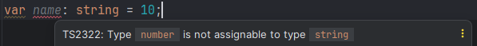
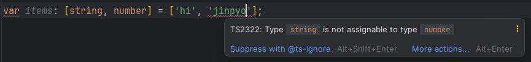
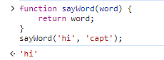
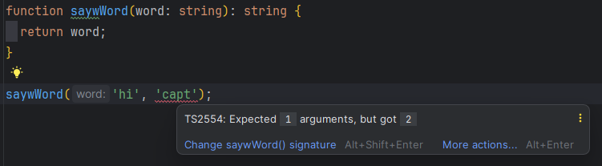
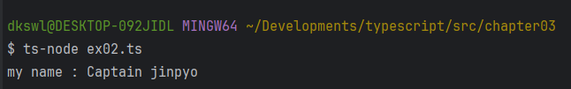
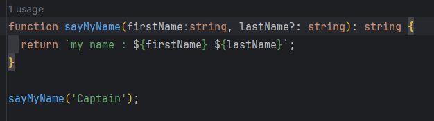

# 3장 타입스크립트 기초: 변수와 함수의 타입 정의

# 3.1 변수에 타입을 정의하는 방법

자바스크립트 코드의 타입 선언

```jsx
var name = 'captain';
```

- name 변수에 captain 문자열 할당

**타입스크립트 코드로 변경**

name 변수에 타입을 선언

→ 변수 이름 뒤에 콜론(:)을 붙여 변수의 타입을 정의 `: 타입이름`

```tsx
var name: string = 'captain';
```

- name 변수의 타입은 문자열이고 값은 captain이라는 문자열
- 콜론(:)을 **타입 표기**라고 한다.
    
    타입 표기는 변수뿐만 아니라 함수에도 사용할 수 있다.
    

# 3.2 기본 타입

타입을 정의할 때 사용할 수 있는 타입 종류는 여러 가지가 있다.

주요 데이터 타입 아홉 가지

- string
- number
- boolean
- object
- Array
- tuple
- any
- null
- undefined

## 3.2.1 문자열 타입: string

데이터 타입이 문자열이면 string 타입으로 선언

```tsx
var name: string = 'captain';
```

- name 변수의 타입이 string으로 지정
    
    → 이 변수는 **문자열만 취급하는 변수**가 된다.
    

문자열이 아닌 다른 값을 할당하면 타입 에러가 표시

---



---

## 3.2.2 숫자 타입: number

변수가 숫자만 취급하면 number 타입을 사용

```tsx
var age: number = 100;
```

- 이후에 값을 변경할 때는 숫자만 할당 가능

## 3.2.3 진위 타입: boolean

진위(참/거짓) 값만 취급하는 변수에는 boolean 타입 사용

```tsx
var isLogin: boolean = false;
```

- 참과 거짓을 구분하는 진위 값을 다루는 경우 boolean으로 타입을 선언

## 3.2.4 객체 타입: object

객체 데이터를 취급할 때 object 타입 사용

```tsx
var hero: object = {name: 'captain', age: 100};
```

**Note**

---

타입스크립트의 장점을 극대화하기 위해 타입을 구체적으로 선언해야 한다.

- 위 예제는 object 타입은 어떤 속성이 있고 해당 속성이 무슨 타입을 갖는지 명시되어 있지 않다.
    
    → 추후에 구체적으로 타입을 명시하는 방법을 배울 예정
    

---

## 3.2.5 배열 타입: Array

배열 타입은 2가지 방법으로 선언 가능

```tsx
// 문자열 배열
var companies: Array<string> = ['네이버', '삼성', '인프런'];
var companies: string[] = ['네이버', '삼성', '인프런'];

// 숫자 배열
var cards: Array<number> = [13, 7, 2, 4];
var cards: number[] = [13, 7, 2, 4];
```

- 각각의 회사 이름이 문자열로 선언
    
    → 문자열 배열의 의미의 `Array<string>`, `string[]` 타입 표기 방식 사용
    

2가지 형식

```tsx
1. Array<배열의 데이터 타입>
2. 배열의 데이터 타입[]
```

‘배열의 데이터 타입’  → 배열을 구성할 요소의 타입

Array<string>보다 `string[]` 형태의 문법을 권장

`why?` 키보드 입력이 적고 직관적이다.

## 3.2.6 튜플 타입: tuple

배열의 길이가 고정되고 각 요소의 타입이 정의된 배열을 튜플이라고 한다.

```tsx
var items: [string, number] = ['hi', 11];
```

- items 변수
    - 배열의 길이가 2
    - 첫 번째 요소는 문자열, 두 번째 요소는 숫자 타입으로 정의

정해진 순서와 타입에 맞지 않게 값을 할당하면 에러 발생

---



---

## 3.2.7 any

any 타입은 아무 데이터나 취급하겠다는 의미

- 타입스크립트에서 자바스크립트의 유연함을 취하려할 때 사용

```tsx
var myName: any = '진표';
myName = 100;
var age: any = 21;
```

myName 변수에 any 타입을 지정 후 ‘진표’ 문자열 선언

- any 타입으로 지정
    
    → 이후 다른 데이터 타입의 값으로 변경 가능: `진표 → 100`
    

+) any는 자바스크립트 코드를 타입스크립트로 변환할 때 유용하게 사용할 수 있는 타입

## 3.2.8 null과 undefined

자바스크립트의 `null` : 의도적인 빈 값을 의미

`undefined` : 변수를 선언할 때 값을 할당하지 않았을 때 기본적으로 할당되는 값

타입스크립트에서는 두 값을 타입으로 정의할 수 있다.

```tsx
var empty: null = null;
var nothingAssigned: undefined;
```

- `nothingAssigned` 변수는 선언만 하고 아무 값도 할당하지 않아서 `undefined`가 초기값으로 지정

# 3.3 함수에 타입을 정의하는 방법

## 3.3.1 함수란?

자바스크립트에서의 함수 선언 방식

```jsx
function sayHi() {
	return 'hi';
}
```

→ sayHi라는 함수 선언, 함수 실행 시 문자열 hi 반환

- function이라는 예약어(키워드)와 함께 함수 이름으로 함수를 선언
- 함수 본문에 returrn을 추가해 값을 반환하거나 함수를 종료

함수의 또다른 특징: 입력 값에 따라 출력 값이 달라진다.

```jsx
function sayWord(word) {
	return word;
}
```

→ word는 함수의 파라미터(매개변수)

- 파라미터로 함수를 호출할 때 값을 넘겨 받을 수 있다.

```jsx
sayWord('hello'); // hello
sayWord('bye'); // bye
```

→ 함수를 호출할 때 넘긴 문자열 hello, bye는 **인자**라고 한다.

## 3.3.2 함수의 타입 정의: 파라미터와 반환값

타입스크립트로 반환값의 타입을 문자열로 지정

```tsx
function sayWord(word): string  {
  return word;
}
```

→ 위와 같이 함수 이름 오른쪽에 `‘: 타입이름’`으로 지정

- 함수의 반환값은 문자열이라는 것을 명시

함수의 입력 값인 파라미터 타입도 문자열로 지정

파라미터 오른쪽에 `‘: 타입이름’`으로 지정

```tsx
function saywWord(word: string): string {
  return word;
}
```

→ word 파라미터의 타입은 문자열이라고 명시

# 3.4 타입스크립트 함수의 인자 특징

자바스크립트 함수에서는 파라미터와 인자의 개수가 일치하지 않아도 문제가 없다.

```jsx
function sayWord(word) {
 return word;
}

sayWord('hi', 'capt'); // hi
```

→ 에러가 발생하지 않고 정상적으로 실행된다.

---



---

그러나 타입스크립트에서는 파라미터와 인자의 개수가 다르면 에러가 발생

---



---

→ 위와 같이 부가적인 함수 정보가 표시되어서 함수를 정의된 내용에 맞게 올바르게 사용

# 3.5 옵셔널 파라미터

파라미터의 개수보다 적게 인자를 넘기고 싶을 때?

성과 이름을 입력받아 이름을 반환해주는 함수

```tsx
function sayMyName(firstName: string, lastName: string): string {
  return `my name : ${firstName} ${lastName}`;
}

console.log(sayMyName('Captain', 'jinpyo'));
```

firstName과 lastName을 모두 입력하면 다음 결과가 나온다.

---



---

성만 입력해서 결과를 얻기 위해선?

→ 함수의 파라미터를 선택적으로 사용하기 위해 **옵셔널 파라미터**를 사용

옵셔널 파라미터는 ?로 표기

- 선택적으로 사용할 파라미터에 ?를 붙인다.

```tsx
function sayMyName(firstName:string, **lastName?: string**): string {
  return `my name : ${firstName} ${lastName}`;
}
```

두 번째 파라미터에 ?를 붙여 옵셔널 파라미터로 정의

→ lastName은 호출할 때 넘겨도 되고 넘기지 않아도 된다.

 

타입 에러가 발생하지 않는다.

---



---